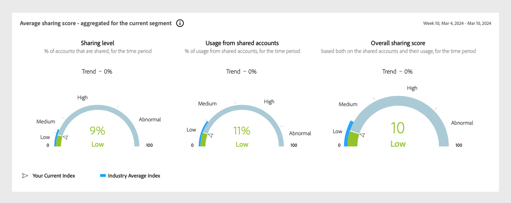

# Mode d’isolation MVPD pour les programmeurs TV Everywhere {#isolation-mode-tve}

>[!IMPORTANT]
>
> La limitation du mode Isolation MVPD s’applique uniquement aux programmeurs TV Everywhere.

En mode Isolation, les distributeurs multicanaux de programmes audiovisuels (Xfinity, par exemple) identifient de manière cohérente les abonnés sur tous les appareils en fonction de leurs interactions avec des programmeurs spécifiques. En mode standard, les distributeurs multicanaux de programmes audiovisuels identifient de manière cohérente les abonnés sur tous les appareils, indépendamment des programmeurs impliqués.

Voici un exemple :

*Les MVPD du mode d’isolation identifient quatre abonnés différents au lieu de deux*

* Si un abonné B d’un mode d’isolation MVPD (tel que Xfinity) accède au contenu proposé par deux programmeurs différents utilisant le même appareil, le MVPD associera différents identifiants aux deux tentatives d’accès différentes. Il semble qu’il y ait deux abonnés différents qui accèdent au contenu pour les programmeurs (L et M dans la figure).

* Pour les MVPD standard, si l’abonné B accède au contenu proposé par deux programmeurs différents, le MVPD associe un identifiant d’accès unique pour les deux tentatives d’accès.

* Les MVPD (tels que Xfinity) en mode Isolation n’identifient pas de manière cohérente un abonné, même si l’abonné utilise le même appareil sur différents programmeurs.

Pour éviter toute distorsion des données due au comptage d’un seul abonné comme plusieurs abonnés en raison de l’accès à différents programmeurs, le mode Isolation limite l’activité signalée sur un programmeur à leurs applications uniquement.

Par exemple, le programmeur L peut afficher les données uniquement en fonction de l’activité des identités W et Y, en ignorant les identités X et Z dans l’image précédente.

>[!IMPORTANT]
>
> L&#39;inconvénient est que le programmeur L est privé de partager les informations rassemblées sur les Abonnés A et B en raison d&#39;une activité avec un programmeur autre que L.

En mode Isolation, le partage des scores et des mesures associées sont calculés uniquement à partir de l’activité des appareils diffusés en continu à partir des applications du programmeur et du canal sélectionné. Les scores de partage et les probabilités sont calculés à partir des démarrages de diffusion sur les canaux actuellement sélectionnés.

Le système fonctionne automatiquement en mode Isolation lorsque le segment sélectionné contient un MVPD de mode Isolation qui identifie les abonnés uniques comme plusieurs abonnés lors de la diffusion en continu à partir de différents programmeurs. Tous les graphiques et diagrammes de ces segments refléteront les résultats de ce comportement modifié.

>[!IMPORTANT]
>
> Le comportement en mode Isolation est incompatible avec le mode standard, le mode Isolation MVPD ne peut pas être mélangé avec d’autres MVPD et vice versa.

Pour créer un segment qui est analysé en mode Isolation, faites glisser le mode Isolation MVPD, tel que **Xfinity**, vers la section MVPD de la définition de segment.

>[!NOTE]
>
> Étant donné que les MVPD du mode d’isolation ne peuvent pas être mélangés avec d’autres MVPD, la section MVPD de la définition de segment ne permettra pas qu’un autre MVPD y soit glissé.

*Sélection Xfinity en mode Isolation*

>[!IMPORTANT]
>
> Le partage de compte est plus pertinent lorsqu’il est mesuré pour la diffusion en continu dans toutes les applications du programmeur. Attendez-vous à des **scores de partage** plus bas et à une certaine variation des mesures en mode Isolation.

*Partage des indicateurs de probabilité en mode Isolation*

Les jauges ci-dessus indiquent que seulement 9 % de tous les comptes sont partagés et que, parmi ceux-ci, seulement 11 % du contenu est consommé. En raison des scores naturellement plus bas, les résultats en mode Isolation doivent être interprétés différemment des résultats en mode standard.
