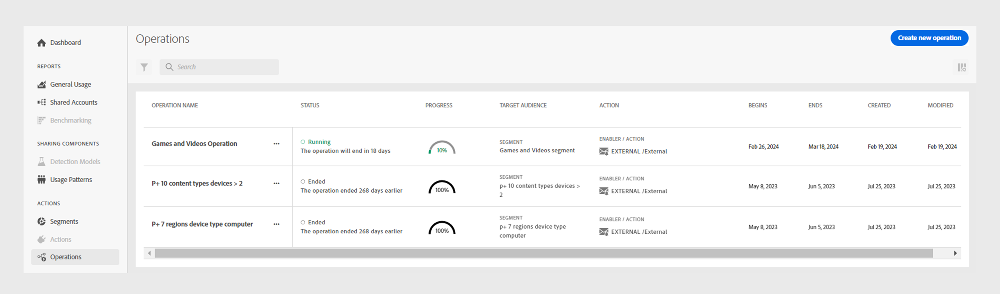
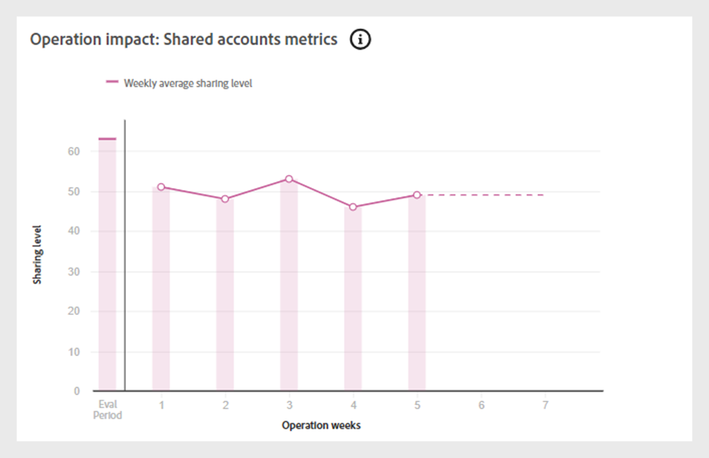
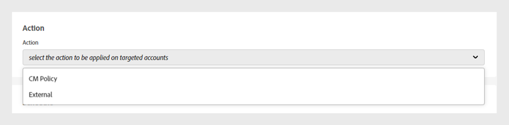

# Opérations {#operations-tab-next-steps}

Une fois que vous avez analysé les schémas d’utilisation de votre abonné et identifié les instances de partage de mot de passe pour un segment sélectionné à l’aide de [!DNL Account IQ] Analytics, vous pouvez effectuer des actions ciblées par le biais de procédures ciblées appelées opérations dans [!DNL Account IQ].

Les **opérations** vous permettent de suivre et de gérer efficacement le partage des informations d’identification vers un groupe de comptes afin d’atténuer le partage des mots de passe et d’améliorer l’expérience des abonnés estimés.

Vous pouvez appliquer des actions à un [segment](/help/accountiq/product-concepts.md#segment-def) défini pour traiter le partage de mot de passe dans un [ intervalle de temps](/help/accountiq/product-concepts.md#time-interval-def) spécifique et planifier l’exécution de l’opération à une date ultérieure. Ces actions comprennent des restrictions visant à minimiser le partage de mot de passe ou à alléger les contraintes sur les comptes de non-partage.

En utilisant les opérations, vous spécifiez non seulement les actions et leur portée, mais vous évaluez également leurs résultats.

En évaluant les résultats, vous pouvez affiner votre stratégie pour optimiser les effets, que ce soit en convertissant les emprunteurs, en atténuant le partage des informations d’identification ou en réduisant le taux de perte de clientèle.

Vous pouvez exécuter différentes fonctions avec des opérations :

* [Affichage des rapports d’opération](#operation-reports)
* [Création d’une opération](#create-new-operation)
* [Opération Stop](#stop-operation)

## Affichage des rapports d’opération {#operation-reports}

Vous pouvez examiner les effets d’une opération à l’aide de rapports d’opération. Pour afficher le rapport d’opération, sélectionnez l’onglet **Opérations** sous **Actions** dans le panneau gauche de l’application Account IQ. Une liste des opérations disponibles dans le système s’affiche. Vous pouvez accéder aux détails clés de chaque opération dans un format tabulaire. Les détails incluent :

* Nom de l’opération
* État actuel (planifié, en cours d’exécution, terminé, erreur ou arrêté)
* Pourcentage d&#39;achèvement de la progression
* Public cible ou segment sur lequel l’opération est appliquée
* Type d’action sélectionnée pour l’opération
* Date de début de l’opération
* Date de fin de l’opération
* Date de création de l’opération
* Date de la dernière modification de l’opération

*Liste et détails des opérations existantes dans Account IQ*

Sélectionnez le **nom de l’opération** de votre choix dans la liste des opérations. Les rapports suivants sont affichés :

### Performances des opérations {#operation-performance}

Les performances de l’opération fournissent une vue d’ensemble résumant le nombre de comptes concernés, l’état d’avancement de l’opération et le score de partage global des comptes dans le segment pendant la [période d’évaluation](/help/accountiq/product-concepts.md#evaluation-period-def) de l’opération.

*Rapport de performances de l’opération*

**A.** Comptes affectés **B.** Progression de l’opération **C.** Score de partage global

#### Comptes affectés {#impacted-accounts}

Ce nombre indique le nombre de comptes abonnés affectés par l&#39;action entreprise au cours de la période d&#39;évaluation de l&#39;opération.

#### En cours d&#39;opération {#operation-progress}

Cette jauge indique le nombre de jours et le pourcentage de l’opération effectuée en dehors du planning planifié.

#### Score de partage global {#overall-sharing-score}

Ce graphique linéaire représente le [score de partage global](/help/accountiq/data-panels.md#overall-sharing-score), qui inclut le niveau de partage et l’utilisation des comptes partagés de chaque semaine pendant la période d’évaluation de l’opération.

### Impact de l’opération : comptes dans le segment {#impact-accounts}

Ce rapport s’affiche sous la forme d’un graphique en colonnes empilé qui illustre l’impact d’une opération au fil du temps.

*Impact de l’opération sur les comptes dans le graphique de segments*

L’axe X représente la [période d’évaluation](/help/accountiq/product-concepts.md#evaluation-period-def) de l’opération, tandis que l’axe Y indique l’état des comptes dans le segment de l’opération. Chaque barre du graphique est divisée en trois couleurs :

* Pink représente le nombre de comptes répondant aux conditions du segment utilisées dans cette opération.

* Bleu représente le nombre de comptes actifs qui se trouvaient à l’origine dans le segment mais qui ne remplissaient pas les conditions du segment durant chaque semaine ou mois au cours de la [période d’évaluation](/help/accountiq/product-concepts.md#evaluation-period-def) de l’opération.

* Gris représente les comptes qui étaient inactifs pendant la période d’évaluation.

>[!NOTE]
>
>La première barre rose représente le nombre de comptes répondant aux conditions du segment d&#39;opération au début de la période d&#39;évaluation.

Au fil du temps, le graphique illustre les changements de comportement du compte par rapport aux critères d’origine (par exemple, la probabilité de partage de plus de 90 appareils et l’utilisation de plus de 5 appareils sont devenus inactifs).

### Impact de l’opération : mesures des comptes partagés {#impact-shared-accounts}

Les mesures des comptes partagés fournissent un aperçu du niveau de partage et des demandes de lecture par les comptes abonnés dans le segment de l’opération pendant la [période d’évaluation](/help/accountiq/product-concepts.md#evaluation-period-def) de l’opération.

#### Niveau de partage {#share-level}

Ce graphique linéaire représente le [niveau de partage](/help/accountiq/data-panels.md#sharing-level) chaque semaine au cours de la période d’évaluation de l’opération.

{width="550" align="left"}

*Graphique linéaire de niveau de partage*

#### Nombre de requêtes de lecture {#play-requests}

Ce graphique linéaire représente les [requêtes de lecture](/help/accountiq/general-usage-reports.md#playreq-uniquesubs) chaque semaine pendant la période d’évaluation de l’opération.

{width="550" align="left"}

*Graphique linéaire du nombre de requêtes de lecture*

### Impact de l’opération : mesures d’utilisation générales {#impact-general-usage}

Les mesures d’utilisation générales fournissent un aperçu du nombre moyen de périphériques, d’adresses IP et d’emplacements dans le segment de l’opération au cours de la [période d’évaluation](/help/accountiq/product-concepts.md#evaluation-period-def) de l’opération.

#### Nombre d’appareils {#devices}

Ce graphique linéaire représente le nombre moyen [d’appareils](/help/accountiq/general-usage-reports.md#devices-week-account) chaque semaine au cours de la période d’évaluation de l’opération.

{width="550" align="left"}

*Graphique linéaire du nombre d’appareils*

#### Nombre d’adresses IP et d’emplacements {#IPs-locations}

Ce graphique linéaire représente le nombre moyen [d’adresses IP](/help/accountiq/general-usage-reports.md#ip-week-account) et [emplacements](/help/accountiq/general-usage-reports.md#locations-week-account) chaque semaine pendant la période d’évaluation de l’opération.

{width="550" align="left"}

*Graphique linéaire du nombre d’adresses IP et d’emplacements*

Pour fermer le rapport et revenir à la page principale **Opérations**, sélectionnez l’onglet **Opérations** sous **Actions** dans le panneau de gauche.

## Créer une opération {#create-new-operation}

Lorsque vous accédez à l’onglet **Opérations** sous **Actions** dans le panneau de gauche, sélectionnez **Créer une opération** en haut de la page **Opérations**.

Pour créer une opération, suivez les instructions des sections suivantes :

* [Détails de l&#39;opération](#operation-details)
* [Segment](#segment)
* [Action](#action)
* [Planning](#schedule)

### Détails de l&#39;opération {#operation-details}

Dans cette section, saisissez le nom de l’opération dans **Operation name**.

>[!TIP]
>
>Décrivez l’objectif de l’opération ou la nature de l’action dans **nom de l’opération** pour une identification rapide. L’option **Ajouter une description et des balises** sera disponible dans les prochaines versions.

*Ajouter le nom de l’opération*

### Segment {#segment}

Dans cette section, cliquez sur **Sélectionner un segment** et choisissez un segment auquel vous souhaitez utiliser cette opération. Découvrez [comment sélectionner un segment](/help/accountiq/segments-timeinterval.md#segment-selection).

Une fois que vous avez sélectionné un segment, utilisez icône  pour afficher le résumé détaillé du segment. En savoir plus sur [résumé du segment](segments-timeinterval.md#segment-summary).

*Sélectionner un segment et un intervalle de temps*

>[!NOTE]
>
>Les [catégories vidéo](product-concepts.md#video-category-def) affichées dans l’image précédente, telles que **MVPDs**, **Programmeurs** et **Canaux** représentent les étiquettes utilisées dans la version TV Everywhere d’Account IQ. Si vous êtes connecté en tant que service D2C, ces étiquettes affichent les catégories vidéo spécifiques de votre entreprise.

Si nécessaire, utilisez icône  pour modifier le segment sélectionné ou  Icône  pour créer un segment. Pour plus d’informations, reportez-vous aux instructions de [création d’un nouveau segment](work-with-segments.md#create-new-segment) ou de [modification d’un segment](work-with-segments.md#edit-segment).

>[!IMPORTANT]
>
>**Le type de segment** nommé **[!UICONTROL Fixed number of accounts]** est actuellement sélectionné par défaut. L’option permettant de sélectionner **[!UICONTROL Variable number of accounts]** sera disponible dans les prochaines versions.

Sélectionnez **Granularité et intervalle de temps** pour surveiller l’opération pendant une période spécifique. Découvrez [comment sélectionner la granularité et l’intervalle de temps](/help/accountiq/segments-timeinterval.md#granularity-timeinterval).

### Action {#action}

Dans cette section, choisissez une **action** que vous souhaitez exécuter sur le segment sélectionné dans le menu déroulant.

*Sélectionnez le type d&#39;action*

Deux options sont disponibles :

* Sélectionnez **CM Policy** pour le système de surveillance de la simultanéité intégré à Account IQ.

* Sélectionnez **Actions externes** pour créer et traiter des workflows externes à Account IQ et non intégrés au système Account IQ.

>[!NOTE]
>
>Les actions externes peuvent ne pas toujours être directement liées au partage de mot de passe, mais peuvent encore avoir un impact, comme le lancement d’une nouvelle saison.

### Planning {#schedule}

Dans cette section, sélectionnez la **Date de début** et la **Date de fin** dans le sélecteur de date pour définir l’activation de l’opération.

>[!IMPORTANT]
>
>Actuellement, les valeurs par défaut **Date de début** et **Date de fin** de l’activation sont définies sur **Date d’activation**. L’option permettant de sélectionner **Lorsqu’une condition est remplie** et **Manuellement** sera disponible dans les prochaines versions.

>[!NOTE]
>
>Assurez-vous que la date de début et la date de fin correspondent à la granularité sélectionnée pour l’évaluation dans l’ **étape 4**.

* Si vous avez choisi d’agréger la granularité par semaines, sélectionnez les dates de début et de fin dans les semaines (Semaine 10, par exemple).
* Si vous avez choisi d’agréger la granularité par mois, sélectionnez les dates de début et de fin par mois.

*Sélectionnez Date de début et Date de fin dans le sélecteur de date*

**A.** Sélecteur de date de début **B.** Sélecteur de date de fin

>[!NOTE]
>
>La **date de début** doit être postérieure à la période d’évaluation et à la date actuelle, tandis que la **date de fin** doit être postérieure à la date de début et à la date actuelle pour planifier et exécuter des opérations dans la période ultérieure.

Sélectionnez **Save operation** en haut de la page **Operations** pour traiter une nouvelle opération.

## Opération Stop {#stop-operation}

Vous pouvez uniquement arrêter les opérations qui sont actuellement à l’état **En cours d’exécution**. Pour arrêter une opération existante, procédez comme suit :

1. Accédez à l’onglet **Opérations** sous **Actions** dans le volet de navigation de gauche de l’application Account IQ.
1. Sélectionnez le menu **Options** de l’opération que vous souhaitez arrêter.

   

   *Menu Sélectionner les options pour arrêter l’opération*

1. Sélectionnez **Arrêter**.

