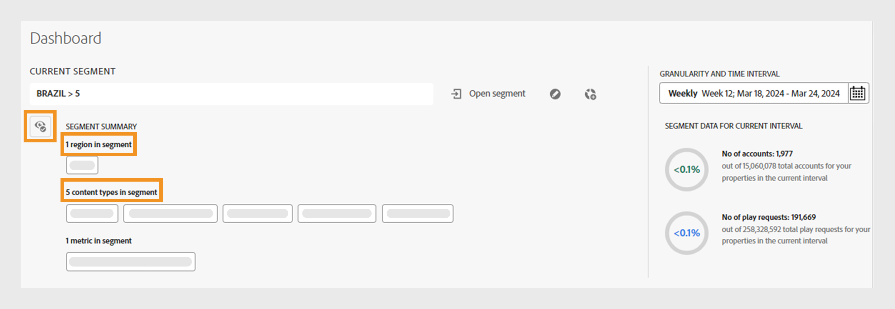

# Segments et intervalle de temps {#segment-timeinterval}

Lorsque vous vous connectez à Account IQ, le panneau de segments et d’intervalles de temps situé au-dessus du tableau de bord vous permet de définir l’abonné [segment](product-concepts.md#segmet-def). Ce panneau permet de filtrer les résultats et d’afficher des rapports sur le comportement et les modèles de partage des abonnés. Un segment nommé **TOUS LES COMPTES DANS VOS PROPRIÉTÉS** est actuellement sélectionné par défaut, où vous pouvez afficher les options suivantes :

{align="left"}

*Panneau Segment et intervalle de temps avec résumé de segment réduit*

**A.** Nom de segment actuellement sélectionné **B.** Ouvrir la liste de segments **C.** Modifier le segment **D.** Créer un segment **E.** Granularité et sélecteur d’intervalle de temps **F.** Icône pour développer le résumé de segment **G.** Résumé de segment réduit **H.** Nombre de comptes dans le segment pour l’intervalle sélectionné

>[!NOTE]
>
> Le résumé du segment réduit montre les [catégories vidéo](product-concepts.md#video-category-def) utilisées dans la version TV Everywhere d’Account IQ. Si vous êtes connecté en tant que service D2C, ces étiquettes affichent les catégories vidéo spécifiques de votre entreprise.

Pour en savoir plus sur [la création](work-with-segments.md#create-new-segment) et [la gestion des segments](work-with-segments.md#manage-segment) à partir de l’onglet **Segments** dans le panneau de gauche, découvrez comment créer  et  gérer les segments.

## Sélection de segment {#segment-selection}

Pour sélectionner un segment spécifique, procédez comme suit :

1. Accédez à l’option **[!UICONTROL Open segment]** dans le panneau des segments et de l’intervalle de temps.
1. Sélectionnez le **nom du segment** pour lequel vous souhaitez afficher les rapports de partage de compte.

   {align="left"}

   *Sélectionner le nom du segment*

   >[!NOTE]
   >
   > Les catégories vidéo affichées dans l’image précédente, telles que **MVPDs**, **Programmers** et **Canaux** , représentent les étiquettes utilisées dans la version TV Everywhere d’Account IQ. Si vous êtes connecté en tant que service D2C, ces étiquettes affichent les catégories vidéo spécifiques de votre entreprise.

1. Sélectionnez **[!UICONTROL Open segment]**.

## Sélection de la granularité et de l’intervalle de temps {#granularity-timeinterval}

Le sélecteur **Granularité et Intervalle temporel** vous permet de spécifier les dates et la durée agrégées toutes les semaines/tous les mois pour observer le comportement de partage des abonnés. La sélection par défaut correspond à la semaine en cours.

{align="left"}

*Boîte de dialogue Granularité et intervalle de temps*

**A.** Sélecteur de granularité et d’intervalle de temps **B.** Flèche vers la droite pour accéder au mois/semaine suivant **C.** Option pour choisir la granularité par semaine/mois **D.** Intervalle de temps actuellement sélectionné **E.** Flèche vers la gauche pour accéder au mois/semaine précédent

Vous pouvez modifier la durée en procédant comme suit :

1. Sélectionnez le **[!UICONTROL Granularity and Time Interval]** dans le sélecteur de date.

1. Sélectionnez l’option **[!UICONTROL Week]** ou **[!UICONTROL Month]** depuis **[!UICONTROL Aggregate By]** pour définir la granularité de votre évaluation.

1. Une fois la granularité sélectionnée, vous pouvez utiliser les flèches vers l’avant ou vers l’arrière pour naviguer dans la période.

1. Sélectionnez une période spécifique pour l’évaluation.

1. Sélectionnez **[!UICONTROL Apply]** pour vous assurer que votre sélection prend effet.

Cela vous permet de définir votre énoncé de problème comme &quot;Abonnés de MVPD A qui ont regardé les canaux X, Y et Z pendant la semaine choisie de décembre&quot;.

## Synthèse des segments {#segment-summary}

Le résumé de segment est similaire pour les services D2C et TV Everywhere. Les catégories vidéo seront différentes pour chaque version respective d’Account IQ.

Sélectionner icône  pour afficher le résumé détaillé du segment. Il présente également des informations sur le nombre de comptes abonnés et leurs demandes de lecture au cours de la période sélectionnée.

+++ Services D2C

{align="left"}

*Résumé de segment pour les services D2C*

>[!NOTE]
>
>Les [catégories vidéo](product-concepts.md#video-category-def) affichées dans l’image précédente, telles que **région** et les **types de contenu** dans le segment ne sont que des exemples. Lorsque vous vous connectez à Account IQ, ces étiquettes affichent les catégories vidéo spécifiques à votre entreprise.

Le **résumé du segment** comprend les conditions suivantes qui définissent un segment :

**[Les régions et les types de contenu](product-concepts.md#video-category-def) dans le segment** font référence aux étiquettes de métadonnées associées aux diffusions vidéo regardées par les comptes partagés représentés dans les rapports de partage de compte.

**[Les mesures](product-concepts.md#metric) dans le segment** font référence à des attributs ou des critères que les abonnés doivent avoir remplis pour être identifiés dans les rapports de partage de compte.

+++

+++ TV partout

{align="left"}

*Résumé du segment pour les programmeurs/MVPD*

Le **résumé du segment** comprend les conditions suivantes qui définissent un segment :

**[Les programmeurs](product-concepts.md#programmer-def) dans le segment** font référence aux fournisseurs de contenu dont les diffusions vidéo ont été visionnées par des comptes partagés représentés dans les rapports de partage de compte.

**[Les canaux](product-concepts.md#channel-def) dans le segment** se rapportent aux canaux dont les diffusions vidéo ont été visionnées par des comptes partagés représentés dans les rapports de partage de compte.

**[Les MVPD](product-concepts.md#mvpd-def) dans le segment** font référence à des distributeurs de programmation multividéo auxquels les abonnés sont associés afin d’être identifiés dans les rapports de partage de compte.

**[Les mesures](product-concepts.md#metric) dans le segment** font référence à des attributs ou des critères que les abonnés doivent avoir remplis pour être identifiés dans les rapports de partage de compte.

+++
