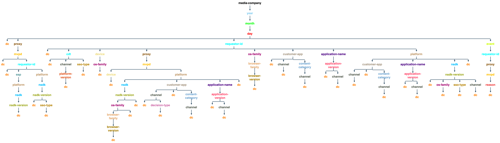
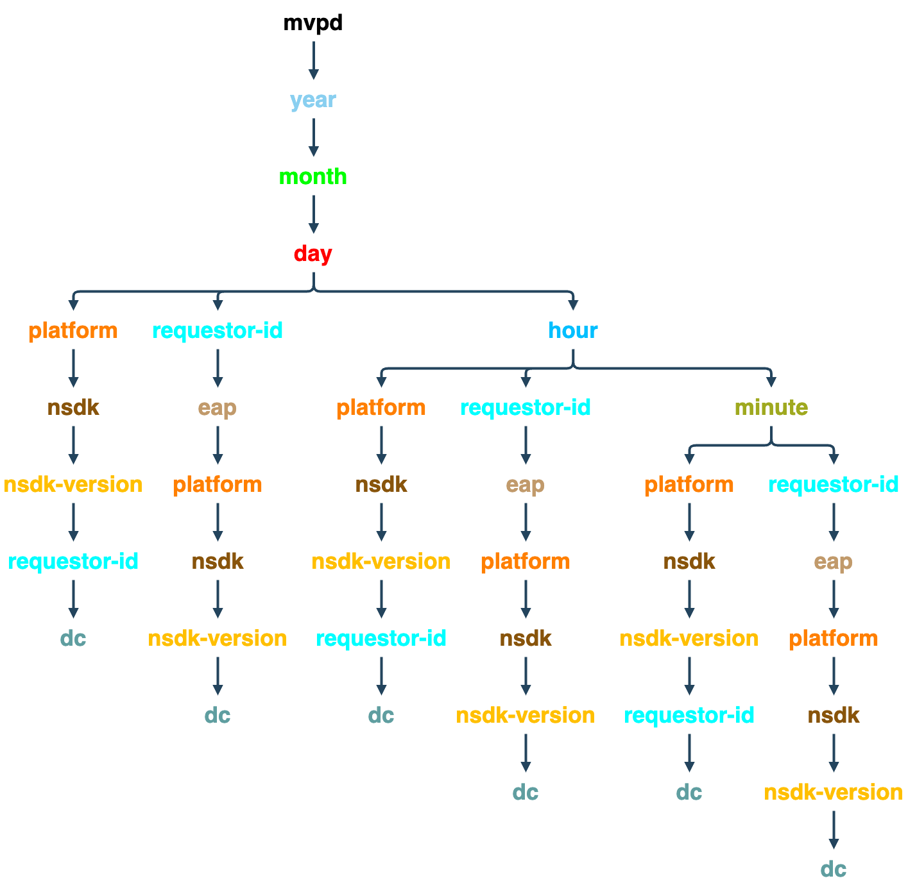

# API de surveillance du service de droit {#entitlement-service-monitoring-api}

>[!IMPORTANT]
>
>Le contenu de cette page est fourni à titre d’information uniquement. L’utilisation de cette API nécessite une licence Adobe actuelle. Aucune utilisation non autorisée n’est autorisée.

>[!IMPORTANT]
>
> Avant d’utiliser l’API de dégradation, vérifiez que les conditions préalables suivantes sont remplies :
>
> * Obtenez les informations d’identification du client comme décrit dans la documentation de l’API [Récupération des informations d’identification du client](../../rest-apis/rest-api-dcr/apis/dynamic-client-registration-apis-retrieve-client-credentials.md).
> * Obtenez le jeton d’accès comme décrit dans la documentation de l’API [ Récupérer le jeton d’accès ](../../rest-apis/rest-api-dcr/apis/dynamic-client-registration-apis-retrieve-access-token.md) .
>
> Pour plus d’informations sur la création d’une application enregistrée et le téléchargement de l’instruction logicielle[ reportez-vous à la documentation ](../../rest-apis/rest-api-dcr/dynamic-client-registration-overview.md)Présentation de l’enregistrement du client dynamique.

## Présentation de l’API {#api-overview}

La surveillance du service de droit (ESM) est mise en œuvre en tant que projet WOLAP (Web-based [Online Analytical Processing](https://en.wikipedia.org/wiki/Online_analytical_processing){target=_blank}). ESM est une API Web de création de rapports d’entreprise générique soutenue par un entrepôt de données. Il agit comme un langage de requête HTTP qui permet d’effectuer entièrement des opérations OLAP standard avec REST.

>[!NOTE]
>
>L’API ESM n’est généralement pas disponible. Contactez votre représentant Adobe pour toute question sur la disponibilité.

L’API ESM offre une vue hiérarchique des cubes OLAP sous-jacents. Chaque ressource ([dimension](#esm_dimensions) de la hiérarchie des dimensions, mappée en tant que segment de chemin d’URL) génère des rapports avec des [mesures](#esm_metrics) (agrégées) pour la sélection en cours. Chaque ressource pointe vers sa ressource parent (pour le cumul) et ses sous-ressources (pour l’exploration vers le bas). Le découpage et la division sont réalisés au moyen de paramètres de chaîne de requête qui épinglent des dimensions à des valeurs ou des plages spécifiques.

L’API REST fournit les données disponibles dans un intervalle de temps spécifié dans la requête (en revenant aux valeurs par défaut si aucune valeur n’est fournie), en fonction du chemin d’accès à la dimension, des filtres fournis et des mesures sélectionnées. La période ne sera pas appliquée aux rapports qui ne contiennent pas de dimensions temporelles (année, mois, jour, heure, minute, seconde).

Le chemin d’accès racine de l’URL du point d’entrée renvoie les mesures agrégées globales dans un seul enregistrement, ainsi que les liens vers les options d’analyse disponibles. La version de l’API est mappée comme segment de fin du chemin d’URI du point d’entrée. Par exemple, `https://mgmt.auth.adobe.com/esm/v3` signifie que les clients accéderont à WOLAP version 3.

Les chemins d’URL disponibles sont détectables via les liens contenus dans la réponse. Des chemins d’URL valides sont conservés pour mapper un chemin dans l’arborescence d’exploration en profondeur sous-jacente qui contient des mesures (pré) agrégées. Un chemin d’accès dans l’`/dimension1/dimension2/dimension3` de formulaire reflétera une pré-agrégation de ces trois dimensions (l’équivalent d’un `clause GROUP` SQL PAR `dimension1`, `dimension2`, `dimension3`). Si une telle pré-agrégation n’existe pas et que le système ne peut pas la calculer à la volée, l’API renvoie une réponse 404 Introuvable.

## Arborescence déroulante {#drill-down-tree}

Les arborescences détaillées suivantes illustrent les dimensions (ressources) disponibles dans ESM 3.0 pour [Programmeurs](#progr-dimensions) et [MVPD](#mvpd-dimensions).


### Dimensions disponibles pour les programmeurs {#progr-dimensions}

#### Jour



#### Heure


#### Minute


### Dimensions disponibles pour les MVPD {#mvpd-dimensions}



Un GET vers le point d’entrée de l’API `https://mgmt.auth.adobe.com/esm/v3` renvoie une représentation contenant les éléments suivants :

* Liens vers les chemins d’accès d’analyse racine disponibles :

   * `<link rel="drill-down" href="/v3/dimensionA"/>`

   * `<link rel="drill-down" href="/v3/dimensionB"/>`

* Un résumé (valeurs agrégées) pour toutes les mesures (dans la valeur par défaut
intervalle, puisqu’aucun paramètre de chaîne de requête n’est fourni, voir ci-dessous).


En suivant un chemin d’exploration (étape par étape) :
`/dimensionA/year/month/day/dimensionX` récupère les éléments suivants :
réponse :

* Liens vers les options d’analyse « `dimensionY` » et « `dimensionZ` »

* Rapport contenant des agrégats quotidiens pour chaque valeur de `dimensionX`


### Filtres

À l’exception des dimensions date/heure, toute dimension disponible pour la projection actuelle (chemin de dimension) peut être filtrée en utilisant son nom comme paramètre de chaîne de requête.

Les options de filtrage disponibles sont les suivantes :

* Les filtres **Est égal à** sont fournis en définissant le nom de la dimension sur une valeur particulière dans la chaîne de requête.

* Les filtres **IN** peuvent être spécifiés en ajoutant le même paramètre dimension-name plusieurs fois avec des valeurs différentes : dimension=value1\&amp;dimension=value2

* **différent de** les filtres doivent utiliser le caractère &#39;\!&#39; symbole après le nom de la dimension générant le caractère &#39;\!=&#39; « operator » : dimension\!=valeur

* Les filtres **NOT IN** nécessitent le caractère &#39;\!Opérateur =&#39; à utiliser plusieurs fois, une fois pour chaque valeur de l&#39;ensemble : dimension\!=valeur1\&amp;dimension\!=valeur2&amp;...

Il existe également une utilisation spéciale pour les noms de dimension dans la chaîne de requête : si le nom de la dimension est utilisé comme paramètre de chaîne de requête sans valeur, l’API est chargée de renvoyer une projection qui inclut cette dimension dans le rapport.

### Exemples de requêtes ESM

| *URL* | *Équivalent SQL* |
|---|---|
| /dimension1/dimension2/dimension3?dimension1=valeur1 | SELECT * from projection WHERE dimension1 = &#39;valeur1&#39; </br> GROUP BY dimension1, dimension2, dimension3 |
| /dimension1/dimension2/dimension3?dimension1=value1&amp;dimension1=value2 | SELECT * from projection WHERE dimension1 IN (&#39;valeur1&#39;, &#39;valeur2&#39;) </br> GROUP BY dimension1, dimension2, dimension3 |
| /dimension1/dimension2/dimension3?dimension1!=valeur1 | SELECT * from projection WHERE dimension1 &lt;> &#39;valeur1&#39; | </br> GROUP BY dimension1, dimension2, dimension3 |
| /dimension1/dimension2/dimension3?dimension1!=valeur1&amp;dimension2 !=valeur2 | SELECT * from projection WHERE dimension1 NOT IN (&#39;valeur1&#39;, &#39;valeur2&#39;) | </br> GROUP BY dimension1, dimension2, dimension3 |
| Supposons qu’il n’y ait pas de chemin direct : /dimension1/dimension3 </br>, mais qu’il y ait un chemin : /dimension1/dimension2/dimension3 </br> </br> /dimension1?dimension3 | SELECT * from projection GROUP BY dimension1, dimension3 |

>[!NOTE]
>
>Aucune de ces techniques de filtrage ne fonctionne pour les dimensions `date/time`. La seule façon de filtrer `date/time` dimensions consiste à définir les paramètres de chaîne de requête `start` et `end` (décrits ci-dessous) sur les valeurs requises.

Les paramètres de chaîne de requête suivants ont une signification réservée pour l’API (ils ne peuvent donc pas être utilisés comme noms de dimension, ou aucun filtrage ne serait possible pour une telle dimension).

### Paramètres de chaîne de requête réservés à l’API ESM

| Paramètre | Facultatif | Description | Valeur par défaut | Exemple |
| --- | ---- |-----------------------------------------------------------------------------------------------------------------------------------------------------------------------------------------------------------------------------------------------------------------------------------------------------| ---- | --- |
| access_token | Oui | Le jeton DCR peut être transmis en tant que jeton porteur d’autorisation standard. | Aucun | access_token=XXXXXX |
| nom-dimension | Oui | Tout nom de dimension (contenu dans le chemin d’URL actuel ou dans tout sous-chemin d’accès valide) ; la valeur est traitée comme un filtre égal à . Si aucune valeur n’est fournie, la dimension spécifiée sera forcée à être incluse dans la sortie même si elle n’est pas incluse ou adjacente au chemin d’accès actuel | Aucun | someDimension=someValue&amp;someOtherDimension |
| fin | Oui | Heure de fin du rapport en millisecondes | Heure actuelle du serveur | end=2024-07-30 |
| format | Oui | Utilisé pour la négociation de contenu (avec le même effet mais une priorité inférieure au chemin « extension », voir ci-dessous). | Aucune : la négociation du contenu va essayer les autres stratégies | format=json |
| limite | Oui | Nombre maximal de lignes à renvoyer | Valeur par défaut indiquée par le serveur dans le lien self si aucune limite n’est spécifiée dans la requête | limit=1500 |
| mesures | Oui | Liste séparée par des virgules des noms des mesures à renvoyer. Cela doit être utilisé pour filtrer un sous-ensemble des mesures disponibles (afin de réduire la taille de la payload) et également pour appliquer l’API à renvoyer une projection contenant les mesures demandées (plutôt que la projection optimale par défaut). | Toutes les mesures disponibles pour la projection actuelle sont renvoyées si ce paramètre n’est pas fourni. | metrics=m1,m2 |
| démarrer | Oui | Heure de début du rapport ISO8601 ; le serveur remplira la partie restante si seul un préfixe est fourni : par exemple, start=2024 donnera start=2024-01-01:00:00:00. | Signalé par le serveur dans le lien automatique ; le serveur tente de fournir des valeurs par défaut raisonnables en fonction de la granularité temporelle sélectionnée | start=2024-07-15 |

Actuellement, la seule méthode HTTP disponible est GET.

## Codes d’état de l’API ESM {#esm-api-status-codes}

| Code de statut | Expression de motif | Description |
|---|---|---|
| 200 | OK | La réponse contiendra des liens « de cumul » et « d’exploration » (le cas échéant). Le rapport est rendu en tant qu’attribut de la ressource : un élément/une propriété « rapport » imbriqué. |
| 400 | Requête incorrecte | Le corps de la réponse contient un message texte expliquant le problème lié à la requête. </br> </br> Un statut de requête incorrecte 400 est accompagné d’un texte explicatif dans le corps de la réponse (type de média brut/texte) qui fournit des informations utiles concernant l’erreur du client. Outre les scénarios triviaux tels que les formats de date non valides ou les filtres appliqués à des dimensions non existantes, le système refusera également de répondre aux requêtes qui nécessitent un volume massif de données à renvoyer ou à agréger à la volée. |
| 401 | Non Autorisé | Cause : une requête qui ne contient pas les en-têtes OAuth appropriés pour authentifier l’utilisateur |
| 403 | Interdit | Indique que la requête n’est pas autorisée dans le contexte de sécurité actuel ; cela se produit lorsque l’utilisateur est authentifié mais n’est pas autorisé à accéder aux informations demandées |
| 404 | Introuvable | Se produit si un chemin d’URL non valide est fourni avec la requête. Cela ne devrait jamais se produire si le client suit les liens « exploration »/« cumul » fournis avec 200 réponses |
| 405 | Méthode Non Autorisée | Indique qu’une méthode non prise en charge a été utilisée dans la requête. Bien qu’actuellement seule la méthode GET soit prise en charge, les versions ultérieures peuvent autoriser HEAD ou OPTIONS |
| 406 | Non acceptable | Indique qu’un type de média non pris en charge a été demandé par le client |
| 500 | Erreur de serveur interne | « Cela ne devrait jamais arriver » |
| 503 | Service non disponible | Signale une erreur dans l’application ou ses dépendances |

## Formats de données {#data-formats}

Les données sont disponibles dans les formats suivants :

* JSON (par défaut)
* XML
* CSV
* HTML (à des fins de démonstration)

Les stratégies de négociation de contenu suivantes peuvent être utilisées par les clients (la priorité est donnée par la position dans la liste - premiers éléments) :

1. Une « extension de fichier » ajoutée au dernier segment du chemin de l’URL : par exemple, `/esm/v3/media-company/year/month/day.xml`. Si l’URL contient une chaîne de requête, l’extension doit précéder le point d’interrogation : `/esm/v3/media-company/year/month/day.csv?mvpd= SomeMVPD`
1. Un paramètre de chaîne de requête de format : par exemple, `/esm/report?format=json`
1. En-tête HTTP Accept standard : par exemple, `Accept: application/xml`

L’« extension » et le paramètre de requête prennent en charge les valeurs suivantes :

* xml
* json
* csv
* html

Si aucun type de média n’est spécifié par l’une des stratégies, l’API génère du contenu JSON par défaut.

## Langage D&#39;Application Hypertexte {#hypertext-application-language}

Pour JSON et XML, la payload sera codée en tant que HAL, comme décrit ici : <http://stateless.co/hal_specification.html>.

Le rapport réel (une balise/propriété imbriquée appelée « rapport ») se compose de la liste réelle des enregistrements contenant toutes les dimensions et mesures sélectionnées/applicables avec leurs valeurs, encodées comme suit :

### JSON

```JSON
 "report": [
  {
    "dimension1": "d1",
    ...
    "metric1": "m1",
    ...
  }, {
    ...
  }
]
```

### XML

```XML
 <report>
  <record dimension1="d1" ... metric1="m1" ... />
  ...
</report
```

Pour les formats XML et JSON, l’ordre des champs (dimensions et mesures) au sein d’un enregistrement n’est pas spécifié, mais cohérent (l’ordre sera le même dans tous les enregistrements). Toutefois, les clients ne doivent pas se fier à un ordre particulier des champs dans un enregistrement.

Le lien de ressource (le lien de ressource « self » dans le JSON et l’attribut de ressource « href » dans le XML) contient le chemin d’accès actuel et la chaîne de requête utilisée pour le rapport intégré. La chaîne de requête affiche tous les paramètres implicites et explicites, de sorte que la payload indique explicitement l’intervalle de temps utilisé, les filtres implicites (le cas échéant), etc. Le reste des liens de la ressource contient tous les segments disponibles qui peuvent être suivis afin d’analyser en profondeur les données actives. Un lien pour le cumul est également fourni, et il pointe vers le chemin d’accès parent (le cas échéant). La valeur `href` pour les liens d’exploration/de cumul contient uniquement le chemin de l’URL (elle n’inclut pas la chaîne de requête, elle doit donc être ajoutée par le client si nécessaire). Notez que tous les paramètres de chaîne de requête utilisés (ou implicites) par la ressource actuelle ne s’appliqueront pas aux liens « de cumul » ou « d’exploration » (par exemple, les filtres peuvent ne pas s’appliquer aux sous-ressources ou aux super-ressources).

Exemple (en supposant que nous ayons une mesure unique appelée `clients` et qu’il existe une pré-agrégation pour `year/month/day/...`) :

* https://mgmt.auth.adobe.com/esm/v3/year/month.xml

```XML
   <resource href="/esm/v3/year/month?start=2024-07-20T00:00:00&end=2024-08-20T14:35:21">
   <links>
   <link rel="roll-up" href="/esm/v3/year"/>
   <link rel="drill-down" href="/esm/v3/year/month/day"/>
   </links>
   <report>
   <record month="6" year="2024" clients="205"/>
   <record month="7" year="2024" clients="466"/>
   </report>
   </resource>
```

* https://mgmt.auth.adobe.com/esm/v3/year/month.json

  ```JSON
      {
        "_links" : {
          "self" : {
            "href" : "/esm/v3/year/month?start=2024-07-20T00:00:00&end=2024-08-20T14:35:21"
          },
          "roll-up" : {
            "href" : "/esm/v3/year"
          },
          "drill-down" : {
            "href" : "/esm/v3/year/month/day"
          }
        },
        "report" : [ {
          "month" : "6",
          "year" : "2024",
          "clients" : "205"
        }, {
          "month" : "7",
          "year" : "2024",
          "clients" : "466"
        } ]
      }
  ```

### CSV

Au format de données CSV, aucun lien ni aucune autre métadonnée (à l’exception de la ligne d’en-tête) ne sont fournis en ligne ; à la place, les métadonnées de sélection sont fournies dans le nom du fichier, qui suit ce modèle :

```CSV
    esm__<start-date>_<end-date>_<filter-values,...>.csv
```

Le fichier CSV contient une ligne d’en-tête, puis les données du rapport en tant que lignes suivantes. La ligne d’en-tête contient toutes les dimensions suivies de toutes les mesures. L’ordre de tri des données du rapport est reflété dans l’ordre des dimensions. Par conséquent, si les données sont triées par `D1`, puis par `D2`, l’en-tête CSV ressemble à ceci : `D1, D2, ...metrics...`.

L’ordre des champs dans la ligne d’en-tête reflète l’ordre de tri des données du tableau.


Exemple : https://mgmt.auth.adobe.com/esm/v3/year/month.csv génère un fichier nommé `report__2024-07-20_2024-08-20_1000.csv` avec le contenu suivant :


| Année | Mois | Clients |
| ---- | :---: | ------- |
| 2024 | 6 | 580 |
| 2024 | 7 | 231 |

## Actualisation des données {#data-freshness}

Les réponses HTTP réussies contiennent un en-tête `Last-Modified` qui indique l’heure de la dernière mise à jour du rapport dans le corps. L’absence d’en-tête Dernière modification indique que les données du rapport sont calculées en temps réel.

En règle générale, les données grossières sont mises à jour moins fréquemment que les données fines (par exemple, les valeurs par minute, ou les valeurs horaires, peuvent être plus récentes que les valeurs quotidiennes, en particulier pour les mesures qui ne peuvent pas être calculées sur la base de granularités plus petites, comme des décomptes uniques).

## Compression GZIP {#gzip-compression}

Adobe recommande vivement d’activer la prise en charge gzip sur les clients qui récupèrent des rapports ESM. Cela permet de réduire considérablement la taille de la réponse, ce qui réduit votre temps de réponse. (Le taux de compression des données ESM est compris entre 20 et 30.)

Pour activer la compression GZIP dans votre client, définissez l’en-tête `Accept-Encoding:` comme suit :

* Accept-Encoding : gzip, deflate
