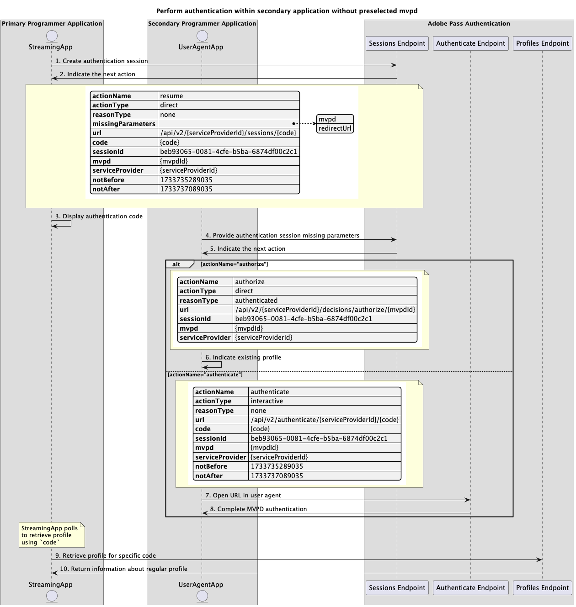

# Flux d’authentification de base effectué dans l’application secondaire {#basic-authentication-flow-performed-within-secondary-application}

>[!IMPORTANT]
>
> Le contenu de cette page est fourni à titre d’information uniquement. L’utilisation de cette API nécessite une licence Adobe actuelle. Aucune utilisation non autorisée n’est autorisée.

>[!IMPORTANT]
>
> L’implémentation de l’API REST V2 est limitée par la documentation [Mécanisme de limitation](/help/authentication/integration-guide-programmers/throttling-mechanism.md).

>[!MORELIKETHIS]
>
> Veillez également à consulter la [FAQ sur l’API REST V2](/help/authentication/integration-guide-programmers/rest-apis/rest-api-v2/rest-api-v2-faqs.md#authentication-phase-faqs-general).

Le **flux d’authentification** dans les droits d’authentification Adobe Pass permet à l’application de diffusion en continu de vérifier qu’un utilisateur dispose d’un compte MVPD valide. Pour ce faire, l’utilisateur doit disposer d’un compte MVPD actif et saisir des informations de connexion valides sur la page de connexion de MVPD.

Le flux d’authentification est requis dans les cas suivants :

* Lorsque l’utilisateur ouvre une application pour la première fois.
* Lorsque l’authentification précédente de l’utilisateur a expiré.
* Lorsque l’utilisateur se déconnecte du compte MVPD.
* Lorsque l’utilisateur souhaite s’authentifier avec un autre MVPD.

Dans tous ces cas, l’application appelant l’un des points d’entrée de profils reçoit une réponse vide pour un ou plusieurs profils, mais pour différents MVPD.

Le **flux d’authentification** nécessite qu’un agent utilisateur (navigateur) effectue une série d’appels de l’application vers le serveur principal Adobe Pass, puis vers la page de connexion MVPD, et enfin vers l’application. Ce flux peut inclure plusieurs redirections vers les systèmes MVPD et la gestion des cookies ou des sessions stockés pour chaque domaine, ce qui peut être difficile à réaliser et à sécuriser sans agent utilisateur.

En fonction des fonctionnalités de l’application principale (application de diffusion en continu) permettant de prendre en charge l’interaction des utilisateurs pour sélectionner un MVPD et s’authentifier avec le MVPD sélectionné dans un agent utilisateur, les scénarios d’authentification sont les suivants :

* [Authentification dans l’application principale](rest-api-v2-basic-authentication-primary-application-flow.md)
* [Authentification dans l’application secondaire avec mvpd présélectionné](./rest-api-v2-basic-authentication-secondary-application-flow.md)
* [Effectuer l’authentification dans l’application secondaire sans mvpd présélectionné](./rest-api-v2-basic-authentication-secondary-application-flow.md)

## Authentification dans l’application secondaire avec mvpd présélectionné {#perform-authentication-within-secondary-application-with-preselected-mvpd}

### Conditions préalables {#prerequisites-perform-authentication-within-secondary-application-with-preselected-mvpd}

Avant de démarrer le flux d’authentification dans une application principale et de le terminer par l’interaction de l’utilisateur dans une application secondaire, assurez-vous que les conditions préalables suivantes sont remplies :

* L’application de diffusion en continu doit sélectionner un MVPD.
* L’application de diffusion en continu doit lancer une session d’authentification pour se connecter avec le MVPD sélectionné.
* L’application secondaire doit s’authentifier avec le MVPD sélectionné dans un agent utilisateur.

>[!IMPORTANT]
>
> Hypothèses
>
>  
> 
> * L’application de diffusion en continu prend en charge l’interaction utilisateur pour sélectionner un MVPD.
> * L’application secondaire (généralement sur un appareil secondaire) prend en charge l’interaction utilisateur pour l’authentification avec le MVPD sélectionné dans un agent utilisateur.

### Workflow {#workflow-perform-authentication-within-secondary-application-with-preselected-mvpd}

Suivez les étapes données pour implémenter le flux d’authentification de base effectué dans une application secondaire avec un MVPD présélectionné, comme illustré dans le diagramme ci-dessous.

*Authentification dans l’application secondaire avec mvpd présélectionné*

1. **Créer une session d’authentification :** l’application de diffusion en continu rassemble toutes les données nécessaires pour lancer une session d’authentification en appelant le point d’entrée Sessions.

   >[!IMPORTANT]
   >
   > Consultez la documentation de l’API [Créer une session d’authentification](../../apis/sessions-apis/rest-api-v2-sessions-apis-create-authentication-session.md) pour plus d’informations sur :
   > 
   > * Tous les paramètres _obligatoires_ tels que `serviceProvider`, `mvpd`, `domainName` et `redirectUrl`
   > * Tous les en-têtes _obligatoires_ tels que `Authorization`, `AP-Device-Identifier`
   > * Tous les paramètres _facultatifs_ et en-têtes
   >
   >  
   > 
   > L’application de diffusion en continu doit fournir tous les paramètres requis en un seul appel lors de la création de la session d’authentification.

1. **Indiquez l’action suivante :** la réponse du point d’entrée des sessions contient les données nécessaires pour guider l’application de diffusion en continu concernant l’action suivante.

   >[!IMPORTANT]
   >
   > Reportez-vous à la documentation de l’API [Créer une session d’authentification](../../apis/sessions-apis/rest-api-v2-sessions-apis-create-authentication-session.md) pour plus d’informations sur les informations fournies dans une réponse de session.
   > 
   >  
   > 
   > Le point d’entrée Sessions valide les données de requête pour s’assurer que les conditions de base sont remplies :
   >
   > * Les paramètres _obligatoire_ et les en-têtes doivent être valides.
   > * L’intégration entre les `serviceProvider` et `mvpd` fournis doit être active.
   >
   >  
   > 
   > Si la validation échoue, une réponse d’erreur est générée, fournissant des informations supplémentaires qui sont conformes à la documentation [Codes d’erreur améliorés](../../../../features-standard/error-reporting/enhanced-error-codes.md).

1. **Poursuivre avec les flux de décisions :** la réponse du point d’entrée des sessions contient les données suivantes :
   * L’attribut `actionName` est défini sur « autoriser ».
   * L’attribut `actionType` est défini sur « direct ».

   Si le serveur principal Adobe Pass identifie un profil valide, l’application de diffusion en continu n’a pas besoin de s’authentifier à nouveau avec le MVPD sélectionné, car il existe déjà un profil qui peut être utilisé pour les flux de décisions suivants.

1. **Afficher le code d’authentification :** la réponse du point d’entrée des sessions contient les données suivantes :
   * `code` qui peut être utilisé pour reprendre la session d’authentification dans une application secondaire.
   * L’attribut `actionName` est défini sur « authentifier ».
   * L’attribut `actionType` est défini sur « interactif ».

   Si le serveur principal Adobe Pass n’identifie pas de profil valide, l’application de diffusion en continu affiche les `code` qui peuvent être utilisées pour reprendre la session d’authentification dans une application secondaire.

1. **Valider le code d’authentification :** l’application secondaire valide le `code` fourni par l’utilisateur pour s’assurer qu’elle peut procéder à l’authentification MVPD dans l’agent utilisateur.

   >[!IMPORTANT]
   >
   > Consultez la documentation de l’API [Récupération des informations de session d’authentification](../../apis/sessions-apis/rest-api-v2-sessions-apis-retrieve-authentication-session-information-using-code.md) pour plus d’informations sur :
   >
   > * Tous les paramètres _obligatoires_ tels que `serviceProvider` et `code`
   > * Tous les en-têtes _obligatoires_, comme `Authorization`
   > * Tous les paramètres _facultatifs_ et en-têtes

1. **Renvoyer des informations sur la session d’authentification :** la réponse du point d’entrée Sessions contient les données suivantes :
   * L’attribut `existing` contient les paramètres existants déjà fournis.
   * L’attribut `missing` contient les paramètres manquants qui doivent être fournis pour terminer le flux d’authentification.

   >[!IMPORTANT]
   >
   > Reportez-vous à la documentation de l’API [&#x200B; Récupération des informations de session d’authentification &#x200B;](../../apis/sessions-apis/rest-api-v2-sessions-apis-retrieve-authentication-session-information-using-code.md) pour plus d’informations sur les informations fournies dans une réponse de validation de session.
   >
   >  
   >
   > Le point d’entrée Sessions valide les données de requête pour s’assurer que les conditions de base sont remplies :
   >
   > * Les paramètres _obligatoire_ et les en-têtes doivent être valides.
   >
   >  
   >
   > Si la validation échoue, une réponse d’erreur est générée, fournissant des informations supplémentaires qui sont conformes à la documentation [Codes d’erreur améliorés](../../../../features-standard/error-reporting/enhanced-error-codes.md).

   >[!TIP]
   >
   > L’application secondaire peut informer les utilisateurs que le `code` utilisé n’est pas valide en cas de réponse d’erreur indiquant une session d’authentification manquante et leur conseiller d’en réessayer un nouveau.

1. **Ouvrir l’URL dans l’agent utilisateur :** l’application secondaire ouvre un agent utilisateur pour charger l’`url` calculée par l’utilisateur lui-même et envoie une requête au point d’entrée d’authentification. Ce flux peut inclure plusieurs redirections et conduire finalement l’utilisateur à la page de connexion de MVPD et fournir des informations d’identification valides.

   >[!IMPORTANT]
   >
   > Consultez la documentation de l’API [Effectuer une authentification dans l’agent utilisateur](../../apis/sessions-apis/rest-api-v2-sessions-apis-perform-authentication-in-user-agent.md) pour plus d’informations sur :
   >
   > * Tous les paramètres _obligatoires_ tels que `serviceProvider` et `code`
   > * Tous les paramètres _facultatifs_ et en-têtes

1. **Terminer l’authentification MVPD :** si le flux d’authentification est réussi, l’interaction de l’agent utilisateur enregistre un profil standard sur le serveur principal Adobe Pass et atteint le `redirectUrl` fourni.

1. **Récupérer le profil pour un code spécifique :** l’application de diffusion en continu rassemble toutes les données nécessaires pour récupérer les informations de profil en envoyant une requête au point d’entrée Profils .

   >[!IMPORTANT]
   >
   > Consultez la documentation de l’API [Récupérer le profil pour un code spécifique](../../apis/profiles-apis/rest-api-v2-profiles-apis-retrieve-profile-for-specific-code.md) pour plus d’informations sur :
   > 
   > * Tous les paramètres _obligatoires_ tels que `serviceProvider` et `code`
   > * Tous les en-têtes _obligatoires_ tels que `Authorization`, `AP-Device-Identifier`
   > * Tous les paramètres _facultatifs_ et en-têtes

   >[!TIP]
   >
   > L’application de diffusion en continu doit implémenter un mécanisme d’interrogation à l’aide de l’`code` pour vérifier si le profil standard a bien été généré et enregistré.

1. **Renvoyer des informations sur le profil normal :** la réponse de point d’entrée des profils contient des informations sur le profil normal associé aux paramètres et en-têtes reçus.

   >[!IMPORTANT]
   >
   > Reportez-vous à la documentation de l’API [Récupérer le profil pour un code spécifique](../../apis/profiles-apis/rest-api-v2-profiles-apis-retrieve-profile-for-specific-code.md) pour plus d’informations sur les informations fournies dans une réponse de profil.
   > 
   >  
   > 
   > Le point d’entrée des profils valide les données de requête pour s’assurer que les conditions de base sont remplies :
   >
   > * Les paramètres _obligatoire_ et les en-têtes doivent être valides.
   >
   >  
   > 
   > Si la validation échoue, une réponse d’erreur est générée, fournissant des informations supplémentaires qui sont conformes à la documentation [Codes d’erreur améliorés](../../../../features-standard/error-reporting/enhanced-error-codes.md).

## Effectuer l’authentification dans l’application secondaire sans mvpd présélectionné {#perform-authentication-within-secondary-application-without-preselected-mvpd}

### Conditions préalables {#prerequisites-perform-authentication-within-secondary-application-without-preselected-mvpd}

Avant de démarrer le flux d’authentification dans une application principale et de le terminer par l’interaction de l’utilisateur dans une application secondaire, assurez-vous que les conditions préalables suivantes sont remplies :

* L’application de diffusion en continu doit lancer une session d’authentification lorsqu’elle doit se connecter.
* L’application secondaire doit sélectionner un MVPD.
* L’application secondaire doit s’authentifier avec le MVPD sélectionné dans un agent utilisateur.

>[!IMPORTANT]
>
> Hypothèses
>
>  
> 
> * L’application secondaire (généralement sur un appareil secondaire) prend en charge l’interaction de l’utilisateur pour sélectionner un MVPD.
> * L’application secondaire (généralement sur un appareil secondaire) prend en charge l’interaction utilisateur pour l’authentification avec le MVPD sélectionné dans un agent utilisateur.

### Workflow {#workflow-perform-authentication-within-secondary-application-without-preselected-mvpd}

Suivez les étapes données pour implémenter le flux d’authentification de base effectué dans une application secondaire sans MVPD présélectionné, comme illustré dans le diagramme ci-dessous.

*Effectuer l’authentification dans l’application secondaire sans mvpd présélectionné*

1. **Créer une session d’authentification :** l’application de diffusion en continu collecte certaines des données nécessaires pour lancer une session d’authentification en appelant le point d’entrée Sessions.

   >[!IMPORTANT]
   >
   > Consultez la documentation de l’API [Créer une session d’authentification](../../apis/sessions-apis/rest-api-v2-sessions-apis-create-authentication-session.md) pour plus d’informations sur :
   >
   > * Tous les paramètres _obligatoires_ comme `serviceProvider`
   > * Tous les en-têtes _obligatoires_ tels que `Authorization`, `AP-Device-Identifier`
   > * Tous les paramètres _facultatifs_ et en-têtes
   >
   >  
   > 
   > L’application de diffusion en continu ne peut pas fournir tous les paramètres requis en un seul appel lors de la création de la session d’authentification.

1. **Indiquez l’action suivante :** la réponse du point d’entrée des sessions contient les données nécessaires pour guider l’application de diffusion en continu concernant l’action suivante :
   * `code` qui peut être utilisé pour reprendre la session d’authentification dans une application secondaire.
   * L’attribut `actionName` est défini sur « resume ».
   * L’attribut `actionType` est défini sur « direct ».

   >[!IMPORTANT]
   >
   > Reportez-vous à la documentation de l’API [Créer une session d’authentification](../../apis/sessions-apis/rest-api-v2-sessions-apis-create-authentication-session.md) pour plus d’informations sur les informations fournies dans une réponse de session.
   > 
   >  
   > 
   > Le point d’entrée Sessions valide les données de requête pour s’assurer que les conditions de base sont remplies :
   >
   > * Les paramètres _obligatoire_ et les en-têtes doivent être valides.
   >
   >  
   > 
   > Si la validation échoue, une réponse d’erreur est générée, fournissant des informations supplémentaires qui sont conformes à la documentation [Codes d’erreur améliorés](../../../../features-standard/error-reporting/enhanced-error-codes.md).

1. **Afficher le code d’authentification :** l’application de diffusion en continu affiche les `code` qui peuvent être utilisées pour reprendre la session d’authentification dans une application secondaire.

1. **Fournir des paramètres manquants pour la session d’authentification :** l’application secondaire collecte toutes les données manquantes requises pour reprendre la session d’authentification et appelle le point d’entrée Sessions.

   >[!IMPORTANT]
   >
   > Consultez la documentation de l’API [Reprendre l’authentification](../../apis/sessions-apis/rest-api-v2-sessions-apis-resume-authentication-session.md) pour plus d’informations sur :
   >
   > * Tous les paramètres _obligatoires_ tels que `serviceProvider`, `mvpd`, `domainName` et `redirectUrl`
   > * Tous les en-têtes _obligatoires_ tels que `Authorization`, `AP-Device-Identifier`
   > * Tous les paramètres _facultatifs_ et en-têtes

1. **Indiquez l’action suivante :** la réponse du point d’entrée des sessions contient les données nécessaires pour guider l’application de diffusion en continu concernant l’action suivante.

   >[!IMPORTANT]
   >
   > Reportez-vous à la documentation de l’API [Reprendre l’authentification de session](../../apis/sessions-apis/rest-api-v2-sessions-apis-resume-authentication-session.md) pour plus d’informations sur les informations fournies dans une réponse de session.
   > 
   >  
   > 
   > Le point d’entrée Sessions valide les données de requête pour s’assurer que les conditions de base sont remplies :
   >
   > * Les paramètres _obligatoire_ et les en-têtes doivent être valides.
   > * L’intégration entre les `serviceProvider` et `mvpd` fournis doit être active.
   >
   >  
   > 
   > Si la validation échoue, une réponse d’erreur est générée, fournissant des informations supplémentaires qui sont conformes à la documentation [Codes d’erreur améliorés](../../../../features-standard/error-reporting/enhanced-error-codes.md).

   >[!TIP]
   >
   > L’application secondaire peut informer les utilisateurs que le `code` utilisé n’est pas valide en cas de réponse d’erreur indiquant une session d’authentification manquante et leur conseiller d’en réessayer un nouveau.

1. **Indiquer le profil existant :** la réponse du point d’entrée des sessions contient les données suivantes :
   * L’attribut `actionName` est défini sur « autoriser ».
   * L’attribut `actionType` est défini sur « direct ».

   Si le serveur principal Adobe Pass identifie un profil valide, l’application de diffusion en continu n’a pas besoin de s’authentifier à nouveau avec le MVPD sélectionné, car il existe déjà un profil qui peut être utilisé pour les flux de décisions suivants.

1. **Ouvrir l’URL dans l’agent utilisateur :** la réponse de point d’entrée des sessions contient les données suivantes :
   * `url` qui peut être utilisé pour lancer l’authentification interactive dans la page de connexion de MVPD.
   * L’attribut `actionName` est défini sur « authentifier ».
   * L’attribut `actionType` est défini sur « interactif ».

   Si le serveur principal d’Adobe Pass n’identifie pas de profil valide, l’application secondaire ouvre un agent utilisateur pour charger le `url` fourni, envoyant une requête au point d’entrée Authentifier. Ce flux peut inclure plusieurs redirections et conduire finalement l’utilisateur à la page de connexion de MVPD et fournir des informations d’identification valides.

1. **Terminer l’authentification MVPD :** si le flux d’authentification est réussi, l’interaction de l’agent utilisateur enregistre un profil standard sur le serveur principal Adobe Pass et atteint le `redirectUrl` fourni.

1. **Récupérer le profil pour un code spécifique :** l’application de diffusion en continu rassemble toutes les données nécessaires pour récupérer les informations de profil en envoyant une requête au point d’entrée Profils .

   >[!IMPORTANT]
   >
   > Consultez la documentation de l’API [Récupérer le profil pour un code spécifique](../../apis/profiles-apis/rest-api-v2-profiles-apis-retrieve-profile-for-specific-code.md) pour plus d’informations sur :
   >
   > * Tous les paramètres _obligatoires_ tels que `serviceProvider` et `code`
   > * Tous les en-têtes _obligatoires_ tels que `Authorization`, `AP-Device-Identifier`
   > * Tous les paramètres _facultatifs_ et en-têtes

   >[!TIP]
   >
   > L’application de diffusion en continu doit implémenter un mécanisme d’interrogation à l’aide de l’`code` pour vérifier si le profil standard a bien été généré et enregistré.

1. **Renvoyer des informations sur le profil normal :** la réponse de point d’entrée des profils contient des informations sur le profil normal associé aux paramètres et en-têtes reçus.

   >[!IMPORTANT]
   >
   > Reportez-vous à la documentation de l’API [Récupérer le profil pour un code spécifique](../../apis/profiles-apis/rest-api-v2-profiles-apis-retrieve-profile-for-specific-code.md) pour plus d’informations sur les informations fournies dans une réponse de profil.
   > 
   >  
   > 
   > Le point d’entrée des profils valide les données de requête pour s’assurer que les conditions de base sont remplies :
   >
   > * Les paramètres _obligatoire_ et les en-têtes doivent être valides.
   >
   >  
   > 
   > Si la validation échoue, une réponse d’erreur est générée, fournissant des informations supplémentaires qui sont conformes à la documentation [Codes d’erreur améliorés](../../../../features-standard/error-reporting/enhanced-error-codes.md).
