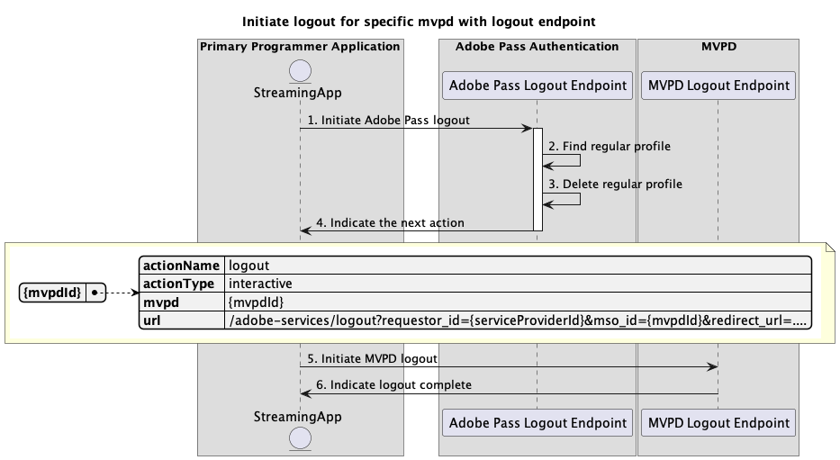

# Flux de déconnexion de base effectué dans l’application principale {#basic-logout-flow-performed-within-primary-application}

>[!IMPORTANT]
>
> Le contenu de cette page est fourni à titre d’information uniquement. L’utilisation de cette API nécessite une licence Adobe actuelle. Aucune utilisation non autorisée n’est autorisée.

>[!IMPORTANT]
>
> L’implémentation de l’API REST V2 est limitée par la documentation [Mécanisme de limitation](/help/authentication/integration-guide-programmers/throttling-mechanism.md).

Le **flux de déconnexion** dans les droits d’authentification Adobe Pass permet à l’application de diffusion en continu d’effectuer deux étapes principales :

* Supprimez les profils standard enregistrés sur le serveur principal d’Adobe Pass.
* Utilisez un agent utilisateur (navigateur) pour accéder au point d’entrée de la déconnexion de MVPD, ce qui déclenche un nettoyage du serveur principal de MVPD.

Le flux de déconnexion de base vous permet de rechercher les scénarios suivants :

* [Lancer la déconnexion pour un mvpd spécifique avec le point d’entrée de déconnexion](#initiate-logout-for-specific-mvpd-with-logout-endpoint)
* [Lancer la déconnexion pour un mvpd spécifique sans point d’entrée de déconnexion](#initiate-logout-for-specific-mvpd-without-logout-endpoint)

## Lancer la déconnexion pour un mvpd spécifique ayant un point d’entrée de déconnexion {#initiate-logout-for-specific-mvpd-with-logout-endpoint}

### Conditions préalables {#prerequisites-initiate-logout-for-specific-mvpd-with-logout-endpoint}

Avant de lancer la déconnexion pour un MVPD spécifique avec un point d’entrée de déconnexion, assurez-vous que les conditions préalables suivantes sont remplies :

* L’application de diffusion en continu doit avoir un profil standard valide qui a été créé avec succès pour le MVPD à l’aide de l’un des flux d’authentification de base :
   * [Authentification dans l’application principale](rest-api-v2-basic-authentication-primary-application-flow.md)
   * [Authentification dans l’application secondaire avec mvpd présélectionné](rest-api-v2-basic-authentication-secondary-application-flow.md)
   * [Effectuer l’authentification dans l’application secondaire sans mvpd présélectionné](rest-api-v2-basic-authentication-secondary-application-flow.md)
* L’application de diffusion en continu doit lancer le flux de déconnexion lorsqu’elle doit se déconnecter du MVPD.

>[!IMPORTANT]
>
> Hypothèses
>
>  
> 
> * Le MVPD prend en charge le flux de déconnexion et possède un point d’entrée de déconnexion.

### Workflow {#workflow-initiate-logout-for-specific-mvpd-with-logout-endpoint}

Suivez les étapes données pour implémenter le flux de déconnexion de base pour un MVPD spécifique avec un point d’entrée de déconnexion exécuté dans une application principale, comme illustré dans le diagramme ci-dessous.

*Lancer la déconnexion pour un mvpd spécifique avec le point d’entrée de déconnexion*

1. **Lancer la déconnexion d’Adobe Pass :** l’application de diffusion en continu rassemble toutes les données nécessaires pour lancer le flux de déconnexion en appelant le point d’entrée de déconnexion Adobe Pass.

   >[!IMPORTANT]
   >
   > Consultez la documentation de l’API [Lancer la déconnexion pour des API mvpd](../../apis/logout-apis/rest-api-v2-logout-apis-initiate-logout-for-specific-mvpd.md) spécifiques pour plus d’informations sur :
   >
   > * Tous les paramètres _obligatoires_ tels que `serviceProvider`, `mvpd` et `redirectUrl`
   > * Tous les en-têtes _obligatoires_ tels que `Authorization`, `AP-Device-Identifier`
   > * Tous les paramètres _facultatifs_ et en-têtes

1. **Rechercher un profil normal :** le serveur Adobe Pass identifie un profil valide en fonction des paramètres et des en-têtes reçus.

1. **Supprimer le profil normal :** le serveur Adobe Pass supprime le profil normal identifié du serveur principal d’Adobe Pass.

1. **Indiquez l’action suivante :** la réponse du point d’entrée de déconnexion Adobe Pass contient les données nécessaires pour guider l’application de diffusion en continu concernant l’action suivante :
   * L’attribut `url` est présent, car le MVPD prend en charge le flux de déconnexion.
   * L’attribut `actionName` est défini sur « déconnexion ».
   * L’attribut `actionType` est défini sur « interactif ».

   >[!IMPORTANT]
   >
   > Reportez-vous à la documentation de l’API [Lancer la déconnexion pour des API mvpd](../../apis/logout-apis/rest-api-v2-logout-apis-initiate-logout-for-specific-mvpd.md) spécifiques pour plus d’informations sur les informations fournies dans une réponse de déconnexion.
   > 
   >  
   > 
   > Le point d’entrée de la déconnexion Adobe Pass valide les données de la requête pour s’assurer que les conditions de base sont remplies :
   >
   > * Les paramètres _obligatoire_ et les en-têtes doivent être valides.
   > * L’intégration entre les `serviceProvider` et `mvpd` fournis doit être active.
   >
   >  
   > 
   > Si la validation échoue, une réponse d’erreur est générée, fournissant des informations supplémentaires qui sont conformes à la documentation [Codes d’erreur améliorés](../../../../features-standard/error-reporting/enhanced-error-codes.md).

1. **Lancer la déconnexion de MVPD :** l’application de diffusion en continu lit le `url` et utilise un agent utilisateur pour lancer le flux de déconnexion avec MVPD. Le flux peut inclure plusieurs redirections vers des systèmes MVPD. Néanmoins, le résultat est que le MVPD effectue son nettoyage interne et envoie la confirmation de déconnexion finale au serveur principal d’Adobe Pass.

1. **Indiquer la déconnexion terminée :** l’application de diffusion en continu peut attendre que l’agent utilisateur atteigne le `redirectUrl` fourni et l’utiliser comme signal pour afficher éventuellement un message spécifique sur l’interface utilisateur.

## Lancer la déconnexion pour un mvpd spécifique sans point d’entrée de déconnexion {#initiate-logout-for-specific-mvpd-without-logout-endpoint}

### Conditions préalables {#prerequisites-initiate-logout-for-specific-mvpd-without-logout-endpoint}

Avant de lancer la déconnexion pour un MVPD spécifique sans point d’entrée de déconnexion, assurez-vous que les conditions préalables suivantes sont remplies :

* L’application de diffusion en continu doit avoir un profil standard valide qui a été créé avec succès pour le MVPD à l’aide de l’un des flux d’authentification de base :
   * [Authentification dans l’application principale](rest-api-v2-basic-authentication-primary-application-flow.md)
   * [Authentification dans l’application secondaire avec mvpd présélectionné](rest-api-v2-basic-authentication-secondary-application-flow.md)
   * [Effectuer l’authentification dans l’application secondaire sans mvpd présélectionné](rest-api-v2-basic-authentication-secondary-application-flow.md)
* L’application de diffusion en continu doit lancer le flux de déconnexion lorsqu’elle doit se déconnecter du MVPD.

>[!IMPORTANT]
>
> Hypothèses
>
>  
> 
> * Le MVPD ne prend pas en charge le flux de déconnexion et ne dispose pas de point d’entrée de déconnexion.

### Workflow {#workflow-initiate-logout-for-specific-mvpd-without-logout-endpoint}

Suivez les étapes données pour implémenter le flux de déconnexion de base pour un MVPD spécifique sans point d’entrée de déconnexion effectué dans une application principale, comme illustré dans le diagramme ci-dessous.

*Lancer la déconnexion pour un mvpd spécifique sans point d’entrée de déconnexion*

1. **Lancer la déconnexion d’Adobe Pass :** l’application de diffusion en continu rassemble toutes les données nécessaires pour lancer le flux de déconnexion en appelant le point d’entrée de déconnexion Adobe Pass.

   >[!IMPORTANT]
   >
   > Consultez la documentation de l’API [Lancer la déconnexion pour des API mvpd](../../apis/logout-apis/rest-api-v2-logout-apis-initiate-logout-for-specific-mvpd.md) spécifiques pour plus d’informations sur :
   >
   > * Tous les paramètres _obligatoires_ tels que `serviceProvider`, `mvpd` et `redirectUrl`
   > * Tous les en-têtes _obligatoires_ tels que `Authorization`, `AP-Device-Identifier`
   > * Tous les paramètres _facultatifs_ et en-têtes

1. **Rechercher un profil normal :** le serveur Adobe Pass identifie un profil valide en fonction des paramètres et des en-têtes reçus.

1. **Supprimer le profil normal :** le serveur Adobe Pass supprime le profil normal identifié.

1. **Indiquez l’action suivante :** la réponse du point d’entrée de déconnexion Adobe Pass contient les données nécessaires pour guider l’application de diffusion en continu concernant l’action suivante :
   * L’attribut `url` est manquant, car le MVPD ne prend pas en charge le flux de déconnexion.
   * L’attribut `actionName` est défini sur « terminé ».
   * L’attribut `actionType` est défini sur « none ».

   >[!IMPORTANT]
   >
   > Reportez-vous à la documentation de l’API [Lancer la déconnexion pour des API mvpd](../../apis/logout-apis/rest-api-v2-logout-apis-initiate-logout-for-specific-mvpd.md) spécifiques pour plus d’informations sur les informations fournies dans une réponse de déconnexion.
   > 
   >  
   > 
   > Le point d’entrée de la déconnexion Adobe Pass valide les données de la requête pour s’assurer que les conditions de base sont remplies :
   >
   > * Les paramètres _obligatoire_ et les en-têtes doivent être valides.
   > * L’intégration entre les `serviceProvider` et `mvpd` fournis doit être active.
   >
   >  
   > 
   > Si la validation échoue, une réponse d’erreur est générée, fournissant des informations supplémentaires qui sont conformes à la documentation [Codes d’erreur améliorés](../../../../features-standard/error-reporting/enhanced-error-codes.md).

1. **Indiquer la déconnexion terminée :** l’application de diffusion en continu traite la réponse et peut l’utiliser pour afficher éventuellement un message spécifique sur l’interface utilisateur.
