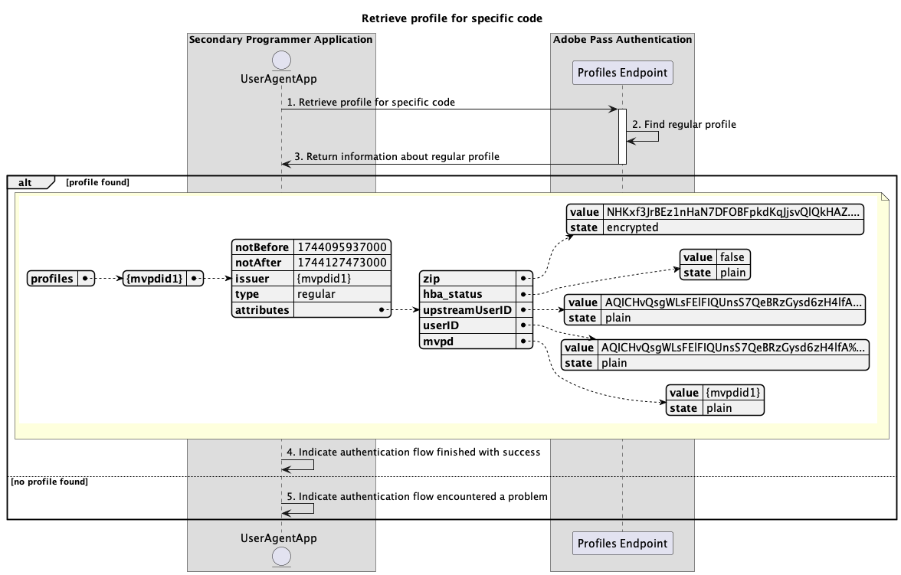

# Flux de profils de base exécuté dans l’application secondaire {#basic-profiles-flow-secondary-application}

>[!IMPORTANT]
>
> Le contenu de cette page est fourni à titre d’information uniquement. L’utilisation de cette API nécessite une licence Adobe actuelle. Aucune utilisation non autorisée n’est autorisée.

>[!IMPORTANT]
>
> L’implémentation de l’API REST V2 est limitée par la documentation [Mécanisme de limitation](/help/authentication/integration-guide-programmers/throttling-mechanism.md).

>[!MORELIKETHIS]
>
> Veillez également à consulter la [FAQ sur l’API REST V2](/help/authentication/integration-guide-programmers/rest-apis/rest-api-v2/rest-api-v2-faqs.md#authentication-phase-faqs-general).

Le **flux des profils** dans les droits d’authentification Adobe Pass permet à l’application secondaire d’accéder aux informations sur les connexions actives des utilisateurs.

Le flux des profils de base vous permet de rechercher les scénarios suivants :

* [Récupération du profil pour un code spécifique](#retrieve-profile-for-specific-code)

## Récupération du profil pour un code spécifique {#retrieve-profile-for-specific-code}

### Conditions préalables {#prerequisites-retrieve-profile-for-specific-code}

Avant de récupérer le profil pour un code d’authentification spécifique, assurez-vous que les conditions préalables suivantes sont remplies :

* L’application secondaire, qui dispose d’un `code` utilisé pour effectuer l’authentification interactive avec MVPD, souhaite récupérer le profil pour un code d’authentification spécifique.

### Workflow {#workflow-retrieve-profile-for-specific-code}

Suivez les étapes données pour implémenter le flux de récupération des profils de base pour un code d’authentification spécifique effectué dans une application secondaire, comme illustré dans le diagramme suivant.

*Récupérer le profil pour un code spécifique*

1. **Récupérer le profil pour un code spécifique :** l’application secondaire rassemble toutes les données nécessaires pour récupérer les informations de profil pour ce code d’authentification spécifique en envoyant une requête au point d’entrée Profils .

   >[!IMPORTANT]
   >
   > Consultez la documentation de l’API [Récupérer le profil pour un code spécifique](../../apis/profiles-apis/rest-api-v2-profiles-apis-retrieve-profile-for-specific-code.md) pour plus d’informations sur :
   >
   > * Tous les paramètres _obligatoires_ tels que `serviceProvider` et `code`
   > * Tous les en-têtes _obligatoires_, comme `Authorization`
   > * Tous les paramètres _facultatifs_ et en-têtes

1. **Rechercher un profil normal :** le serveur Adobe Pass identifie un profil valide en fonction des paramètres et des en-têtes reçus.

1. **Renvoyer des informations sur le profil normal :** la réponse de point d’entrée des profils contient des informations sur le profil trouvé associé aux paramètres et en-têtes reçus.

   >[!IMPORTANT]
   >
   > Reportez-vous à la documentation de l’API [Récupérer le profil pour un code spécifique](../../apis/profiles-apis/rest-api-v2-profiles-apis-retrieve-profile-for-specific-code.md) pour plus d’informations sur les informations fournies dans une réponse de profil.
   > 
   >  
   > 
   > Le point d’entrée des profils valide les données de requête pour s’assurer que les conditions de base sont remplies :
   >
   > * Les paramètres _obligatoire_ et les en-têtes doivent être valides.
   >
   >  
   > 
   > Si la validation échoue, une réponse d’erreur est générée, fournissant des informations supplémentaires qui sont conformes à la documentation [Codes d’erreur améliorés](../../../../features-standard/error-reporting/enhanced-error-codes.md).

1. **Indiquez que le flux d’authentification est terminé avec succès :** si la réponse de point d’entrée des profils contient un profil, l’application secondaire traite la réponse et peut l’utiliser pour afficher éventuellement un message spécifique sur l’interface utilisateur.

1. **Indiquez que le flux d’authentification a rencontré un problème :** si la réponse de point d’entrée des profils ne contient pas de profil, l’application secondaire traite la réponse et peut l’utiliser pour afficher éventuellement un message spécifique sur l’interface utilisateur.
