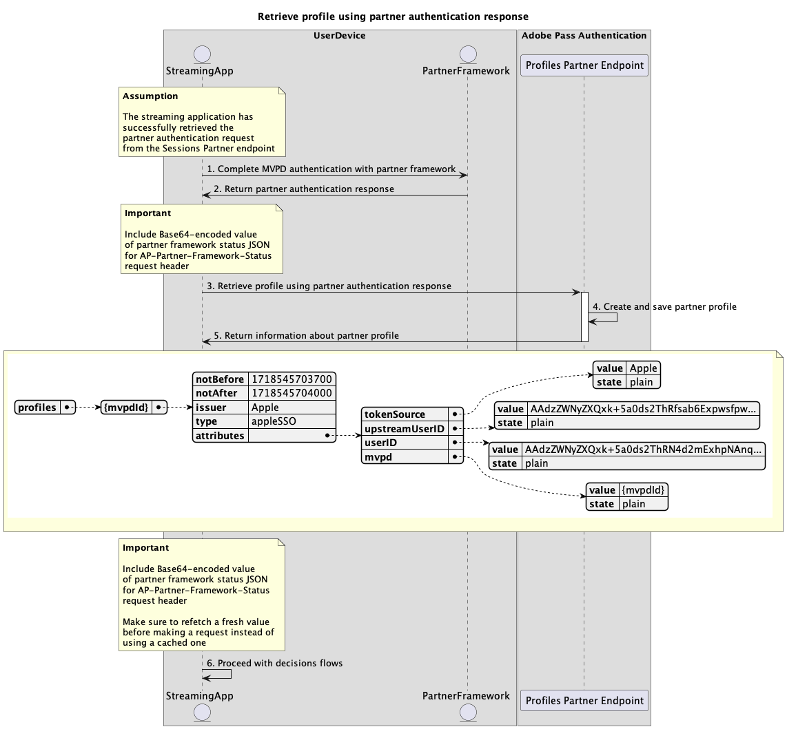

# Authentification unique à l’aide des flux de partenaires {#single-sign-on-partner-flows}

>[!IMPORTANT]
>
> Le contenu de cette page est fourni à titre d’information uniquement. L’utilisation de cette API nécessite une licence Adobe actuelle. Aucune utilisation non autorisée n’est autorisée.

>[!IMPORTANT]
>
> L’implémentation de l’API REST V2 est limitée par la documentation [Mécanisme de limitation](/help/authentication/integration-guide-programmers/throttling-mechanism.md).

>[!MORELIKETHIS]
>
> Veillez également à consulter la [FAQ sur l’API REST V2](/help/authentication/integration-guide-programmers/rest-apis/rest-api-v2/rest-api-v2-faqs.md#authentication-phase-faqs-general).

La méthode Partner permet à plusieurs applications d’utiliser une payload de statut de framework de partenaire pour obtenir l’authentification unique (SSO) au niveau de l’appareil lors de l’utilisation des services Adobe Pass.

Les applications sont chargées de récupérer la payload de statut du framework partenaire à l’aide de frameworks ou de bibliothèques spécifiques au partenaire en dehors des systèmes Adobe Pass.

Les applications sont chargées d’inclure cette payload de statut de framework de partenaire dans l’en-tête `AP-Partner-Framework-Status` pour toutes les requêtes qui la spécifient.

Pour plus d’informations sur `AP-Partner-Framework-Status`’en-tête , consultez la documentation [AP-Partner-Framework-Status](../../appendix/headers/rest-api-v2-appendix-headers-ap-partner-framework-status.md).

L’API REST d’authentification Adobe Pass V2 prend en charge l’authentification unique (SSO) du partenaire pour les utilisateurs finaux des applications clientes s’exécutant sur iOS, iPadOS ou tvOS.

Pour plus d’informations sur l’authentification unique (SSO) pour la plateforme Apple, reportez-vous à la documentation du [guide de cookie de l’authentification unique (API REST V2)](/help/authentication/integration-guide-programmers/features-standard/sso-access/partner-sso/apple-sso/apple-sso-cookbook-rest-api-v2.md) d’Apple .

## Récupérer la demande d’authentification du partenaire {#retrieve-partner-authentication-request}

### Conditions préalables {#prerequisites-retrieve-partner-authentication-request}

Avant de récupérer la demande d’authentification du partenaire, assurez-vous que les conditions préalables suivantes sont remplies :

* Le framework du partenaire doit sélectionner un MVPD.
* L’application de diffusion en continu doit obtenir les informations de statut du framework partenaire à partir du framework partenaire et les transmettre au serveur Adobe Pass.
* L’application de diffusion en continu doit obtenir la demande d’authentification du partenaire du serveur Adobe Pass et la transmettre au framework du partenaire.

>[!IMPORTANT]
>
> Hypothèses
> 
>  
> 
> * Le framework de partenaire prend en charge l’interaction des utilisateurs et utilisatrices pour sélectionner un MVPD.
> * Le framework de partenaire prend en charge l’interaction utilisateur pour l’authentification avec le MVPD sélectionné.
> * Le framework de partenaire fournit des informations sur les autorisations d’utilisateur et les fournisseurs.

### Workflow {#workflow-retrieve-partner-authentication-request}

Exécutez les étapes données pour récupérer la demande d’authentification du partenaire, comme illustré dans le diagramme suivant.

*Récupérer la demande d’authentification du partenaire*

1. **Récupérer l’état du framework partenaire :** l’application de diffusion en continu appelle le framework partenaire, en dehors des systèmes Adobe Pass, pour obtenir les autorisations utilisateur et les informations sur le fournisseur.

1. **Renvoyer les informations de statut du framework du partenaire :** l’application de diffusion en continu valide les données de réponse pour s’assurer que les conditions de base sont remplies :
   * Le statut d’accès de l’autorisation utilisateur est accordé.
   * L’identifiant de mappage du fournisseur d’utilisateurs est présent et valide.
   * La date d’expiration du profil du fournisseur d’utilisateurs (si disponible) est valide.

1. **Récupérer la demande d’authentification du partenaire :** l’application de diffusion en continu rassemble toutes les données nécessaires pour lancer une session d’authentification en appelant le point d’entrée Sessions Partner .

   >[!IMPORTANT]
   >
   > Consultez la documentation de l’API [Récupération de la demande d’authentification du partenaire](../../apis/partner-single-sign-on-apis/rest-api-v2-partner-single-sign-on-apis-retrieve-partner-authentication-request.md) pour plus d’informations sur :
   >
   > * Tous les paramètres _obligatoires_ tels que `serviceProvider` et `partner`
   > * Tous les en-têtes _obligatoires_ tels que `Authorization`, `AP-Device-Identifier`, `Content-Type`, `X-Device-Info` et `AP-Partner-Framework-Status`
   > * Tous les en-têtes et paramètres _facultatifs_
   >
   >  
   >
   > L’application de diffusion en continu doit s’assurer qu’elle inclut une valeur valide pour le statut du framework du partenaire avant d’effectuer une requête.
   >
   >  
   > 
   > Pour plus d’informations sur `AP-Partner-Framework-Status`’en-tête , consultez la documentation [AP-Partner-Framework-Status](../../appendix/headers/rest-api-v2-appendix-headers-ap-partner-framework-status.md).

1. **Indiquez l’action suivante :** la réponse du point d’entrée du partenaire Sessions contient les données nécessaires pour guider l’application de diffusion en continu concernant l’action suivante.

   >[!IMPORTANT]
   >
   > Reportez-vous à la documentation de l’API [Récupération de la requête d’authentification du partenaire](../../apis/partner-single-sign-on-apis/rest-api-v2-partner-single-sign-on-apis-retrieve-partner-authentication-request.md) pour plus d’informations sur les informations fournies dans une réponse de session.
   > 
   >  
   > 
   > Le point d’entrée du partenaire Sessions valide les données de requête pour s’assurer que les conditions de base sont remplies :
   >
   > * Les paramètres _obligatoire_ et les en-têtes doivent être valides.
   > * L’intégration entre les `serviceProvider` et `mvpd` fournis doit être active.
   >
   >  
   > 
   > Si la validation de base échoue, une réponse d’erreur est générée, fournissant des informations supplémentaires conformes à la documentation [Codes d’erreur améliorés](../../../../features-standard/error-reporting/enhanced-error-codes.md).
   >
   >  
   >
   > Le point d’entrée du partenaire Sessions valide les données de requête pour s’assurer que les conditions d’authentification unique du partenaire sont remplies :
   >
   >  * La configuration de l’authentification unique du partenaire dans le serveur Adobe Pass doit être valide et activée.
   >  * La payload de statut du framework du partenaire reçue via l’en-tête [AP-Partner-Framework-Status](../../appendix/headers/rest-api-v2-appendix-headers-ap-partner-framework-status.md) doit être valide.
   >
   >  
   >
   > Si la validation de l’authentification unique du partenaire échoue, la réponse est définie par défaut sur le flux d’authentification de base.

1. **Poursuivez le flux de récupération des profils à l’aide de la réponse d’authentification du partenaire :** la réponse du point d’entrée du partenaire Sessions contient les données suivantes :
   * L’attribut `actionName` est défini sur « partner_profile ».
   * L’attribut `actionType` est défini sur « direct ».
   * L’attribut `authenticationRequest - type` inclut le protocole de sécurité utilisé par le framework de partenaire pour la connexion à MVPD (actuellement défini sur SAML uniquement).
   * L’attribut `authenticationRequest - request` inclut la requête SAML transmise au framework du partenaire.
   * L’attribut `authenticationRequest - attributesNames` inclut les attributs SAML transmis au framework du partenaire.

   Si le serveur principal Adobe Pass n’identifie pas de profil valide et que la validation de l’authentification unique du partenaire réussit, l’application de diffusion en continu reçoit une réponse avec des actions et des données à transmettre au framework du partenaire pour démarrer le flux d’authentification avec MVPD.

   Pour plus d’informations sur le flux de récupération du profil à l’aide d’une réponse d’authentification du partenaire, reportez-vous à la section [Créer et récupérer un profil à l’aide d’une réponse d’authentification du partenaire](#create-and-retrieve-profile-using-partner-authentication-response).

1. **Poursuivre avec le flux d’authentification de base :** la réponse du point d’entrée du partenaire Sessions contient les données suivantes :
   * L’attribut `actionName` est défini sur « authentifier » ou « reprendre ».
   * L’attribut `actionType` est défini sur « interactif » ou « direct ».

   Si le serveur principal d’Adobe Pass n’identifie pas de profil valide et que la validation de l’authentification unique du partenaire échoue, le serveur Adobe Pass revient au flux d’authentification de base.

   Pour plus d’informations sur le flux d’authentification de base, reportez-vous aux documents suivants :
   * [Authentification dans l’application principale](../basic-access-flows/rest-api-v2-basic-authentication-primary-application-flow.md)
   * [Authentification dans l’application secondaire avec mvpd présélectionné](../basic-access-flows/rest-api-v2-basic-authentication-secondary-application-flow.md)
   * [Effectuer l’authentification dans l’application secondaire sans mvpd présélectionné](../basic-access-flows/rest-api-v2-basic-authentication-secondary-application-flow.md)

1. **Poursuivre avec les flux de décisions :** la réponse du point d’entrée du partenaire Sessions contient les données suivantes :
   * L’attribut `actionName` est défini sur « autoriser ».
   * L’attribut `actionType` est défini sur « direct ».

   Si le serveur principal Adobe Pass identifie un profil valide, l’application de diffusion en continu n’a pas besoin de s’authentifier à nouveau avec le MVPD sélectionné, car il existe déjà un profil qui peut être utilisé pour les flux de décisions suivants.

   >[!IMPORTANT]
   >
   > L’application de diffusion en continu doit s’assurer qu’elle inclut une valeur valide pour le statut du framework du partenaire avant d’effectuer une requête.
   >
   >  
   > 
   > Pour plus d’informations sur `AP-Partner-Framework-Status`’en-tête , consultez la documentation [AP-Partner-Framework-Status](../../appendix/headers/rest-api-v2-appendix-headers-ap-partner-framework-status.md).

## Créer et récupérer un profil à l’aide de la réponse d’authentification du partenaire {#create-and-retrieve-profile-using-partner-authentication-response}

### Conditions préalables {#prerequisites-create-and-retrieve-profile-using-partner-authentication-response}

Avant de récupérer le profil à l’aide d’une réponse d’authentification du partenaire, assurez-vous que les conditions préalables suivantes sont remplies :

* Le framework du partenaire doit effectuer l’authentification avec le MVPD sélectionné.
* L’application de diffusion en continu doit obtenir la réponse d’authentification du partenaire ainsi que des informations sur l’état du framework partenaire à partir du framework partenaire et les transmettre au serveur Adobe Pass.

>[!IMPORTANT]
>
> Hypothèse
>
> * Le framework de partenaire prend en charge l’interaction des utilisateurs et utilisatrices pour sélectionner un MVPD.
> * Le framework de partenaire prend en charge l’interaction utilisateur pour l’authentification avec le MVPD sélectionné.
> * Le framework de partenaire fournit des informations sur les autorisations d’utilisateur et les fournisseurs.

### Workflow {#workflow-create-and-retrieve-profile-using-partner-authentication-response}

Suivez les étapes données pour implémenter le flux de récupération des profils à l’aide d’une réponse d’authentification du partenaire, comme illustré dans le diagramme suivant.

*Créer et récupérer un profil authentifié à l’aide de la réponse d’authentification du partenaire*

1. **Terminer l’authentification MVPD avec le framework du partenaire :** si le flux d’authentification est réussi, l’interaction du framework du partenaire avec le MVPD produit une réponse d’authentification du partenaire (réponse SAML) qui est renvoyée avec les informations de statut du framework du partenaire.

1. **Réponse d’authentification du partenaire de retour :** l’application de diffusion en continu valide les données de réponse pour s’assurer que les conditions de base sont remplies :
   * Le statut d’accès de l’autorisation utilisateur est accordé.
   * L’identifiant de mappage du fournisseur d’utilisateurs est présent et valide.
   * La date d’expiration du profil du fournisseur d’utilisateurs (si disponible) est valide.

1. **Créer et récupérer un profil à l’aide de la réponse d’authentification du partenaire :** l’application de diffusion en continu rassemble toutes les données nécessaires pour créer et récupérer un profil en appelant le point d’entrée Profiles Partner .

   >[!IMPORTANT]
   >
   > Consultez la documentation de l’API [Créer et récupérer un profil à l’aide de la réponse d’authentification du partenaire](../../apis/partner-single-sign-on-apis/rest-api-v2-partner-single-sign-on-apis-retrieve-profile-using-partner-authentication-response.md) pour plus d’informations sur :
   >
   > * Tous les paramètres _obligatoires_ tels que `serviceProvider`, `partner` et `SAMLResponse`
   > * Tous les en-têtes _obligatoires_ tels que `Authorization`, `AP-Device-Identifier`, `Content-Type`, `X-Device-Info` et `AP-Partner-Framework-Status`
   > * Tous les en-têtes et paramètres _facultatifs_
   >
   >  
   > 
   > L’application de diffusion en continu doit s’assurer qu’elle inclut une valeur valide pour le statut du framework du partenaire avant d’effectuer une requête.
   >
   >  
   > 
   > Pour plus d’informations sur `AP-Partner-Framework-Status`’en-tête , consultez la documentation [AP-Partner-Framework-Status](../../appendix/headers/rest-api-v2-appendix-headers-ap-partner-framework-status.md).

1. **Créer et enregistrer le profil du partenaire :** le serveur Adobe Pass crée et enregistre un profil de partenaire une fois que toutes les conditions sont remplies.

1. **Renvoyer des informations sur le profil du partenaire :** la réponse de point d’entrée des profils contient des informations sur le profil du partenaire, y compris l’attribut `type` défini sur « appleSSO ».

   >[!IMPORTANT]
   >
   > Reportez-vous à la documentation de l’API [Créer et récupérer un profil à l’aide de la réponse d’authentification du partenaire](../../apis/partner-single-sign-on-apis/rest-api-v2-partner-single-sign-on-apis-retrieve-profile-using-partner-authentication-response.md) pour plus d’informations sur les informations fournies dans une réponse de profil.
   > 
   >  
   > 
   > Le point d’entrée du partenaire Profiles valide les données de la requête pour s’assurer que les conditions de base sont remplies :
   >
   > * Les paramètres _obligatoire_ et les en-têtes doivent être valides.
   > * L’intégration entre les `serviceProvider` et `mvpd` fournis doit être active.
   >
   >  
   > 
   > Si la validation échoue, une réponse d’erreur est générée, fournissant des informations supplémentaires qui sont conformes à la documentation [Codes d’erreur améliorés](../../../../features-standard/error-reporting/enhanced-error-codes.md).
   >
   >  
   >
   > Le point d’entrée Partenaire des profils valide les données de requête pour s’assurer que les conditions d’authentification unique du partenaire sont remplies :
   >
   >  * La configuration de l’authentification unique du partenaire dans le serveur Adobe Pass doit être valide et activée.
   >  * La payload de statut du framework du partenaire reçue via l’en-tête [AP-Partner-Framework-Status](../../appendix/headers/rest-api-v2-appendix-headers-ap-partner-framework-status.md) doit être valide.
   >
   >  
   >
   > Si la validation de l’authentification unique du partenaire échoue, la réponse est définie par défaut sur le flux de récupération de profil de base.

1. **Poursuivre avec les flux de décisions :** l’application de diffusion en continu peut continuer avec les flux de décisions suivants.

   >[!IMPORTANT]
   >
   > L’application de diffusion en continu doit s’assurer qu’elle inclut une valeur valide pour le statut du framework du partenaire avant d’effectuer une requête.
   >
   >  
   > 
   > Pour plus d’informations sur `AP-Partner-Framework-Status`’en-tête , consultez la documentation [AP-Partner-Framework-Status](../../appendix/headers/rest-api-v2-appendix-headers-ap-partner-framework-status.md).
