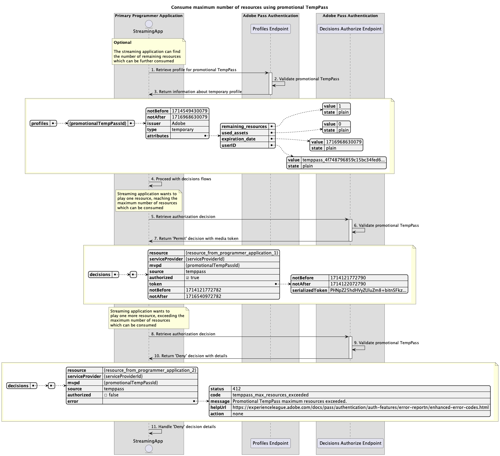

# Flux d’accès temporaires {#temporary-access-flows}

>[!IMPORTANT]
>
> Le contenu de cette page est fourni à titre d’information uniquement. L’utilisation de cette API nécessite une licence Adobe actuelle. Aucune utilisation non autorisée n’est autorisée.

>[!IMPORTANT]
>
> L’implémentation de l’API REST V2 est limitée par la documentation [Mécanisme de limitation](/help/authentication/integration-guide-programmers/throttling-mechanism.md).

>[!MORELIKETHIS]
>
> Veillez également à consulter la [FAQ sur l’API REST V2](/help/authentication/integration-guide-programmers/rest-apis/rest-api-v2/rest-api-v2-faqs.md#authentication-phase-faqs-general).

TempPass permet aux programmeurs de fournir un accès temporaire à leur contenu protégé sans demander aux utilisateurs de s’authentifier à l’aide d’un compte MVPD valide.

Pour plus d’informations sur la fonctionnalité TempPass, consultez la documentation de [TempPass](../../../../features-premium/temporary-access/temp-pass-feature.md).

Les flux d’accès temporaires vous permettent de rechercher les scénarios suivants :

* [Récupérer des décisions d’autorisation à l’aide du TempPass de base](#retrieve-authorization-decisions-using-basic-temppass)
* [Récupérer des décisions d’autorisation à l’aide d’un TempPass promotionnel](#retrieve-authorization-decisions-using-promotional-temppass)
* [Utiliser le nombre maximal de ressources à l’aide du TempPass promotionnel](#consume-maximum-number-of-resources-using-promotional-temppass)
* [Récupérer les décisions d’autorisation lorsque le TempPass de base ou promotionnel expire](#retrieve-authorization-decisions-when-basic-or-promotional-temppass-expires)
* [Récupération du profil pour le TempPass de base](#retrieve-profile-for-basic-temppass)
* [Récupérer le profil pour le TempPass promotionnel](#retrieve-profile-for-promotional-temppass)

## Récupérer des décisions d’autorisation à l’aide du TempPass de base {#retrieve-authorization-decisions-using-basic-temppass}

### Conditions préalables {#prerequisites-retrieve-authorization-decisions-using-basic-temppass}

Avant de récupérer des décisions d’autorisation à l’aide du TempPass de base, assurez-vous que les conditions préalables suivantes sont remplies :

* L’application de diffusion en continu souhaite fournir un accès temporaire pour lire le contenu sans demander à l’utilisateur de s’authentifier.
* L’application de diffusion en continu doit récupérer une décision d’autorisation avant de lire une ressource sélectionnée par l’utilisateur.

>[!IMPORTANT]
>
> Hypothèses
> 
>  
> 
> * Il doit y avoir une configuration valide du TempPass de base appliquée à l&#39;intégration entre le `serviceProvider` et le `mvpd` fournis.
> * La durée de vie (TTL) configurée pour le TempPass de base n’a pas expiré.

### Workflow {#workflow-retrieve-authorization-decisions-using-basic-temppass}

Suivez les étapes données pour implémenter le flux d’autorisation à l’aide de TempPass de base, comme illustré dans le diagramme suivant.

*Récupérer des décisions d’autorisation à l’aide du TempPass de base*

1. **Récupérer la décision d’autorisation :** l’application de diffusion en continu rassemble toutes les données nécessaires pour obtenir une décision d’autorisation pour une ressource spécifique en appelant le point d’entrée Decisions Authorize.

   >[!IMPORTANT]
   >
   > Reportez-vous à la documentation [Récupération des décisions d’autorisation à l’aide d’une API mvpd](../../apis/decisions-apis/rest-api-v2-decisions-apis-retrieve-authorization-decisions-using-specific-mvpd.md) spécifique pour plus d’informations sur :
   > 
   > * Tous les paramètres _obligatoires_ tels que `serviceProvider`, `mvpd` et `resources`
   > * Tous les en-têtes _obligatoires_, tels que `Authorization` et `AP-Device-Identifier`
   > * Tous les paramètres _facultatifs_ et en-têtes

1. **Valider le TempPass de base :** le serveur Adobe Pass vérifie si une configuration valide du TempPass de base est appliquée à l’intégration entre le `serviceProvider` et le `mvpd` fournis.

1. **Renvoyer `Permit` décision avec jeton média :** la réponse de point d’entrée Decisions Authorize contient une décision `Permit` et un jeton média.

   >[!IMPORTANT]
   >
   > Reportez-vous à la documentation [Récupérer les décisions d’autorisation à l’aide d’une API mvpd](../../apis/decisions-apis/rest-api-v2-decisions-apis-retrieve-authorization-decisions-using-specific-mvpd.md) spécifique pour plus d’informations sur les informations fournies dans une réponse de décision.
   >
   >  
   > 
   > Le point d’entrée Autoriser les décisions valide les données de la requête pour s’assurer que les conditions de base sont remplies :
   >
   > * Les paramètres _obligatoire_ et les en-têtes doivent être valides.
   > * L’intégration entre les `serviceProvider` et `mvpd` fournis doit être active.
   >
   >  
   > 
   > Si la validation de base échoue, une réponse d’erreur est générée, fournissant des informations supplémentaires conformes à la documentation [Codes d’erreur améliorés](../../../../features-standard/error-reporting/enhanced-error-codes.md).
   >
   >  
   > 
   > Le point d’entrée Autoriser les décisions utilise les données de la requête pour vérifier si les conditions d’accès temporaires sont remplies :
   >
   > * La durée de vie (TTL) configurée pour le TempPass de base ne doit pas expirer.
   >
   >  
   > 
   > Si la validation d’accès temporaire échoue, une réponse d’erreur est générée, fournissant des informations supplémentaires qui respectent la documentation [Codes d’erreur améliorés](../../../../features-standard/error-reporting/enhanced-error-codes.md).

1. **Démarrer le flux avec un jeton de média :** l’application de diffusion en continu utilise le jeton de média pour lire le contenu.

## Récupérer des décisions d’autorisation à l’aide d’un TempPass promotionnel {#retrieve-authorization-decisions-using-promotional-temppass}

### Conditions préalables {#prerequisites-retrieve-authorization-decisions-using-promotional-temppass}

Avant de récupérer des décisions d’autorisation à l’aide du TempPass promotionnel, assurez-vous que les conditions préalables suivantes sont remplies :

* L’application de diffusion en continu souhaite fournir un accès temporaire pour lire un nombre maximal de ressources sans demander à l’utilisateur de s’authentifier.
* L’application de diffusion en continu doit inclure des informations uniques sur l’identité de l’utilisateur lors de la récupération d’une décision d’autorisation.
* L’application de diffusion en continu doit récupérer une décision d’autorisation avant de lire une ressource sélectionnée par l’utilisateur.

>[!IMPORTANT]
>
> Hypothèses
>
>  
> 
> * Une configuration valide du TempPass promotionnel doit être appliquée à l’intégration entre le `serviceProvider` et le `mvpd` fournis.
> * La durée de vie (TTL) configurée pour le TempPass promotionnel n’a pas expiré.
> * Le nombre maximal de ressources configurées pour le TempPass promotionnel n&#39;a pas été utilisé.

### Workflow {#workflow-retrieve-authorization-decisions-using-promotional-temppass}

Suivez les étapes données pour implémenter le flux d’autorisation à l’aide du TempPass promotionnel, comme illustré dans le diagramme suivant.

*Récupérer des décisions d’autorisation à l’aide d’un TempPass promotionnel*

1. **Récupérer la décision d’autorisation :** l’application de diffusion en continu rassemble toutes les données nécessaires pour obtenir une décision d’autorisation pour une ressource spécifique en appelant le point d’entrée Decisions Authorize.

   >[!IMPORTANT]
   >
   > Reportez-vous à la documentation [Récupération des décisions d’autorisation à l’aide d’une API mvpd](../../apis/decisions-apis/rest-api-v2-decisions-apis-retrieve-authorization-decisions-using-specific-mvpd.md) spécifique pour plus d’informations sur :
   >
   > * Tous les paramètres _obligatoires_ tels que `serviceProvider`, `mvpd` et `resources`
   > * Tous les en-têtes _obligatoires_, tels que `Authorization` et `AP-Device-Identifier`
   > * Tous les paramètres _facultatifs_ et en-têtes
   >
   >  
   >
   > Le point d’entrée Autoriser les décisions nécessite la présence d’un en-tête `AP-TempPass-Identity` lors de l’utilisation d’un TempPass promotionnel. L’en-tête contient des informations uniques sur l’identité de la personne accédant au contenu.
   > 
   >  
   > 
   > Pour plus d’informations sur `AP-TempPass-Identity`’en-tête , consultez la documentation de [AP-TempPass-Identity](../../appendix/headers/rest-api-v2-appendix-headers-ap-temppass-identity.md).

1. **Valider le TempPass promotionnel :** le serveur Adobe Pass vérifie si une configuration valide du TempPass promotionnel est appliquée à l’intégration entre le `serviceProvider` et le `mvpd` fournis.

1. **Renvoyer `Permit` décision avec jeton média :** la réponse de point d’entrée Decisions Authorize contient une décision `Permit` et un jeton média.

   >[!IMPORTANT]
   >
   > Reportez-vous à la documentation [Récupérer les décisions d’autorisation à l’aide d’une API mvpd](../../apis/decisions-apis/rest-api-v2-decisions-apis-retrieve-authorization-decisions-using-specific-mvpd.md) spécifique pour plus d’informations sur les informations fournies dans une réponse de décision.
   > 
   >  
   > 
   > Le point d’entrée Autoriser les décisions valide les données de la requête pour s’assurer que les conditions de base sont remplies :
   >
   > * Les paramètres _obligatoire_ et les en-têtes doivent être valides.
   > * L’intégration entre les `serviceProvider` et `mvpd` fournis doit être active.
   >
   >  
   > 
   > Si la validation de base échoue, une réponse d’erreur est générée, fournissant des informations supplémentaires conformes à la documentation [Codes d’erreur améliorés](../../../../features-standard/error-reporting/enhanced-error-codes.md).
   >
   >  
   > 
   > Le point d’entrée Autoriser les décisions utilise les données de la requête pour vérifier si les conditions d’accès temporaires sont remplies :
   >
   > * La durée de vie (TTL) configurée pour le TempPass promotionnel ne doit pas expirer.
   > * Le nombre maximal de ressources configurées pour le TempPass promotionnel ne doit pas être utilisé.
   >
   >  
   > 
   > Si la validation d’accès temporaire échoue, une réponse d’erreur est générée, fournissant des informations supplémentaires qui respectent la documentation [Codes d’erreur améliorés](../../../../features-standard/error-reporting/enhanced-error-codes.md).

1. **Démarrer le flux avec un jeton de média :** l’application de diffusion en continu utilise le jeton de média pour lire le contenu.

## Utiliser le nombre maximal de ressources à l’aide du TempPass promotionnel {#consume-maximum-number-of-resources-using-promotional-temppass}

### Conditions préalables {#prerequisites-consume-maximum-number-of-resources-using-promotional-temppass}

Avant de consommer un nombre maximal de ressources à l’aide du TempPass promotionnel, assurez-vous que les conditions préalables suivantes sont remplies :

* L’application de diffusion en continu souhaite fournir un accès temporaire pour lire un nombre maximal de ressources sans demander à l’utilisateur de s’authentifier.
* L’application de diffusion en continu doit inclure des informations uniques sur l’identité de l’utilisateur lors de la récupération d’une décision d’autorisation.
* L’application de diffusion en continu doit récupérer une décision d’autorisation avant de lire une ressource sélectionnée par l’utilisateur.

>[!IMPORTANT]
>
> Hypothèses
>
>  
> 
> * Une configuration valide du TempPass promotionnel doit être appliquée à l’intégration entre le `serviceProvider` et le `mvpd` fournis.
> * La durée de vie (TTL) configurée pour le TempPass promotionnel n’a pas expiré.
> * Le nombre maximal de ressources configurées pour le TempPass promotionnel est de 1.

### Workflow {#workflow-consume-maximum-number-of-resources-using-promotional-temppass}

Suivez les étapes données pour implémenter le flux d’autorisation lors de la consommation d’un nombre maximal de ressources à l’aide du TempPass promotionnel, comme illustré dans le diagramme suivant.

*Utilisez le nombre maximal de ressources à l’aide du TempPass promotionnel*

1. **Récupérer le profil pour le TempPass promotionnel :** l’application de diffusion en continu rassemble toutes les données nécessaires pour récupérer les informations de profil pour le TempPass promotionnel en envoyant une requête au point d’entrée Profils .

   >[!IMPORTANT]
   >
   > Consultez la documentation de l’API [Récupérer le profil pour des API mvpd](../../apis/profiles-apis/rest-api-v2-profiles-apis-retrieve-profile-for-specific-mvpd.md) spécifiques pour plus d’informations sur :
   >
   > * Tous les paramètres _obligatoires_ tels que `serviceProvider` et `mvpd`
   > * Tous les en-têtes _obligatoires_, tels que `Authorization` et `AP-Device-Identifier`
   > * Tous les paramètres _facultatifs_ et en-têtes
   >
   >  
   > 
   > La requête de point d’entrée des profils est facultative et peut être utilisée pour déterminer le nombre de ressources qui peuvent toujours être lues à l’aide du TempPass promotionnel.

1. **Valider le TempPass promotionnel :** le serveur Adobe Pass vérifie si une configuration valide du TempPass promotionnel est appliquée à l’intégration entre le `serviceProvider` et le `mvpd` fournis.

1. **Renvoyer des informations sur le profil temporaire :** la réponse du point d’entrée des profils contient des informations sur le profil temporaire, y compris l’attribut `type` défini sur « temporaire ».

   >[!IMPORTANT]
   >
   > Reportez-vous à la documentation de l’API [Récupérer le profil pour des API mvpd](../../apis/profiles-apis/rest-api-v2-profiles-apis-retrieve-profile-for-specific-mvpd.md) spécifiques pour plus d’informations sur les informations fournies dans une réponse de profil.
   > 
   >  
   > 
   > Le point d’entrée des profils valide les données de requête pour s’assurer que les conditions de base sont remplies :
   >
   > * Les paramètres _obligatoire_ et les en-têtes doivent être valides.
   > * L’intégration entre les `serviceProvider` et `mvpd` fournis doit être active.
   > 
   >  
   >
   > Si la validation de base échoue, une réponse d’erreur est générée, fournissant des informations supplémentaires conformes à la documentation [Codes d’erreur améliorés](../../../../features-standard/error-reporting/enhanced-error-codes.md).
   >
   >  
   > 
   > Le point d’entrée des profils utilise les données de requête pour vérifier si les conditions d’accès temporaires sont remplies :
   >
   > * La durée de vie (TTL) configurée pour le TempPass promotionnel ne doit pas expirer.
   > * Le nombre maximal de ressources configurées pour le TempPass promotionnel ne doit pas être utilisé.
   >
   >  
   > 
   > Si la validation d’accès temporaire échoue, une réponse d’erreur est générée, fournissant des informations supplémentaires qui respectent la documentation [Codes d’erreur améliorés](../../../../features-standard/error-reporting/enhanced-error-codes.md).

1. **Poursuivre avec les flux de décisions :** si la réponse de point d’entrée des profils contient un profil, l’application de diffusion en continu utilise les informations de profil temporaires pour poursuivre avec les flux de décisions suivants.

1. **Récupérer la décision d’autorisation :** l’application de diffusion en continu rassemble toutes les données nécessaires pour obtenir une décision d’autorisation pour une ressource spécifique en appelant le point d’entrée Decisions Authorize.

   >[!IMPORTANT]
   > 
   > Reportez-vous à la documentation [Récupération des décisions d’autorisation à l’aide d’une API mvpd](../../apis/decisions-apis/rest-api-v2-decisions-apis-retrieve-authorization-decisions-using-specific-mvpd.md) spécifique pour plus d’informations sur :
   >
   > * Tous les paramètres _obligatoires_ tels que `serviceProvider`, `mvpd` et `resources`
   > * Tous les en-têtes _obligatoires_, tels que `Authorization` et `AP-Device-Identifier`
   > * Tous les paramètres _facultatifs_ et en-têtes
   >
   >  
   > 
   > Le point d’entrée Autoriser les décisions nécessite la présence d’un en-tête `AP-TempPass-Identity` lors de l’utilisation d’un TempPass promotionnel. L’en-tête contient des informations uniques sur l’identité de la personne accédant au contenu.
   > 
   >  
   > 
   > Pour plus d’informations sur `AP-TempPass-Identity`’en-tête , consultez la documentation de [AP-TempPass-Identity](../../appendix/headers/rest-api-v2-appendix-headers-ap-temppass-identity.md).

1. **Valider le TempPass promotionnel :** le serveur Adobe Pass vérifie si une configuration valide du TempPass promotionnel est appliquée à l’intégration entre le `serviceProvider` et le `mvpd` fournis.

1. **Renvoyer `Permit` décision avec jeton média :** la réponse de point d’entrée Decisions Authorize contient une décision `Permit` et un jeton média.

   >[!IMPORTANT]
   >
   > Reportez-vous à la documentation [Récupérer les décisions d’autorisation à l’aide d’une API mvpd](../../apis/decisions-apis/rest-api-v2-decisions-apis-retrieve-authorization-decisions-using-specific-mvpd.md) spécifique pour plus d’informations sur les informations fournies dans une réponse de décision.
   > 
   >  
   > 
   > Le point d’entrée Autoriser les décisions valide les données de la requête pour s’assurer que les conditions de base sont remplies :
   >
   > * Les paramètres _obligatoire_ et les en-têtes doivent être valides.
   > * L’intégration entre les `serviceProvider` et `mvpd` fournis doit être active.
   >
   >  
   > 
   > Si la validation de base échoue, une réponse d’erreur est générée, fournissant des informations supplémentaires conformes à la documentation [Codes d’erreur améliorés](../../../../features-standard/error-reporting/enhanced-error-codes.md).
   > 
   >  
   > 
   > Le point d’entrée Autoriser les décisions utilise les données de la requête pour vérifier si les conditions d’accès temporaires sont remplies :
   >
   > * La durée de vie (TTL) configurée pour le TempPass promotionnel ne doit pas expirer.
   > * Le nombre maximal de ressources configurées pour le TempPass promotionnel ne doit pas être utilisé.
   >
   >  
   > 
   > Si la validation d’accès temporaire échoue, une réponse d’erreur est générée, fournissant des informations supplémentaires qui respectent la documentation [Codes d’erreur améliorés](../../../../features-standard/error-reporting/enhanced-error-codes.md).

1. **Récupérer la décision d’autorisation :** l’application de diffusion en continu rassemble toutes les données nécessaires pour obtenir une décision d’autorisation pour une ressource spécifique en appelant le point d’entrée Decisions Authorize.

   >[!IMPORTANT]
   >
   > Reportez-vous à la documentation [Récupération des décisions d’autorisation à l’aide d’une API mvpd](../../apis/decisions-apis/rest-api-v2-decisions-apis-retrieve-authorization-decisions-using-specific-mvpd.md) spécifique pour plus d’informations sur :
   >
   > * Tous les paramètres _obligatoires_ tels que `serviceProvider`, `mvpd` et `resources`
   > * Tous les en-têtes _obligatoires_, tels que `Authorization` et `AP-Device-Identifier`
   > * Tous les paramètres _facultatifs_ et en-têtes
   >
   >  
   > 
   > Le point d’entrée Autoriser les décisions nécessite la présence d’un en-tête `AP-TempPass-Identity` lors de l’utilisation d’un TempPass promotionnel. L’en-tête contient des informations uniques sur l’identité de la personne accédant au contenu.
   >
   >  
   > 
   > Pour plus d’informations sur `AP-TempPass-Identity`’en-tête , consultez la documentation de [AP-TempPass-Identity](../../appendix/headers/rest-api-v2-appendix-headers-ap-temppass-identity.md).

1. **Valider le TempPass promotionnel :** le serveur Adobe Pass vérifie si une configuration valide du TempPass promotionnel est appliquée à l’intégration entre le `serviceProvider` et le `mvpd` fournis.

1. **Renvoyer `Deny` décision avec les détails :** la réponse de point d’entrée Decisions Authorize contient une décision `Deny` et une payload d’erreur qui respecte la documentation [Codes d’erreur améliorés](../../../../features-standard/error-reporting/enhanced-error-codes.md).

   >[!IMPORTANT]
   >
   > Reportez-vous à la documentation [Récupérer les décisions d’autorisation à l’aide d’une API mvpd](../../apis/decisions-apis/rest-api-v2-decisions-apis-retrieve-authorization-decisions-using-specific-mvpd.md) spécifique pour plus d’informations sur les informations fournies dans une réponse de décision.
   > 
   >  
   > 
   > Le point d’entrée Autoriser les décisions valide les données de la requête pour s’assurer que les conditions de base sont remplies :
   >
   > * Les paramètres _obligatoire_ et les en-têtes doivent être valides.
   > * L’intégration entre les `serviceProvider` et `mvpd` fournis doit être active.
   >
   >  
   > 
   > Si la validation de base échoue, une réponse d’erreur est générée, fournissant des informations supplémentaires conformes à la documentation [Codes d’erreur améliorés](../../../../features-standard/error-reporting/enhanced-error-codes.md).
   >
   >  
   > 
   > Le point d’entrée Autoriser les décisions utilise les données de la requête pour vérifier si les conditions d’accès temporaires sont remplies :
   >
   > * La durée de vie (TTL) configurée pour le TempPass promotionnel ne doit pas expirer.
   > * Le nombre maximal de ressources configurées pour le TempPass promotionnel ne doit pas être utilisé.
   >
   >  
   > 
   > Si la validation d’accès temporaire échoue, une réponse d’erreur est générée, fournissant des informations supplémentaires qui respectent la documentation [Codes d’erreur améliorés](../../../../features-standard/error-reporting/enhanced-error-codes.md).

1. **Gérer `Deny` détails de décision :** l’application de diffusion en continu traite les informations d’erreur de la réponse et peut les utiliser pour afficher éventuellement un message spécifique sur l’interface utilisateur.

   >[!TIP]
   >
   > L’application de diffusion en continu peut informer les utilisateurs que le nombre maximal de ressources a été dépassé et leur conseiller de lancer un flux d’authentification de base à l’aide d’un MVPD standard pour continuer à regarder.

## Récupérer les décisions d’autorisation lorsque le TempPass de base ou promotionnel expire {#retrieve-authorization-decisions-when-basic-or-promotional-temppass-expires}

### Conditions préalables {#prerequisites-retrieve-authorization-decisions-when-basic-or-promotional-temppass-expires}

Avant de récupérer des décisions d’autorisation lorsque le TempPass de base ou promotionnel expire, assurez-vous que les conditions préalables suivantes sont remplies :

* [Conditions préalables avant de récupérer des décisions d’autorisation à l’aide du TempPass de base](#prerequisites-retrieve-authorization-decisions-using-basic-temppass).
* [Conditions préalables avant de récupérer des décisions d’autorisation à l’aide du TempPass promotionnel](#prerequisites-retrieve-authorization-decisions-using-promotional-temppass).

>[!IMPORTANT]
>
> Hypothèses
> 
>  
> 
> * Il doit y avoir une configuration valide du TempPass de base ou promotionnel appliquée à l&#39;intégration entre le `serviceProvider` et le `mvpd` fournis.
> * La durée de vie (TTL) configurée pour la version de base ou promotionnelle. La limite de durée d’accès temporaire a été dépassée.

### Workflow {#workflow-retrieve-authorization-decisions-when-basic-or-promotional-temppass-expires}

Suivez les étapes données pour implémenter le flux d’autorisation lorsque le TempPass de base ou promotionnel expire, comme illustré dans le diagramme suivant.

*Récupérer les décisions d’autorisation lorsque le TempPass de base ou promotionnel expire*

1. **Récupérer la décision d’autorisation :** l’application de diffusion en continu rassemble toutes les données nécessaires pour obtenir une décision d’autorisation pour une ressource spécifique en appelant le point d’entrée Decisions Authorize.

   >[!IMPORTANT]
   >
   > Reportez-vous à la documentation [Récupération des décisions d’autorisation à l’aide d’une API mvpd](../../apis/decisions-apis/rest-api-v2-decisions-apis-retrieve-authorization-decisions-using-specific-mvpd.md) spécifique pour plus d’informations sur :
   > 
   > * Tous les paramètres _obligatoires_ tels que `serviceProvider`, `mvpd` et `resources`
   > * Tous les en-têtes _obligatoires_, tels que `Authorization` et `AP-Device-Identifier`
   > * Tous les paramètres _facultatifs_ et en-têtes
   >
   >  
   > 
   > Le point d’entrée Autoriser les décisions nécessite la présence d’un en-tête `AP-TempPass-Identity` lors de l’utilisation d’un TempPass promotionnel. L’en-tête contient des informations uniques sur l’identité de la personne accédant au contenu.
   > 
   >  
   > 
   > Pour plus d’informations sur `AP-TempPass-Identity`’en-tête , consultez la documentation de [AP-TempPass-Identity](../../appendix/headers/rest-api-v2-appendix-headers-ap-temppass-identity.md).

1. **Valider le TempPass de base ou promotionnel :** le serveur Adobe Pass vérifie s’il existe une configuration valide du TempPass de base ou promotionnel appliquée à l’intégration entre le `serviceProvider` et le `mvpd` fournis.

1. **Renvoyer `Deny` décision avec les détails :** la réponse de point d’entrée Decisions Authorize contient une décision `Deny` et une payload d’erreur qui respecte la documentation [Codes d’erreur améliorés](../../../../features-standard/error-reporting/enhanced-error-codes.md).

   >[!IMPORTANT]
   >
   > Reportez-vous à la documentation [Récupérer les décisions d’autorisation à l’aide d’une API mvpd](../../apis/decisions-apis/rest-api-v2-decisions-apis-retrieve-authorization-decisions-using-specific-mvpd.md) spécifique pour plus d’informations sur les informations fournies dans une réponse de décision.
   > 
   >  
   > 
   > Le point d’entrée Autoriser les décisions valide les données de la requête pour s’assurer que les conditions de base sont remplies :
   >
   > * Les paramètres _obligatoire_ et les en-têtes doivent être valides.
   > * L’intégration entre les `serviceProvider` et `mvpd` fournis doit être active.
   >
   >  
   > 
   > Si la validation de base échoue, une réponse d’erreur est générée, fournissant des informations supplémentaires conformes à la documentation [Codes d’erreur améliorés](../../../../features-standard/error-reporting/enhanced-error-codes.md).
   >
   >  
   > 
   > Le point d’entrée Autoriser les décisions utilise les données de la requête pour vérifier si les conditions d’accès temporaires sont remplies :
   >
   > * La durée de vie (TTL) configurée pour le TempPass de base ou promotionnel ne doit pas expirer.
   > * Le nombre maximal de ressources configurées pour le TempPass promotionnel ne doit pas être utilisé.
   >
   >  
   > 
   > Si la validation d’accès temporaire échoue, une réponse d’erreur est générée, fournissant des informations supplémentaires qui respectent la documentation [Codes d’erreur améliorés](../../../../features-standard/error-reporting/enhanced-error-codes.md).

1. **Gérer `Deny` détails de décision :** l’application de diffusion en continu traite les informations d’erreur de la réponse et peut les utiliser pour afficher éventuellement un message spécifique sur l’interface utilisateur.

   >[!TIP]
   >
   > L’application de diffusion en continu peut informer les utilisateurs que l’accès temporaire a expiré et leur conseiller de lancer un flux d’authentification de base à l’aide d’un MVPD standard pour continuer à regarder.

## Récupération du profil pour le TempPass de base {#retrieve-profile-for-basic-temppass}

>[!IMPORTANT]
>
> La requête de point d’entrée des profils est facultative pour le TempPass de base.

### Conditions préalables {#prerequisites-retrieve-profile-for-basic-temppass}

Avant de récupérer le profil pour le TempPass de base, assurez-vous que les conditions préalables suivantes sont remplies :

* L’application de diffusion en continu souhaite récupérer le profil temporaire pour s’assurer que l’accès temporaire n’a pas expiré.

>[!IMPORTANT]
>
> Hypothèses
> 
>  
> 
> * Il doit y avoir une configuration valide du TempPass de base appliquée à l&#39;intégration entre le `serviceProvider` et le `mvpd` fournis.
> * La durée de vie (TTL) configurée pour le TempPass de base ne doit pas expirer.

### Workflow {#workflow-retrieve-profile-information-for-basic-temppass}

Suivez les étapes données pour implémenter le flux de récupération des profils pour le TempPass de base, comme illustré dans le diagramme suivant.

*Récupérer le profil pour le TempPass de base*

1. **Récupérer le profil pour le TempPass de base :** l’application de diffusion en continu rassemble toutes les données nécessaires pour récupérer les informations de profil pour le TempPass de base en envoyant une requête au point d’entrée Profils .

   >[!IMPORTANT]
   >
   > Consultez la documentation de l’API [Récupérer le profil pour des API mvpd](../../apis/profiles-apis/rest-api-v2-profiles-apis-retrieve-profile-for-specific-mvpd.md) spécifiques pour plus d’informations sur :
   > 
   > * Tous les paramètres _obligatoires_ tels que `serviceProvider` et `mvpd`
   > * Tous les en-têtes _obligatoires_, tels que `Authorization` et `AP-Device-Identifier`
   > * Tous les paramètres _facultatifs_ et en-têtes

1. **Valider le TempPass de base :** le serveur Adobe Pass vérifie si une configuration valide du TempPass de base est appliquée à l’intégration entre le `serviceProvider` et le `mvpd` fournis.

1. **Renvoyer des informations sur le profil temporaire :** la réponse du point d’entrée des profils contient des informations sur le profil temporaire, y compris l’attribut `type` défini sur « temporaire ».

   >[!IMPORTANT]
   >
   > Reportez-vous à la documentation de l’API [Récupérer le profil pour des API mvpd](../../apis/profiles-apis/rest-api-v2-profiles-apis-retrieve-profile-for-specific-mvpd.md) spécifiques pour plus d’informations sur les informations fournies dans une réponse de profil.
   > 
   >  
   > 
   > Le point d’entrée des profils valide les données de requête pour s’assurer que les conditions de base sont remplies :
   >
   > * Les paramètres _obligatoire_ et les en-têtes doivent être valides.
   > * L’intégration entre les `serviceProvider` et `mvpd` fournis doit être active.
   >
   >  
   > 
   > Si la validation de base échoue, une réponse d’erreur est générée, fournissant des informations supplémentaires conformes à la documentation [Codes d’erreur améliorés](../../../../features-standard/error-reporting/enhanced-error-codes.md).
   >
   >  
   > 
   > Le point d’entrée des profils utilise les données de requête pour vérifier si les conditions d’accès temporaires sont remplies :
   >
   > * La durée de vie (TTL) configurée pour le TempPass de base ne doit pas expirer.
   >
   >  
   > 
   > Si la validation d’accès temporaire échoue, une réponse d’erreur est générée, fournissant des informations supplémentaires qui respectent la documentation [Codes d’erreur améliorés](../../../../features-standard/error-reporting/enhanced-error-codes.md).

1. **Poursuivre avec les flux de décisions :** si la réponse de point d’entrée des profils contient un profil, l’application de diffusion en continu utilise les informations de profil temporaires pour poursuivre avec les flux de décisions suivants.

## Récupérer le profil pour le TempPass promotionnel {#retrieve-profile-for-promotional-temppass}

>[!IMPORTANT]
>
> La requête de point d’entrée des profils est facultative pour le TempPass promotionnel.

### Conditions préalables {#prerequisites-retrieve-profile-for-promotional-temppass}

Avant de récupérer le profil pour le TempPass promotionnel, assurez-vous que les conditions préalables suivantes sont remplies :

* L’application de diffusion en continu souhaite récupérer le profil temporaire pour s’assurer que l’accès temporaire n’a pas expiré ou pour déterminer combien de ressources peuvent toujours être lues.

>[!IMPORTANT]
>
> Hypothèses
>
>  
> 
> * Une configuration valide du TempPass promotionnel doit être appliquée à l’intégration entre le `serviceProvider` et le `mvpd` fournis.
> * La durée de vie (TTL) configurée pour le TempPass promotionnel n’a pas expiré.
> * Le nombre maximal de ressources configurées pour le TempPass promotionnel n&#39;a pas été utilisé.

### Workflow {#workflow-retrieve-profile-information-for-promotional-temppass}

Suivez les étapes données pour implémenter le flux de récupération des profils pour le TempPass promotionnel, comme illustré dans le diagramme suivant.

*Récupérer le profil pour le TempPass promotionnel*

1. **Récupérer le profil pour le TempPass promotionnel :** l’application de diffusion en continu rassemble toutes les données nécessaires pour récupérer les informations de profil pour le TempPass promotionnel en envoyant une requête au point d’entrée Profils .

   >[!IMPORTANT]
   >
   > Consultez la documentation de l’API [Récupérer le profil pour des API mvpd](../../apis/profiles-apis/rest-api-v2-profiles-apis-retrieve-profile-for-specific-mvpd.md) spécifiques pour plus d’informations sur :
   > 
   > * Tous les paramètres _obligatoires_ tels que `serviceProvider` et `mvpd`
   > * Tous les en-têtes _obligatoires_, tels que `Authorization` et `AP-Device-Identifier`
   > * Tous les paramètres _facultatifs_ et en-têtes

1. **Valider le TempPass promotionnel :** le serveur Adobe Pass vérifie si une configuration valide du TempPass promotionnel est appliquée à l’intégration entre le `serviceProvider` et le `mvpd` fournis.

1. **Renvoyer des informations sur le profil temporaire :** la réponse du point d’entrée des profils contient des informations sur le profil temporaire, y compris l’attribut `type` défini sur « temporaire ».

   >[!IMPORTANT]
   >
   > Reportez-vous à la documentation de l’API [Récupérer le profil pour des API mvpd](../../apis/profiles-apis/rest-api-v2-profiles-apis-retrieve-profile-for-specific-mvpd.md) spécifiques pour plus d’informations sur les informations fournies dans une réponse de profil.
   > 
   >  
   > 
   > Le point d’entrée des profils valide les données de requête pour s’assurer que les conditions de base sont remplies :
   >
   > * Les paramètres _obligatoire_ et les en-têtes doivent être valides.
   > * L’intégration entre les `serviceProvider` et `mvpd` fournis doit être active.
   >
   >  
   > 
   > Si la validation de base échoue, une réponse d’erreur est générée, fournissant des informations supplémentaires conformes à la documentation [Codes d’erreur améliorés](../../../../features-standard/error-reporting/enhanced-error-codes.md).
   >
   >  
   > 
   > Le point d’entrée des profils utilise les données de requête pour vérifier si les conditions d’accès temporaires sont remplies :
   >
   > * La durée de vie (TTL) configurée pour le TempPass promotionnel ne doit pas expirer.
   > * Le nombre maximal de ressources configurées pour le TempPass promotionnel ne doit pas être utilisé.
   >
   >  
   > 
   > Si la validation d’accès temporaire échoue, une réponse d’erreur est générée, fournissant des informations supplémentaires qui respectent la documentation [Codes d’erreur améliorés](../../../../features-standard/error-reporting/enhanced-error-codes.md).

1. **Poursuivre avec les flux de décisions :** si la réponse de point d’entrée des profils contient un profil, l’application de diffusion en continu utilise les informations de profil temporaires pour poursuivre avec les flux de décisions suivants.
