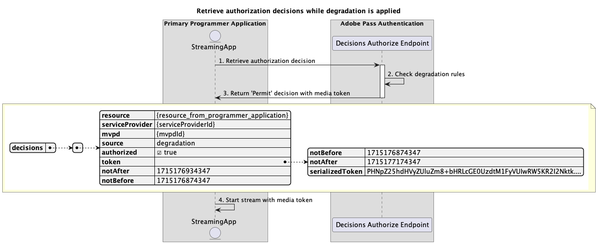

# Flux d&#39;accès dégradés {#degraded-access-flows}

La dégradation permet de contourner temporairement des points de terminaison d’authentification et d’autorisation MVPD spécifiques. En règle générale, le programmeur lance cette action, mais quelle que soit la personne qui déclenche un événement de dégradation, l’action dépend des dispositions prises antérieurement avec les distributeurs multicanaux concernés.

Pour plus d&#39;informations sur la fonctionnalité Dégradation, consultez la documentation [Dégradation](../../../degradation-api-overview.md).

Les flux d&#39;accès dégradés vous permettent de rechercher les scénarios suivants :

* [Effectuer l’authentification pendant la dégradation](#perform-authentication-while-degradation-is-applied)
* [Récupérer les décisions d’autorisation lorsque la dégradation est appliquée](#retrieve-authorization-decisions-while-degradation-is-applied)
* [Récupérer les décisions de préautorisation lorsque la dégradation est appliquée](#retrieve-preauthorization-decisions-while-degradation-is-applied)
* [Récupérer le profil lorsque la dégradation est appliquée](#retrieve-profile-while-degradation-is-applied)

## Effectuer l’authentification pendant la dégradation {#perform-authentication-while-degradation-is-applied}

### Conditions préalables {#prerequisites-perform-authentication-while-degradation-is-applied}

Avant d’effectuer le flux d’authentification lorsque la dégradation est appliquée, assurez-vous que les conditions préalables suivantes sont remplies :

* L’application de diffusion en continu doit lancer une session d’authentification lorsqu’elle doit se connecter avec le MVPD.

>[!IMPORTANT]
> 
> Hypothèses
> 
>  
> 
> * L’application de diffusion en continu ne dispose pas d’un profil valide pour ce MVPD spécifique enregistré dans le serveur principal Adobe Pass.
> * Une règle de dégradation AuthNAll est appliquée à l&#39;intégration entre les `serviceProvider` et `mvpd` fournis.

### Workflow {#workflow-perform-authentication-while-degradation-is-applied}

Suivez les étapes ci-dessous pour mettre en oeuvre le flux d’authentification lorsque la dégradation est appliquée, comme illustré dans le diagramme ci-dessous.

*Effectuez l&#39;authentification pendant que la dégradation est appliquée*

1. **Créer une session d’authentification :** L’application de diffusion en continu rassemble toutes les données nécessaires pour lancer une session d’authentification en appelant le point de terminaison sessions .

   Pour plus d’informations sur :
   * Tous les paramètres _required_, tels que `serviceProvider`, `mvpd`, `domainName` et `redirectUrl`
   * Tous les en-têtes _requis_, comme `Authorization` et `AP-Device-Identifier`
   * Tous les paramètres et en-têtes _optional_

1. **Vérifier les règles de dégradation :** Le serveur Adobe Pass vérifie si une règle de dégradation AuthNAll est appliquée à l&#39;intégration entre les `serviceProvider` et `mvpd` fournis.

1. **Indiquez l’action suivante :** La réponse du point de terminaison sessions contient les données nécessaires pour guider l’application de diffusion en continu concernant l’action suivante :
   * L’attribut `actionName` est défini sur &quot;autoriser&quot;.
   * L’attribut `actionType` est défini sur &quot;direct&quot;.

   Pour plus d’informations sur les informations fournies dans une réponse de session, reportez-vous à la documentation de l’API [Créer une session d’authentification](../../apis/sessions-apis/rest-api-v2-sessions-apis-create-authentication-session.md).

   >[!IMPORTANT]
   >
   > Le point de terminaison Sessions valide les données de requête pour s’assurer que les conditions de base sont remplies :
   >
   > * Les paramètres et en-têtes _required_ doivent être valides.
   > * L&#39;intégration entre les `serviceProvider` et `mvpd` fournis doit être active.
   >
   >  
   > 
   > Si la validation de base échoue, une réponse d’erreur est générée, fournissant des informations supplémentaires conformes à la documentation [Enhanced Error Codes](../../../enhanced-error-codes.md).
   >
   >  
   > 
   > Le point de terminaison Sessions utilise les données de requête pour vérifier si les conditions d’accès dégradées sont remplies :
   >
   > * Une règle de dégradation AuthNAll doit être appliquée à l&#39;intégration entre les `serviceProvider` et `mvpd` fournis.
   >
   >  
   > 
   > Si la validation d’accès dégradée échoue, la réponse sera par défaut au flux d’authentification de base.

1. **Poursuivre avec les flux de décisions :** L’application de diffusion en continu peut continuer avec les flux de décisions suivants.

## Récupérer les décisions d’autorisation lorsque la dégradation est appliquée {#retrieve-authorization-decisions-while-degradation-is-applied}

### Conditions préalables {#prerequisites-retrieve-authorization-decisions-while-degradation-is-applied}

Avant de récupérer les décisions d’autorisation lorsque la dégradation est appliquée, assurez-vous que les conditions préalables suivantes sont remplies :

* L’application en continu doit récupérer une décision d’autorisation avant de lire une ressource sélectionnée par l’utilisateur.

>[!IMPORTANT]
>
> Hypothèses
> 
>  
> 
> * L’application de diffusion en continu ne dispose pas d’un profil valide pour ce MVPD spécifique.
> * Une règle de dégradation AuthZAll ou AuthNAll est appliquée à l&#39;intégration entre les `serviceProvider` et `mvpd` fournis.

### Workflow {#workflow-retrieve-authorization-decisions-while-degradation-is-applied}

Suivez les étapes ci-dessous pour mettre en oeuvre le flux d’autorisation lorsque la dégradation est appliquée, comme illustré dans le diagramme ci-dessous.

*Récupérer les décisions d’autorisation lorsque la dégradation est appliquée*

1. **Récupérer la décision d’autorisation :** L’application de diffusion en continu rassemble toutes les données nécessaires pour obtenir une décision d’autorisation pour une ressource spécifique en appelant le point de terminaison Decisions Authorize.

   Pour plus d’informations, consultez la documentation de l’API [Récupérer les décisions d’autorisation à l’aide de mvpd](../../apis/decisions-apis/rest-api-v2-decisions-apis-retrieve-authorization-decisions-using-specific-mvpd.md) spécifique :
   * Tous les paramètres _required_, comme `serviceProvider`, `mvpd` et `resources`
   * Tous les en-têtes _requis_, comme `Authorization` et `AP-Device-Identifier`
   * Tous les paramètres et en-têtes _optional_

1. **Vérifier les règles de dégradation :** Le serveur Adobe Pass vérifie si une règle de dégradation AuthZAll ou AuthNAll est appliquée à l’intégration entre les `serviceProvider` et `mvpd` fournis.

1. **Renvoi de la décision `Permit` avec jeton multimédia :** La réponse de point de terminaison Decisions Authorize contient une décision `Permit` et un jeton multimédia.

   Pour plus d’informations sur les informations fournies dans une réponse à une décision, reportez-vous à la documentation de l’API [Récupérer les décisions d’autorisation à l’aide de mvpd](../../apis/decisions-apis/rest-api-v2-decisions-apis-retrieve-authorization-decisions-using-specific-mvpd.md) spécifique.

   >[!IMPORTANT]
   >
   > Le point de terminaison Decisions Authorize valide les données de requête afin de s’assurer que les conditions de base sont remplies :
   >
   > * Les paramètres et en-têtes _required_ doivent être valides.
   > * L&#39;intégration entre les `serviceProvider` et `mvpd` fournis doit être active.
   >
   >  
   > 
   > Si la validation de base échoue, une réponse d’erreur est générée, fournissant des informations supplémentaires conformes à la documentation [Enhanced Error Codes](../../../enhanced-error-codes.md).
   >
   >  
   >
   > Le point de terminaison Decisions Authorize utilise les données de requête pour vérifier si les conditions d’accès dégradées sont remplies :
   >
   > * Une règle de dégradation AuthZAll ou AuthNAll doit être appliquée à l’intégration entre les `serviceProvider` et `mvpd` fournis.
   >
   >  
   > 
   > Si la validation de l’accès dégradé échoue, la réponse est définie par défaut sur le flux d’autorisation de base.

1. **Démarrer le flux avec le jeton multimédia :** L’application de diffusion en continu utilise le jeton multimédia pour lire le contenu.

## Récupérer les décisions de préautorisation lorsque la dégradation est appliquée {#retrieve-preauthorization-decisions-while-degradation-is-applied}

### Conditions préalables {#prerequisites-retrieve-preauthorization-decisions-while-degradation-is-applied}

Avant de récupérer les décisions de préautorisation alors que la dégradation est appliquée, assurez-vous que les conditions préalables suivantes sont remplies :

* L’application de diffusion en continu souhaite récupérer les décisions de préautorisation afin d’afficher une liste des ressources avec leurs statuts associés.

>[!IMPORTANT]
>
> Hypothèses
>
>  
> 
> * L’application de diffusion en continu ne dispose pas d’un profil valide pour ce MVPD spécifique.
> * Une règle de dégradation AuthZAll ou AuthNAll est appliquée à l&#39;intégration entre les `serviceProvider` et `mvpd` fournis.

### Workflow {#workflow-retrieve-preauthorization-decisions-while-degradation-is-applied}

Suivez les étapes ci-dessous pour mettre en oeuvre le flux de préautorisation lorsque la dégradation est appliquée, comme illustré dans le diagramme ci-dessous.

*Récupérer les décisions de préautorisation lorsque la dégradation est appliquée*

1. **Récupérer les décisions de préautorisation :** L’application de diffusion en continu rassemble toutes les données nécessaires pour obtenir des décisions de préautorisation pour une liste de ressources en appelant le point de terminaison Decisions Preauthorized .

   Pour plus d’informations, consultez la documentation de l’API [Récupérer les décisions de préautorisation à l’aide de mvpd](../../apis/decisions-apis/rest-api-v2-decisions-apis-retrieve-preauthorization-decisions-using-specific-mvpd.md) spécifique :
   * Tous les paramètres _required_, comme `serviceProvider`, `mvpd` et `resources`
   * Tous les en-têtes _requis_, comme `Authorization` et `AP-Device-Identifier`
   * Tous les paramètres et en-têtes _optional_

1. **Vérifier les règles de dégradation :** Le serveur Adobe Pass vérifie si une règle de dégradation AuthZAll ou AuthNAll est appliquée à l’intégration entre les `serviceProvider` et `mvpd` fournis.

1. **Renvoi des décisions de préautorisation :** La réponse de point de terminaison de préautorisation Decisions contient une décision `Permit` pour chaque ressource.

   Pour plus d’informations sur les informations fournies dans une réponse à une décision, reportez-vous à la documentation de l’API [Récupérer les décisions de préautorisation à l’aide de mvpd](../../apis/decisions-apis/rest-api-v2-decisions-apis-retrieve-preauthorization-decisions-using-specific-mvpd.md) spécifique.

   >[!IMPORTANT]
   >
   > Le point de terminaison Decisions Preallow valide les données de requête pour s’assurer que les conditions de base sont remplies :
   >
   > * Les paramètres et en-têtes _required_ doivent être valides.
   > * L&#39;intégration entre les `serviceProvider` et `mvpd` fournis doit être active.
   >
   >  
   > 
   > Si la validation de base échoue, une réponse d’erreur est générée, fournissant des informations supplémentaires conformes à la documentation [Enhanced Error Codes](../../../enhanced-error-codes.md).
   >
   >  
   >
   > Le point de terminaison Decisions Preallow utilise les données de requête pour vérifier si les conditions d’accès dégradées sont remplies :
   >
   > * Une règle de dégradation AuthZAll ou AuthNAll doit être appliquée à l’intégration entre les `serviceProvider` et `mvpd` fournis.
   >
   >  
   > 
   > Si la validation de l’accès dégradé échoue, la réponse sera par défaut au flux de préautorisation de base.

1. **Gérer les décisions de préautorisation :** L’application de diffusion en continu traite la réponse et peut l’utiliser pour afficher éventuellement l’état approprié pour chaque ressource dans l’interface utilisateur.

## Récupérer le profil lorsque la dégradation est appliquée {#retrieve-profile-while-degradation-is-applied}

>[!IMPORTANT]
>
> La requête Profiles endpoint est facultative lorsque la dégradation est appliquée.
>
>  
> 
> La réponse du point de terminaison sessions indique à l’application de procéder aux processus de décision pendant que la dégradation est appliquée. Pour plus d&#39;informations, reportez-vous à la section [ Effectuer l&#39;authentification pendant la dégradation ](#perform-authentication-while-degradation-is-applied) .

### Conditions préalables {#prerequisites-retrieve-profile-while-degradation-is-applied}

Avant de récupérer le profil d’un MVPD spécifique lorsque la dégradation est appliquée, assurez-vous que les conditions préalables suivantes sont remplies :

* L’application de diffusion en continu, qui a un identifiant `mvpd` sélectionné ou mis en cache, souhaite récupérer le profil pour un MVPD spécifique.

>[!IMPORTANT]
>
> Hypothèses
>
>  
> 
> * L’application de diffusion en continu ne dispose pas d’un profil valide pour ce MVPD spécifique.
> * Une règle de dégradation AuthNAll est appliquée à l&#39;intégration entre les `serviceProvider` et `mvpd` fournis.

### Workflow {#workflow-retrieve-profile-while-degradation-is-applied}

Suivez les étapes ci-dessous pour mettre en oeuvre le flux de récupération des profils pour un MVPD spécifique, tandis que la dégradation est appliquée, comme illustré dans le diagramme ci-dessous.

*Récupérer le profil lorsque la dégradation est appliquée*

1. **Récupérer le profil pour mvpd spécifique :** L’application de diffusion en continu rassemble toutes les données nécessaires pour récupérer les informations de profil pour ce MVPD spécifique en envoyant une requête au point de terminaison Profiles.

   Pour plus d’informations sur :
   * Tous les paramètres _required_, comme `serviceProvider` et `mvpd`
   * Tous les en-têtes _requis_, comme `Authorization` et `AP-Device-Identifier`
   * Tous les paramètres et en-têtes _optional_

1. **Vérifier les règles de dégradation :** Le serveur Adobe Pass vérifie si une règle de dégradation AuthNAll est appliquée à l&#39;intégration entre les `serviceProvider` et `mvpd` fournis.

1. **Renvoi d’informations sur le profil dégradé :** La réponse du point de terminaison Profiles contient des informations sur le profil dégradé, y compris l’attribut `type` défini sur &quot;dégradé&quot;.

   Pour plus d’informations sur les informations fournies dans une réponse de profil, reportez-vous à la documentation de l’API [Retrieve profile for specific mvpd](../../apis/profiles-apis/rest-api-v2-profiles-apis-retrieve-profiles-for-specific-mvpd.md) .

   >[!IMPORTANT]
   >
   > Le point de terminaison Profiles valide les données de requête pour s’assurer que les conditions de base sont remplies :
   >
   > * Les paramètres et en-têtes _required_ doivent être valides.
   > * L&#39;intégration entre les `serviceProvider` et `mvpd` fournis doit être active.
   >
   >  
   > 
   > Si la validation de base échoue, une réponse d’erreur est générée, fournissant des informations supplémentaires conformes à la documentation [Enhanced Error Codes](../../../enhanced-error-codes.md).
   >
   >  
   > 
   > Le point de terminaison Profils utilise les données de requête pour vérifier si les conditions d’accès dégradées sont remplies :
   >
   > * Une règle de dégradation AuthNAll doit être appliquée à l&#39;intégration entre les `serviceProvider` et `mvpd` fournis.
   >
   >  
   > 
   > Si la validation de l’accès dégradée échoue, la réponse sera par défaut au flux de récupération du profil de base.

1. **Poursuivre avec les flux de décisions :** Si la réponse du point de terminaison Profiles contient un profil, l’application en continu utilise les informations de profil dégradées pour continuer avec les flux de décisions suivants.

1. **Indique un nouveau flux d’authentification de base :** Si la réponse du point de terminaison Profiles ne contient pas de profil, l’application de diffusion en continu indique à l’utilisateur de lancer un nouveau flux d’authentification de base.

>[!NOTE]
>
> Les étapes du flux de récupération des profils pour un code d’authentification spécifique sont les mêmes que ci-dessus, sauf que le point de terminaison utilisé est celui décrit dans la documentation [Récupérer le profil pour un code spécifique](../../apis/profiles-apis/rest-api-v2-profiles-apis-retrieve-profiles-for-specific-code.md) .
