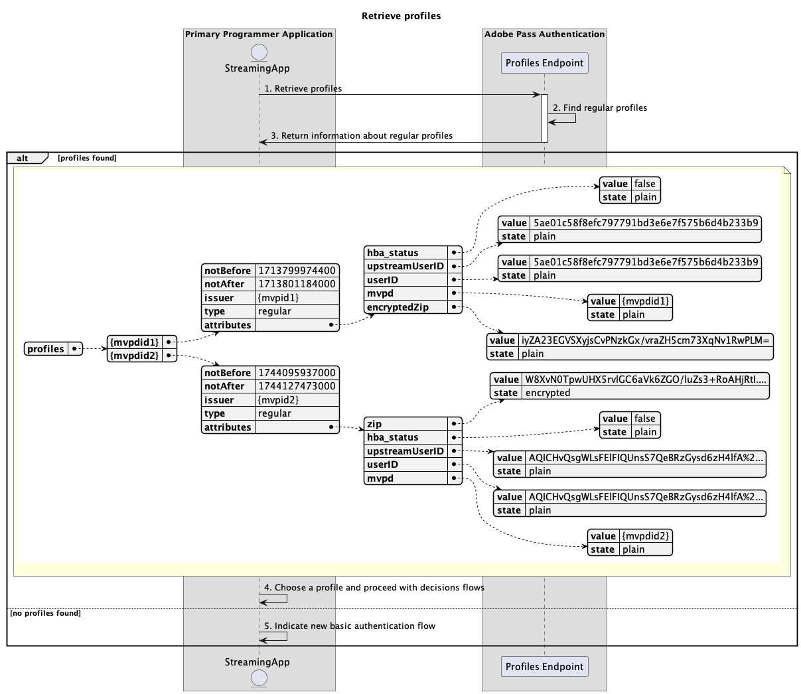
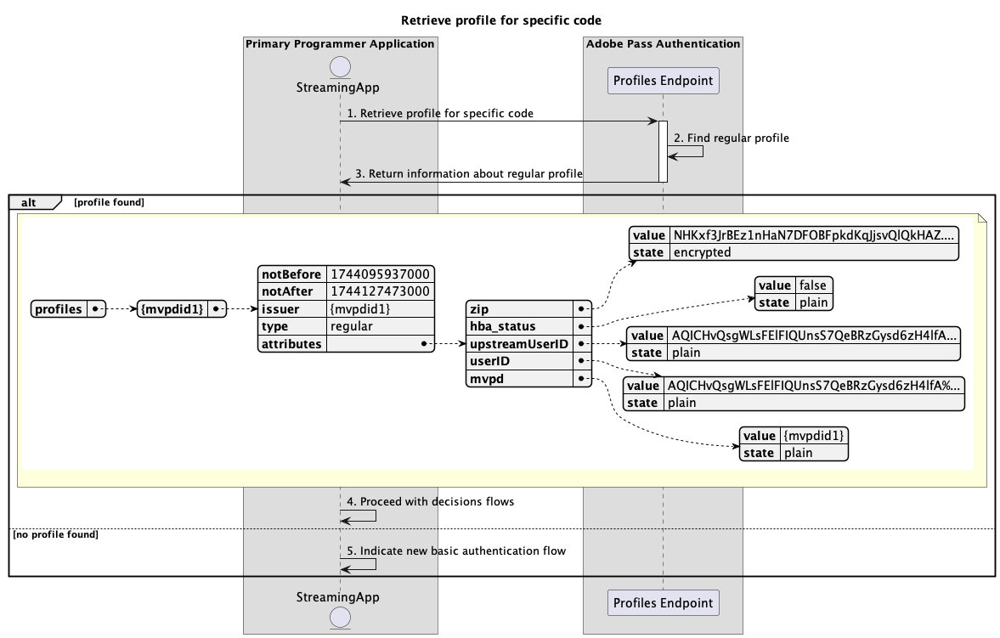

# Flux de profils de base exécuté dans une application principale {#basic-profiles-flow-primary-application}

Le **flux de profils** dans le droit d’authentification Adobe Pass permet à l’application de diffusion en continu d’accéder aux informations sur les connexions d’utilisateurs actives.

Le flux de profils de base vous permet d’effectuer des requêtes pour les scénarios suivants :

* [Récupération des profils](#retrieve-profiles)
* [Récupération du profil pour mvpd spécifique](#retrieve-profile-for-specific-mvpd)
* [Récupération du profil pour un code spécifique](#retrieve-profile-for-specific-code)

## Récupération des profils {#retrieve-profiles}

### Conditions préalables {#prerequisites-retrieve-profiles}

Avant de récupérer les profils, assurez-vous que les conditions préalables suivantes sont remplies :

* L’application de diffusion en continu souhaite récupérer tous les profils standard.

### Workflow {#workflow-retrieve-profiles}

Suivez les étapes ci-dessous pour mettre en oeuvre le flux de récupération des profils de base effectué dans une application principale, comme illustré dans le diagramme ci-dessous.

*Récupération des profils*

1. **Récupérer les profils :** L’application de diffusion en continu rassemble toutes les données nécessaires pour récupérer toutes les informations de profil en envoyant une requête au point de terminaison Profils.

   Pour plus d’informations sur :
   * Tous les paramètres _requis_, comme `serviceProvider`
   * Tous les en-têtes _requis_, comme `Authorization`, `AP-Device-Identifier`
   * Tous les paramètres et en-têtes _optional_

1. **Trouver des profils réguliers :** Le serveur Adobe Pass identifie tous les profils valides en fonction des paramètres et en-têtes reçus.

1. **Renvoi d’informations sur les profils normaux :** La réponse de point de terminaison Profiles contient des informations sur les profils trouvés associés aux paramètres et aux en-têtes reçus.

   Pour plus d’informations sur les informations fournies dans une réponse de profil, reportez-vous à la documentation de l’API [Récupérer les profils](../../apis/profiles-apis/rest-api-v2-profiles-apis-retrieve-profiles.md) .

   >[!NOTE]
   >
   > Le point de terminaison Profiles valide les données de requête pour s’assurer que les conditions de base sont remplies :
   >
   > * Les paramètres et en-têtes _required_ doivent être valides.
   >
   >  
   >
   > Si la validation échoue, une réponse d’erreur est générée, fournissant des informations supplémentaires conformes à la documentation [Enhanced Error Codes](../../../enhanced-error-codes.md).

1. **Sélectionnez un profil et passez aux flux de décisions :** Si la réponse du point de terminaison Profiles contient des profils, l’application en continu utilise sa logique interne (éventuellement en interagissant avec l’utilisateur final) pour choisir l’un des profils disponibles afin de continuer les flux de décisions suivants.

1. **Indique un nouveau flux d’authentification de base :** Si la réponse du point de terminaison Profiles ne contient pas de profil, l’application de diffusion en continu indique à l’utilisateur de lancer un nouveau flux d’authentification de base.

## Récupération du profil pour mvpd spécifique {#retrieve-profile-for-specific-mvpd}

### Conditions préalables {#prerequisites-retrieve-profile-for-specific-mvpd}

Avant de récupérer le profil d’un MVPD spécifique, assurez-vous que les conditions préalables suivantes sont remplies :

* L’application de diffusion en continu, qui a un identifiant `mvpd` sélectionné ou mis en cache, souhaite récupérer le profil normal pour un MVPD spécifique.

### Workflow {#workflow-retrieve-profile-for-specific-mvpd}

Suivez les étapes ci-dessous pour mettre en oeuvre le flux de récupération de profil de base pour un MVPD spécifique exécuté dans une application principale, comme illustré dans le diagramme ci-dessous.

*Récupération du profil pour mvpd spécifique*

1. **Récupérer le profil pour mvpd spécifique :** L’application de diffusion en continu rassemble toutes les données nécessaires pour récupérer les informations de profil pour ce MVPD spécifique en envoyant une requête au point de terminaison Profiles.

   Pour plus d’informations sur :
   * Tous les paramètres _requis_, comme `serviceProvider` et `mvpd`
   * Tous les en-têtes _requis_, comme `Authorization`, `AP-Device-Identifier`
   * Tous les paramètres et en-têtes _optional_

1. **Rechercher un profil régulier :** Le serveur Adobe Pass identifie un profil valide en fonction des paramètres et des en-têtes reçus.

1. **Renvoi d’informations sur le profil normal :** La réponse du point de terminaison Profiles contient des informations sur le profil trouvé associé aux paramètres et en-têtes reçus.

   Pour plus d’informations sur les informations fournies dans une réponse de profil, reportez-vous à la documentation de l’API [Retrieve profile for specific mvpd](../../apis/profiles-apis/rest-api-v2-profiles-apis-retrieve-profiles-for-specific-mvpd.md) .

   >[!NOTE]
   >
   > Le point de terminaison Profiles valide les données de requête pour s’assurer que les conditions de base sont remplies :
   >
   > * Les paramètres et en-têtes _required_ doivent être valides.
   > * L&#39;intégration entre les `serviceProvider` et `mvpd` fournis doit être active.
   >
   >  
   > 
   > Si la validation échoue, une réponse d’erreur est générée, fournissant des informations supplémentaires conformes à la documentation [Enhanced Error Codes](../../../enhanced-error-codes.md).

1. **Poursuivre avec les flux de décisions :** Si la réponse du point de terminaison Profiles contient un profil, l’application en continu utilise les informations de profil pour continuer avec les flux de décisions suivants.

1. **Indique un nouveau flux d’authentification de base :** Si la réponse du point de terminaison Profiles ne contient pas de profil, l’application de diffusion en continu indique à l’utilisateur de lancer un nouveau flux d’authentification de base.

## Récupération du profil pour un code spécifique {#retrieve-profile-for-specific-code}

### Conditions préalables {#prerequisites-retrieve-profile-for-specific-code}

Avant de récupérer le profil pour un code d’authentification spécifique, assurez-vous que les conditions préalables suivantes sont remplies :

* L’application de diffusion en continu, qui possède un `code` utilisé pour effectuer l’authentification interactive avec le MVPD, souhaite récupérer le profil pour un code d’authentification spécifique.

### Workflow {#workflow-retrieve-profile-for-specific-code}

Suivez les étapes ci-dessous pour mettre en oeuvre le flux de récupération de profil de base pour un code d’authentification spécifique exécuté dans une application principale, comme illustré dans le diagramme ci-dessous.

*Récupération du profil pour un code spécifique*

1. **Récupérer le profil pour un code spécifique :** L’application de diffusion en continu rassemble toutes les données nécessaires pour récupérer les informations de profil pour ce code d’authentification spécifique en envoyant une requête au point de terminaison Profiles.

   Pour plus d’informations sur :
   * Tous les paramètres _required_, comme `serviceProvider` et `code`
   * Tous les en-têtes _requis_, comme `Authorization`
   * Tous les paramètres et en-têtes _optional_

1. **Rechercher un profil régulier :** Le serveur Adobe Pass identifie un profil valide en fonction des paramètres et des en-têtes reçus.

1. **Renvoi d’informations sur le profil normal :** La réponse du point de terminaison Profiles contient des informations sur le profil trouvé associé aux paramètres et en-têtes reçus.

   Pour plus d’informations sur les informations fournies dans une réponse de profil, reportez-vous à la documentation de l’API [Récupérer le profil pour un code spécifique](../../apis/profiles-apis/rest-api-v2-profiles-apis-retrieve-profiles-for-specific-code.md).

   >[!NOTE]
   >
   > Le point de terminaison Profiles valide les données de requête pour s’assurer que les conditions de base sont remplies :
   >
   > * Les paramètres et en-têtes _required_ doivent être valides.
   >
   >  
   >
   > Si la validation échoue, une réponse d’erreur est générée, fournissant des informations supplémentaires conformes à la documentation [Enhanced Error Codes](../../../enhanced-error-codes.md).

1. **Poursuivre avec les flux de décisions :** Si la réponse du point de terminaison Profiles contient un profil, l’application en continu utilise les informations de profil pour continuer avec les flux de décisions suivants.

1. **Indique un nouveau flux d’authentification de base :** Si la réponse du point de terminaison Profiles ne contient pas de profil, l’application principale indique à l’utilisateur de lancer un nouveau flux d’authentification de base.
