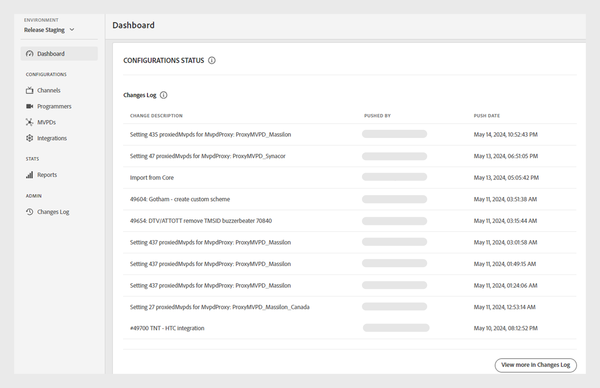

# Tableau de bord {#dashboard}

>[!NOTE]
>
>Le contenu de cette page est fourni à titre d’information uniquement. L’utilisation de cette API nécessite une licence actuelle de Adobe. Aucune utilisation non autorisée n’est autorisée.

La variable **Tableau de bord** dans le panneau de gauche sert de page d’accueil au tableau de bord TVE d’authentification Adobe Pass.

Deux sections sont disponibles sur la page d’accueil :

* [Écran de bienvenue](#welcome-screen)
* [État de la configuration](#configuration-status)

## Écran de bienvenue {#welcome}

Dans cette section, vous pouvez accéder à la documentation publique directement à partir du message de bienvenue et afficher un instantané de vos configurations actuelles.

* **Intégrations actives**: nombre d’intégrations actives dans l’environnement actuel. Sélectionner **En savoir plus dans la section sur l’intégration** pour accéder aux informations détaillées de la section [Intégrations](tve-dashboard-integrations.md) .
* **Canaux actifs**: nombre de canaux actifs dans l’environnement actuel. Sélectionner **En savoir plus dans la section Canaux** pour accéder aux informations détaillées de la section [Canaux](tve-dashboard-channels.md) .
* **Mises à jour de base de données**: nombre de modifications de configuration apportées à l’environnement actuel. Sélectionner **En savoir plus dans la section Journal des modifications** pour accéder aux informations détaillées de la section [Journal des modifications](tve-dashboard-changes-log.md) .
* **Tableau de bord ESM**: gardez un oeil sur le tableau de bord ESM à venir, qui proposera des mesures détaillées sur l’utilisation des propriétés dans l’environnement actuel. Cette fonctionnalité sera accessible lors des futures mises à jour.

*Écran de bienvenue*

## État de la configuration {#conf-status}

Cette section présente 10 modifications de configuration les plus récentes, parmi lesquelles :

* **Description des modifications**: description brève de la modification sélectionnée par l’utilisateur.
* **Poussé par**: compte responsable de la modification.
* **Date push**: date à laquelle la modification a été effectuée.

*État de configuration d’un journal des modifications*

Pour afficher la liste complète des modifications, sélectionnez **En savoir plus dans le journal des modifications** dans le coin inférieur droit pour afficher la variable [Journal des modifications](tve-dashboard-changes-log.md) .
