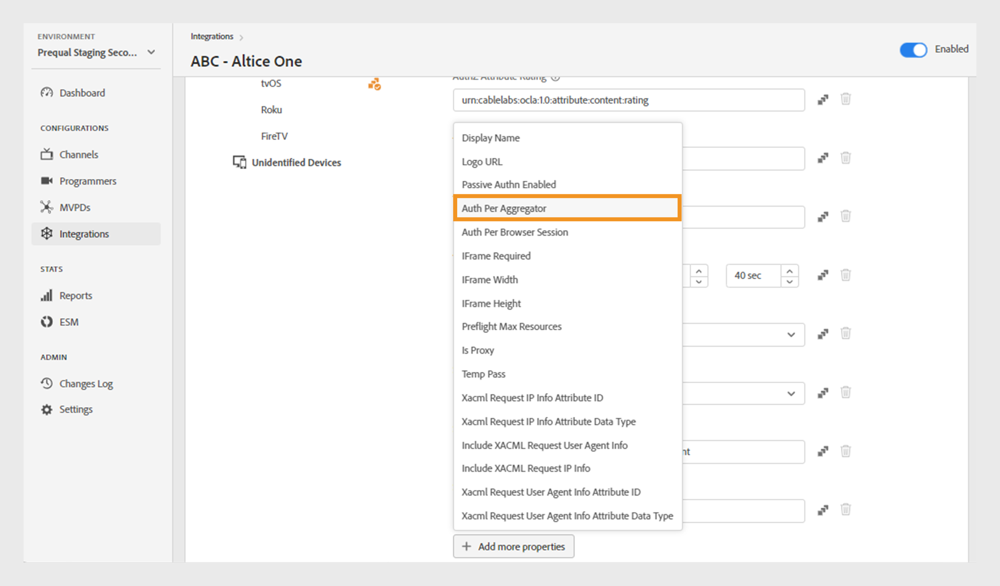

# Intégrations

>[!NOTE]
>
>Le contenu de cette page est fourni à titre d’information uniquement. L’utilisation de cette API nécessite une licence actuelle de Adobe. Aucune utilisation non autorisée n’est autorisée.

La variable **Intégrations** La section du tableau de bord TVE vous permet d’afficher et de gérer les paramètres pour les intégrations entre vos canaux et MVPD. Vous pouvez également [créer une nouvelle intégration ;](#create-new-integration) selon vos besoins.

La variable **Intégrations** dans le panneau de gauche affiche une liste des intégrations existantes avec les détails suivants :

* État indiquant si l’intégration est actuellement active ou inactive
* Intégration liant des canaux spécifiques à des MVPD respectifs
* Nom du canal avec identifiant de canal
* Nom d’affichage MVPD et identifiant MVPD

*Liste des intégrations existantes*

Saisissez le nom du canal ou du MVPD dans la variable **Rechercher** au-dessus de la liste pour en savoir plus sur l’intégration.

## Gestion des configurations d’intégration {#manage-integration-conf}

Pour gérer une intégration spécifique, procédez comme suit.

1. Sélectionnez la variable **Intégrations** dans le panneau de gauche.
1. Sélectionnez une intégration dans la liste fournie pour afficher et modifier divers paramètres dans les sections suivantes :

   * [Sélection du point de fin](#endpoint-selection)
   * [Paramètres de plateforme](#platform-settings)
   * [Métadonnées utilisateur](#user-metadata)

>[!IMPORTANT]
>
> Affichage [Révision et notification push des modifications](/help/authentication/tve-dashboard-review-push-changes.md) pour plus d’informations sur l’activation des modifications de configuration.

### Sélection du point de fin {#endpoint-selection}

Cette section vous permet de choisir les points de terminaison du MVPD utilisé pour l’authentification, l’autorisation et les flux de déconnexion depuis les menus déroulants respectifs.

*Points de terminaison pour les flux d’authentification, d’autorisation et de déconnexion*

>[!NOTE]
>
>Les MVPD peuvent fournir un ou plusieurs points de terminaison pour chaque flux. Lors de l’intégration d’un nouveau canal, le MVPD doit spécifier son point de terminaison préféré pour chaque flux.

>[!IMPORTANT]
>
>Toute modification apportée aux points de terminaison aura un impact sur le comportement global d’une intégration. Ces modifications ne doivent être implémentées qu’après avoir reçu la confirmation du MVPD.

### Paramètres de plateforme {#platform-settings}

Cette section vous permet d’afficher et de modifier les paramètres d’intégration dans tous les [plateformes](/help/authentication/tve-dashboard-reports.md#platforms). Vous pouvez modifier ces paramètres en fonction de plateformes individuelles. Par exemple, vous pouvez ajuster la durée de vie de l’autorisation sur Android tout en conservant une valeur par défaut pour une autre plateforme.

Chaque propriété des paramètres de la plateforme hérite d’une valeur par défaut définie par le MVPD, mais peut être ajustée si nécessaire.

>[!IMPORTANT]
>
>Un accord avec le MVPD est nécessaire pour déterminer les valeurs définies pour chaque propriété dans les paramètres de la plateforme.

>[!IMPORTANT]
>
> L’héritage des paramètres suit une chaîne commençant par les paramètres MVPD (qui sont les plus généraux), puis le point de terminaison MVPD, l’intégration, la catégorie de plateforme et la plateforme (qui contient la valeur la plus spécifique).

**Paramètres de plateforme** est utilisé pour remplacer les paramètres de chaque niveau de la chaîne d’héritage. Les niveaux disponibles dans la chaîne sont regroupés comme suit :

* **Par défaut pour tous**: définissez des valeurs pour les propriétés applicables universellement à toutes les plateformes si des valeurs de plateforme spécifiques ne sont pas définies, quelles que soient les implémentations du programmeur.

* **Appareils de bureau**: définissez des valeurs pour les propriétés applicables à tous les ordinateurs de bureau et portables, indépendamment de la méthode de programmation (SDK JS ou API REST).

* **Périphériques mobiles**: définissez les valeurs des propriétés applicables à tous les appareils mobiles, y compris **iOS**, **Android**, etc., quelle que soit l’approche de programmation (SDK ou API REST).

* **Périphériques connectés à la télévision**: définissez des valeurs pour les propriétés applicables à tous les appareils connectés à la télévision, y compris **tvOS**, **Roku**, **FireTV**, etc., indépendamment de la méthode de programmation (SDK ou API REST).

* **Périphériques non identifiés**: définissez des valeurs pour les propriétés applicables à tous les appareils pour lesquels le mécanisme actuel ne peut pas identifier précisément la plateforme. Dans ce cas, appliquez les règles les plus restrictives définies par le MVPD.

  

  *Catégorie des plateformes et de leurs appareils*

Sélectionner  icône située à droite de chaque propriété pour explorer les propriétés utilisées pour chaque niveau d’héritage décrit ci-dessus.

#### Flux d’entreprise les plus utilisés {#most-used-flows}

La variable **Paramètres de plateforme** propose un éventail de propriétés utilisées dans différents flux d’activités. Les propriétés réelles peuvent varier en fonction des MVPD sélectionnés dans l’intégration spécifique. Vous trouverez ci-dessous les flux les plus utilisés :

**AuthN TTL et AuthZ TTL sur toutes les plateformes**

>[!IMPORTANT]
>
>Les valeurs TTL d’authentification (AuthN) et d’autorisation (AuthZ) doivent correspondre de manière cohérente aux paramètres MVPD.

Pour modifier le délai d’activation de l’authentification et de l’autorisation sur toutes les plateformes pour une intégration spécifique, procédez comme suit.

1. Sélectionnez la variable **Intégrations** dans le panneau de gauche.
1. Sélectionnez l’intégration pour laquelle vous souhaitez modifier les valeurs TTL AuthN et TTL AuthZ.
1. Accédez au **Paramètres de plateforme** .

1. Sélectionner **Par défaut pour tous** sous **Paramètres de plateforme**.

   >[!NOTE]
   >
   >Si vous souhaitez modifier la durée de **AuthN TTL** et **AuthZ TTL** pour une catégorie de plateforme ou une plateforme spécifique, sélectionnez la plateforme en conséquence.

   

   *Modifiez la durée TTL AuthN TTL AuthZ sur toutes les plateformes.*

   **A.** Propriété TTL AuthN **B.** Propriété TTL AuthZ

1. Sélectionnez les flèches haut et bas pour ajuster la durée en jours, heures, minutes et secondes dans la variable **AuthN TTL** et **AuthZ TTL** propriétés.

La durée de **AuthN TTL** et **AuthZ TTL** sur toutes les plateformes ne sera mis à jour qu’après [révision et notification push des modifications](/help/authentication/tve-dashboard-review-push-changes.md).

**Activation de la connexion unique à la plateforme**

>[!IMPORTANT]
>
>**Activer la connexion unique** est exclusivement prise en charge sur *iOS, tvOS, Roku et FireTV* plateformes. Il s’applique uniquement aux intégrations avec des MVPD qui prennent en charge l’authentification unique pour ces plateformes.

Suivez ces étapes pour activer ou désactiver l’authentification unique pour une intégration et une plateforme spécifiques.

1. Sélectionnez la variable **Intégrations** dans le panneau de gauche.
1. Sélectionnez l’intégration pour laquelle vous souhaitez activer ou désactiver l’authentification unique.

1. Accédez au **Paramètres de plateforme** .

1. Sélectionnez une plateforme ou une catégorie spécifique de plateformes pour laquelle vous souhaitez activer l’authentification unique sous **Paramètres de plateforme**.

   

   *Activation de la connexion unique pour une plateforme spécifique*

   **A.** Connexion unique, propriété **B.** Application de la propriété d’autorisations de Platform

1. Sélectionner **Oui** pour activer ou **Non** pour désactiver dans le **Activer la connexion unique** menu déroulant.

1. Sélectionner **Oui** pour activer ou **Non** pour désactiver dans le **Application des autorisations de Platform** menu déroulant.

   **Application des autorisations de Platform** contrôle si la décision de l’utilisateur **Autoriser** ou **Refuser** L&#39;accès à la plate-forme de leur abonnement à un fournisseur de télévision est respecté.

   Par exemple, si la variable **Activer la connexion unique** et **Application des autorisations de Platform** sont activés et l’utilisateur choisit de refuser à la plateforme l’accès à son abonnement au fournisseur de télévision, puis l’application correspondante (canal) ne pourra pas utiliser le jeton d’authentification Adobe Pass obtenu par une autre application (canal).

La variable **Authentification unique** pour une plateforme sélectionnée, l’option sera activée ou désactivée uniquement après [révision et notification push des modifications](/help/authentication/tve-dashboard-review-push-changes.md).

**Activation de l’authentification à domicile**

Suivez ces étapes pour activer ou désactiver l’authentification basée sur la page d’accueil pour les MVPD basés sur OAuth2.

1. Sélectionnez la variable **Intégrations** dans le panneau de gauche.
1. Sélectionnez l’intégration pour laquelle vous souhaitez activer ou désactiver l’authentification par domicile.
1. Accédez au **Paramètres de plateforme** .
1. Sélectionnez une plateforme ou une catégorie spécifique de plateformes pour laquelle vous souhaitez activer l’authentification basée sur l’accueil sous **Paramètres de plateforme**.

   

   *Activation de l’authentification à domicile pour une plateforme spécifique*

   **A.** Tentative de propriété de l’adaptateur de bus hôte **B.** Propriété TTL de l’hôte AuthN

1. Sélectionner **Oui** pour activer et **Non** pour désactiver dans le **Tenter l’adaptateur de bus hôte** menu déroulant.

>[!IMPORTANT]
>
>Modification de la durée de **Adaptateur de bus hôte AuthN TTL** doit être évitée. Cela peut entraîner des échecs inattendus du processus d’autorisation.

La variable **Tenter l’adaptateur de bus hôte** pour un MVPD spécifique sera activé ou désactivé uniquement après [révision et notification push des modifications](/help/authentication/tve-dashboard-review-push-changes.md).

#### Ajout de propriétés {#add-more-properties}

La variable **Ajout de propriétés** offre la possibilité d’inclure des propriétés spécifiques supplémentaires pour les intégrations, en particulier pour les flux moins courants.

Vous pouvez ajouter les propriétés suivantes :

* Pour toutes les plateformes, sélectionnez **Par défaut pour tous** de gauche.
* Pour une catégorie de plateforme, sélectionnez **Appareils de bureau**, **Périphériques mobiles**, ou **Périphériques connectés à la télévision** de gauche.
* Pour un appareil spécifique, sélectionnez **iOS**, **Android**, **tvOS**, **Roku**, ou **FireTV** de gauche.

Voici quelques exemples de différents flux qui peuvent être activés en ajoutant ces propriétés :

**Modifier le nombre de ressources préautorisées**

La plupart des MVPD prennent en charge un appel authZ de contrôle en amont à l’aide de 5 identifiants de ressource par défaut au maximum.
Cependant, dans les cas où les distributeurs multicanaux de programmes audiovisuels acceptent d’augmenter cette limite, vous pouvez accéder au **Ajout de propriétés** et sélectionnez **Contrôle en amont des ressources max.** dans le menu options.

**Contrôle en amont des ressources max.** ajoute un nouvel attribut où la limite convenue avec le MVPD peut être spécifiée.

*Ajouter la propriété Preflight Max Resources*

La variable **Contrôle en amont des ressources max.** ne sera ajoutée qu’après [révision et notification push des modifications](/help/authentication/tve-dashboard-review-push-changes.md).

**Modification du nom d’affichage MVPD ou de l’URL du logo**

Pour les applications de programmation qui ne souhaitent pas créer leur sélecteur MVPD et qui utilisent plutôt les configurations fournies, vous pouvez accéder au **Ajout de propriétés** et sélectionnez **Nom d’affichage** ou **URL du logo** pour ajouter les URL de nom d’affichage ou de logo requises pour chaque MVPD dans le menu d’options.

Des valeurs différentes pour ces propriétés peuvent être utilisées pour le même MVPD en fonction de la plateforme de l’appareil et de l’expérience utilisateur souhaitée.

*Ajouter la propriété Nom d’affichage ou URL du logo*

La variable **Nom d’affichage** ou **URL du logo** ne sera ajoutée qu’après [révision et notification push des modifications](/help/authentication/tve-dashboard-review-push-changes.md).

**Demande d’un nouveau flux d’authentification lors du changement d’application (canal)**

Si vous souhaitez forcer une nouvelle authentification lorsque les utilisateurs basculent entre les applications. Dans ce cas, vous pouvez accéder au **Ajout de propriétés**, sélectionnez la variable **Auteur par agrégateur** .

Ajouter **Auteur par agrégateur** interrompt effectivement l’authentification unique pour le canal respectif.

*Ajouter la propriété Auth Per Aggregator*

La variable **Auteur par agrégateur** ne sera ajoutée qu’après [révision et notification push des modifications](/help/authentication/tve-dashboard-review-push-changes.md).

Une fois l’ajout effectué, sélectionnez **Oui** pour activer **Auteur par agrégateur** pour une intégration sélectionnée.

#### Suppression des propriétés {#delete-properties}

Sélectionner  icône située à droite de chaque propriété pour supprimer les propriétés qui ne sont plus requises.

>[!NOTE]
>
>Certaines propriétés ne peuvent pas être supprimées car il s’agit d’exigences obligatoires pour le MVPD sélectionné.

La propriété sera supprimée de la propriété **Paramètres de plateforme** section uniquement après [révision et notification push des modifications](/help/authentication/tve-dashboard-review-push-changes.md).

### Métadonnées utilisateur {#user-metadata}

Cette section vous permet de mettre à jour les paramètres de métadonnées utilisateur partagés par le MVPD.

>[!NOTE]
>
>Chaque MVPD peut partager des paramètres différents. Pour plus d’informations sur les paramètres qu’un MVPD spécifique peut partager, contactez votre représentant Adobe.

La section de métadonnées utilisateur affiche les colonnes suivantes :

**Clé**: représente les paramètres de métadonnées utilisateur réels à utiliser dans l’API pour extraire des valeurs.

**Description**: fournit une brève description de chaque paramètre de métadonnées utilisateur.

**Chiffré**: cette colonne vous permet d’activer ou de désactiver des paramètres dans l’API en sélectionnant **Oui** ou **Non** dans le menu déroulant, respectivement. Sélection de **Oui** indique que la valeur du paramètre sera chiffrée dans l’API. Le chiffrement est effectué à l’aide d’un certificat défini par une **Métadonnées utilisateur** portée.

>[!TIP]
>
>
> Veillez toujours à ce que la variable **ZIP** est chiffré.

En savoir plus sur les certificats disponibles dans [Programmeurs](/help/authentication/tve-dashboard-programmers.md#available-certificates) et [Canaux](/help/authentication/tve-dashboard-channels.md#available-certificates) sections.

**Activé**: cette colonne vous permet d’activer ou de désactiver les paramètres de l’API en sélectionnant **Oui** ou **Non** dans le menu déroulant, respectivement.

*Paramètres disponibles pour les métadonnées utilisateur*

## Création d’une intégration {#create-new-integration}

Pour créer une nouvelle intégration avec un nouveau MVPD dans votre configuration actuelle, procédez comme suit :

1. Sélectionnez la variable **Intégrations** dans le panneau de gauche.
1. Sélectionner **Création d’une intégration** dans le coin supérieur droit de la propriété **Intégrations** .

   

   *Création d’une intégration*

   Les sections suivantes s’affichent :

   **Sélectionner le canal et MVPD**

   Sélectionnez une **Canal** de la **Sélectionner un canal** pour ajouter une nouvelle intégration. Une fois le canal sélectionné, sélectionnez le **MVPD** de la **Sélectionner MVPD** menu déroulant à intégrer au canal sélectionné.

   

   *Sélectionner le canal et MVPD*

   **Sélectionner des points de fin**

   Après avoir sélectionné le MVPD requis, **Sélectionner le point de fin**  est prérenseignée avec les points de terminaison par défaut configurés pour ce MVPD particulier.

   >[!IMPORTANT]
   >
   >Ne modifiez pas les points de terminaison par défaut dans aucun flux, sauf indication spécifique du MVPD.

   

   *Sélectionner des points de fin*

   **Informations supplémentaires**

   Cette section comprend diverses propriétés qui doivent être configurées pour le MVPD sélectionné dans la variable **Sélectionner le canal et MVPD** .

   >[!NOTE]
   >
   > Les propriétés réelles peuvent varier en fonction des MVPD sélectionnés dans la variable **Sélectionner le canal et MVPD** .

   Par exemple, vous pouvez modifier la variable **AuthN TTL** ou **Identifiant du partenaire** (ID de canal) à des fins d’alliance de marques sur la page de connexion MVPD de l’image suivante.

   

   *Modifier les informations supplémentaires*

   Sélectionner **Enregistrement de l’intégration** dans le coin supérieur droit de la propriété **Création d’une intégration** .

Une nouvelle intégration sera créée uniquement après [révision et notification push des modifications](/help/authentication/tve-dashboard-review-push-changes.md).

## Désactivation de l’intégration {#disable-integratgion}

Pour désactiver une intégration, procédez comme suit :

1. Sélectionnez la variable **Intégrations** dans le panneau de gauche.
1. Sélectionnez l’intégration que vous souhaitez désactiver.
1. Désactivez le bouton d’activation disponible dans le coin supérieur droit de l’intégration sélectionnée.

   

   *Désactivation de l’intégration*

L’intégration ne sera désactivée qu’après [révision et notification push des modifications](/help/authentication/tve-dashboard-review-push-changes.md).

Une fois l’intégration désactivée, les utilisateurs finaux perdront la possibilité de s’authentifier ou d’autoriser à l’aide du MVPD spécifique.

