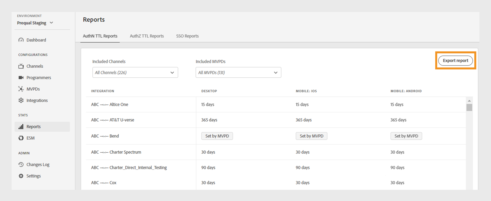

# Rapports {#Reports}

>[!NOTE]
>
>Le contenu de cette page est fourni à titre d’information uniquement. L’utilisation de cette API nécessite une licence actuelle de Adobe. Aucune utilisation non autorisée n’est autorisée.

La variable **Rapports** La section du tableau de bord TVE permet d’accéder aux données agrégées pour les rapports AuthN TTL, AuthZ TTL et SSO. Ces rapports incluent vos intégrations de canaux avec différents MVPD sur tous les [plateformes](#platforms).

Les rapports vous permettent de filtrer les données et de collecter des informations sur l’ensemble des [canaux ou MVPD spécifiques](#selecting-specific-channels-mvpds). Vous pouvez également exporter des rapports dans un fichier CSV pour une analyse plus approfondie.

## Affichage des rapports {#view-reports}

Pour afficher un rapport spécifique, procédez comme suit.

1. Sélectionnez la variable **Rapports** dans le panneau de gauche.
1. Sélectionnez l’un des onglets suivants pour afficher et exporter les données agrégées des canaux et MVPD inclus :
   * [Rapports TTL AuthN](#authn-ttl-reports)
   * [Rapports TTL AuthZ](#authz-ttl-reports)
   * [Rapports SSO](#sso-reports)

   

   *Type de rapport*

### Rapports TTL AuthN {#authn-ttl-reports}

Les rapports TTL AuthN, également appelés durée de vie de l’authentification (TTL), affichent la durée de configuration des jetons d’authentification pour vos intégrations de canaux avec divers MVPD pour tous les canaux. [plateformes](#platforms). Ces rapports vous permettent d’examiner le temps pendant lequel un utilisateur reste authentifié pour un MVPD et une plateforme spécifiques. Les valeurs de durée sont présentées dans des formats conviviaux tels que, **days**, **heures**, **minutes**, et **seconds**. Le tableau Rapports TTL AuthN comprend un défilement horizontal et vertical pour s’adapter à différentes tailles d’écran.

Vous pouvez également afficher et télécharger des données pour [canaux spécifiques ou MVPD](#selecting-specific-channels-mvpds).

*Exporter des rapports TTL AuthN*

>[!IMPORTANT]
>
> La variable **Défini par MVPD** L’espace réservé est utilisé lorsque le MVPD applique la valeur TTL AuthN plutôt que la configuration d’authentification Adobe Pass.

Sélectionner **Exporter des rapports** pour enregistrer les données au format CSV sur votre ordinateur local.

### Rapports TTL AuthZ {#authz-ttl-reports}

Les rapports TTL AuthZ, également appelés Durée de vie de l’autorisation (TTL), affichent la durée du jeton d’autorisation configuré pour vos intégrations de canaux avec divers MVPD pour tous les canaux. [plateformes](#platforms). Ces rapports vous permettent d’examiner le temps pendant lequel un utilisateur reste autorisé à regarder le contenu pour un MVPD et une plateforme spécifiques. Les valeurs de durée sont présentées dans des formats conviviaux tels que, **days**, **heures**, **minutes**, et **seconds**. Le tableau Rapports TTL AuthZ propose un défilement horizontal et vertical pour s’adapter à différentes tailles d’écran.

Vous pouvez également afficher et télécharger les données pour [canaux spécifiques ou MVPD](#selecting-specific-channels-mvpds).

*Exporter des rapports TTL AuthZ*

>[!IMPORTANT]
>
> La variable **Défini par MVPD** L’espace réservé est utilisé lorsque le MVPD applique la valeur AuthZ TTL plutôt que la configuration de l’authentification Adobe Pass.

Sélectionner **Exporter des rapports** pour enregistrer les données au format CSV sur votre ordinateur local.

### Rapports SSO {#sso-reports}

Les rapports d’authentification unique (SSO), également appelés connexion unique, affichent l’état de connexion unique configuré pour vos intégrations de canaux avec divers MVPD sur l’ensemble des [plateformes](#platforms). Ces rapports vous permettent d’examiner l’expérience d’authentification unique de l’utilisateur attendue pour un MVPD et une plateforme spécifique. Les valeurs sont présentées dans des formats conviviaux, tels que : **SSO désactivé**, **SSO activé**, et **SSO incertain**. Le tableau Rapports d’authentification unique (SSO) propose un défilement horizontal et vertical pour s’adapter à différentes tailles d’écran.

Vous pouvez également afficher et télécharger des données pour [canaux spécifiques ou MVPD](#selecting-specific-channels-mvpds).

*Exportation des rapports SSO*

>[!IMPORTANT]
>
> La variable **SSO incertain** espace réservé indique que l’authentification unique (SSO) est activée et peut être opérationnelle. Toutefois, les paramètres répertoriés ci-dessous peuvent empêcher l’authentification SSO, comme expliqué dans les exemples suivants :
>
> * Paramètres de la plateforme utilisateur : option permettant de bloquer les cookies tiers.
> * Décisions de l&#39;utilisateur : les utilisateurs refusent à la plateforme l&#39;accès à leur abonnement au fournisseur de télévision.
> * Paramètres MVPD : le MVPD demande une authentification pour chaque canal.

Sélectionner **Exporter des rapports** pour enregistrer les données au format CSV sur votre ordinateur local.

## Plateformes {#platforms}

La variable [Rapports TTL AuthN](#authn-ttl-reports), [Rapports TTL AuthZ](#authz-ttl-reports), et [Rapports SSO](#sso-reports) présenter des données sur différentes plateformes, par exemple :

* **Bureau**: affiche les valeurs appliquées aux mises en oeuvre de programmeur via le SDK JavaScript d’authentification Adobe Pass.

* **Mobile**

  **iOS**: affiche les valeurs appliquées à l’aide du SDK iOS d’authentification Adobe Pass.

  **Android**: affiche les valeurs appliquées par le biais du SDK Android d’authentification Adobe Pass.

  **Autres**: affiche les valeurs appliquées à l’aide de l’API REST d’authentification Adobe Pass développée pour les appareils mobiles.

* **TVCD**

  **Roku**: affiche les valeurs appliquées via l’API REST d’authentification Adobe Pass, en identifiant Roku comme type d’appareil.

  **FireTV**: affiche les valeurs appliquées par le biais du SDK Adobe Pass Authentication FireTV.

  **Apple TV**: affiche les valeurs appliquées via le SDK Adobe Pass Authentication tvOS.

  **Autres**: affiche les valeurs appliquées à l’aide de l’API REST d’authentification Adobe Pass pour les appareils connectés à la télévision.

* **Plateforme non identifiée**: affiche les valeurs appliquées aux mises en oeuvre de programmeur lorsque les services d’authentification Adobe Pass détectent un type d’appareil inconnu.

Pour en savoir plus sur le partage du type d’appareil souhaité, par exemple **Roku** avec les API REST d’authentification Adobe Pass ou les SDK, consultez le mécanisme de [transmission des informations client](/help/authentication/passing-client-information-device-connection-and-application.md).

>[!IMPORTANT]
>
> Les données agrégées sont basées sur la configuration spécifique de chaque environnement d’authentification Adobe Pass. Lors du basculement entre différents environnements de tableau de bord TVE, attendez-vous à des variations des données dans les rapports. Voir [Environnements d’authentification Adobe Pass](/help/authentication/tve-dashboard-environments.md) pour en savoir plus.

## Sélection de canaux et de MVPD spécifiques {#selecting-specific-channels-mvpds}

La variable [Rapports TTL AuthN](#authn-ttl-reports), [Rapports TTL AuthZ](#authz-ttl-reports), et [Rapports SSO](#sso-reports) données présentes pour **Tous les canaux** intégrations avec **Tous les MVPD** par défaut.

>[!NOTE]
>
> Si vous désélectionnez **Tous les canaux** ou **Tous les MVPD** dans les menus déroulants respectifs, un message s’affiche pour effectuer une sélection afin d’afficher des rapports pertinents.

Pour générer un rapport pour des canaux spécifiques :

1. Sélectionnez la variable **Canaux inclus** menu déroulant en haut du rapport sélectionné.

   

   *Menu déroulant Canaux inclus*

1. Désélectionner **Tous les canaux**.
1. Sélectionnez les canaux requis dans la **Canaux inclus** menu déroulant pour lequel générer des données.

>[!NOTE]
>
> Pour que les options soient disponibles dans la variable **MVPD inclus** , vous devez sélectionner au moins un canal dans le menu déroulant **Canaux inclus** menu déroulant.

Pour générer un rapport pour des MVPD spécifiques :

1. Sélectionnez la variable **MVPD inclus** menu déroulant en haut du rapport sélectionné.

   

   *Menu déroulant MVPD inclus*

1. Désélectionner **Tous les MVPD**.
1. Sélectionnez les MVPD requis dans la **MVPD inclus** menu déroulant pour lequel générer des données.
