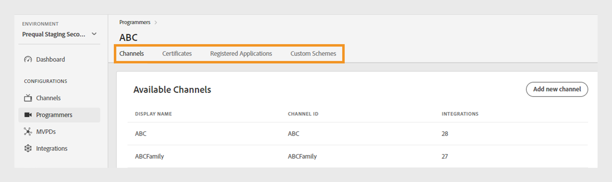
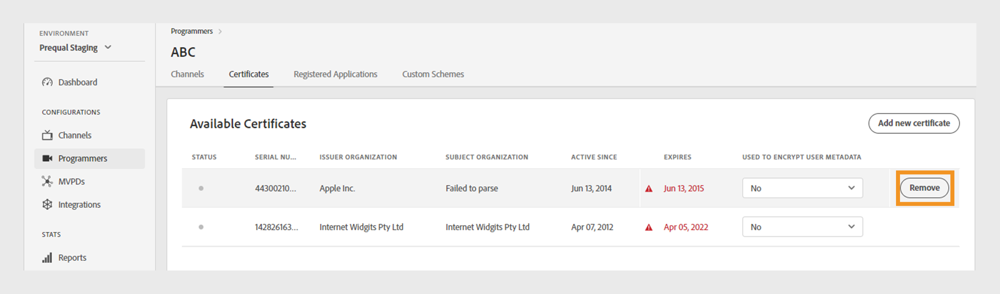
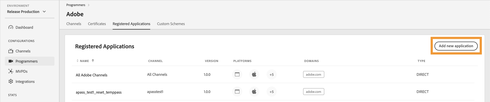

# Programmeurs {#programmers}

>[!NOTE]
>
>Le contenu de cette page est fourni à titre d’information uniquement. L’utilisation de cette API nécessite une licence actuelle de Adobe. Aucune utilisation non autorisée n’est autorisée.

La section **Programmeurs** du tableau de bord TVE vous permet d’afficher et de gérer les paramètres des [programmeurs](/help/authentication/glossary.md#programmer) liés aux droits de votre compte. Vous pouvez également [ajouter un nouveau programmeur](#add-new-programmer) en fonction de vos besoins.

L’onglet **Programmeurs** du panneau de gauche affiche une liste des programmeurs existants avec les détails suivants :

* **Identifiant de programmeur** : identifiant de société de médias dans le système.
* **Canaux** : nombre de canaux associés liés à un programmeur.

*Liste des programmeurs existants*

Saisissez le nom du programmeur dans la barre **Recherche** située au-dessus de la liste pour en savoir plus sur un programmeur.

## Gestion des configurations de programmeur {#manage-programmer-conf}

Suivez ces étapes pour gérer différents paramètres d’un programmeur spécifique.

1. Sélectionnez l’onglet **Programmeurs** dans le panneau de gauche.
1. Sélectionnez un programmeur dans la liste.
1. Sélectionnez l’un des onglets suivants pour afficher et modifier les paramètres correspondants du programmeur sélectionné :

   * [Canaux](#channels)
   * [Certificats](#certificates)
   * [Applications enregistrées](#registered-applications)
   * [Schémas personnalisés](#custom-schemes)

   

   *Paramètres du programmeur*

>[!IMPORTANT]
>
> Afficher [Réviser et pousser les modifications](/help/authentication/tve-dashboard/new-tve-dashboard/tve-dashboard-review-push-changes.md) pour plus d’informations sur l’activation des modifications de configuration.

### Canaux {#channels}

Cet onglet affiche la liste des canaux associés à un programmeur actuel. Sélectionnez un canal spécifique dans cette liste pour accéder à des informations détaillées dans la section [Canaux](/help/authentication/tve-dashboard/new-tve-dashboard/tve-dashboard-channels.md) .

Pour ajouter un nouveau canal pour le programmeur sélectionné, sélectionnez **Ajouter un nouveau canal** dans le coin supérieur droit de la section **Canaux disponibles** . Découvrez [comment ajouter un nouveau canal](/help/authentication/tve-dashboard/new-tve-dashboard/tve-dashboard-channels.md#add-new-channel).

*Ajouter un nouveau canal*

### Certificats {#certificates}

Cet onglet affiche la liste des [certificats disponibles](#available-certificates) utilisés dans les flux de chiffrement des métadonnées utilisateur. Il affiche des détails sur chaque certificat qui comprend :

* État (activé ou non pour l’utilisation du **chiffrement des métadonnées utilisateur**)
* Numéro de série
* Nom de l’organisation émettrice
* Nom de l’organisation concernée
* Date d’émission
* Date d’expiration
* Un menu déroulant pour chiffrer les métadonnées utilisateur (si vous sélectionnez **Oui**, le certificat chiffrera les informations utilisateur sensibles, telles que les valeurs de code postal).

#### Certificats disponibles {#available-certificates}

Ces certificats servent de clés privées ou publiques et sont utilisés pour le chiffrement des métadonnées utilisateur. Tous les canaux associés à la même société de médias peuvent utiliser ces certificats.

Vous pouvez apporter les modifications suivantes aux certificats disponibles :

* [Ajouter un nouveau certificat](#add-new-certificate)
* [Suppression de certificat](#delete-certificate)

##### Ajouter un nouveau certificat {#add-new-certificate}

Pour ajouter un nouveau certificat, procédez comme suit.

1. Sélectionnez **Ajouter un nouveau certificat** dans le coin supérieur droit de la section **Certificats disponibles** .

   

   *Ajouter un nouveau certificat*

1. Collez la clé publique de votre certificat dans la boîte de dialogue **Nouveau certificat**.

1. Sélectionnez **Ajouter un certificat**.

1. Recherchez le nouveau certificat dans la liste de **certificats disponibles**.

   >[!IMPORTANT]
   >
   > Assurez-vous que vos systèmes sont à jour et prêts à utiliser le nouveau certificat.

1. Sélectionnez **Oui** dans le menu déroulant **Utilisé pour les métadonnées utilisateur chiffrées** pour activer un nouveau certificat.

Un nouveau changement de configuration a été créé et est prêt pour la mise à jour du serveur. Pour utiliser le nouveau certificat répertorié dans la section **Certificats disponibles**, passez au flux [ de  modifications de révision et de notification push](/help/authentication/tve-dashboard/new-tve-dashboard/tve-dashboard-review-push-changes.md).

##### Suppression de certificat {#delete-certificate}

Pour supprimer un certificat, procédez comme suit.

1. Pointez sur le certificat que vous souhaitez supprimer de la liste des **certificats disponibles**.

1. Sélectionnez **Supprimer**.

   

   *Supprimer le certificat sélectionné*

1. Sélectionnez **Supprimer** dans la boîte de dialogue **Supprimer le certificat**.

Un nouveau changement de configuration a été créé et est prêt pour la mise à jour du serveur. Le certificat sera supprimé de la section **Certificats disponibles** uniquement après [la révision et la notification push des modifications](/help/authentication/tve-dashboard/new-tve-dashboard/tve-dashboard-review-push-changes.md).

### Applications enregistrées {#registered-applications}

Cet onglet affiche la liste des applications enregistrées. Pour plus d’informations sur l’utilisation des applications enregistrées, consultez la documentation [présentation de l’enregistrement dynamique du client](../../dcr-api/dynamic-client-registration-overview.md) .

Vous pouvez effectuer les actions suivantes avec les applications enregistrées :

* [Ajouter une nouvelle application enregistrée](#add-registered-applications)
* [Téléchargement d’une instruction logicielle](#download-software-statement)

#### Ajouter une nouvelle application enregistrée {#add-registered-applications}

Pour ajouter une nouvelle application enregistrée, procédez comme suit.

1. Sélectionnez **Ajouter une nouvelle application** dans le coin supérieur droit de la section **Applications enregistrées** .

   

   *Ajouter une nouvelle application*

1. Sélectionnez **Attribué au canal** dans le menu déroulant de la boîte de dialogue **Nouvelle application**.

   >[!IMPORTANT]
   >
   > Il est recommandé de créer des applications enregistrées avec des autorisations plus spécifiques et limitées afin d’améliorer la sécurité et de prévenir les accès non autorisés. Par conséquent, lors de la création d’applications enregistrées, envisagez d’utiliser des options plus étroites pour le `channel` affecté.

1. Sélectionnez **Plateformes** dans le menu déroulant.

   >[!IMPORTANT]
   >
   > Il est recommandé de créer des applications enregistrées avec des autorisations plus spécifiques et limitées afin d’améliorer la sécurité et de prévenir les accès non autorisés. Par conséquent, lors de la création d’applications enregistrées, envisagez d’utiliser des options plus étroites pour le `platforms` affecté.

1. Sélectionnez **Domaines** dans le menu déroulant.

   >[!IMPORTANT]
   >
   > Dans le processus d’enregistrement du client, l’application cliente peut demander à être autorisée à utiliser une URL de redirection pour finaliser le flux d’authentification. Lorsqu’une application cliente utilise une URL de redirection spécifique, elle est validée par rapport au `domains` sélectionné dans cette sélection.

1. Saisissez le **nom** de l’application.

1. Saisissez la **version** de l’application.

   >[!IMPORTANT]
   >
   > Il est recommandé de créer une nouvelle application enregistrée pour chaque mise à jour majeure de votre application cliente afin de gérer son cycle de vie et son utilisation. Si nécessaire, créez un ticket via notre [Zendesk](https://adobeprimetime.zendesk.com) et demandez à votre gestionnaire de compte technique (TAM) de révoquer une application enregistrée afin de bloquer les fonctionnalités d’une version spécifique de l’application cliente.

1. Sélectionnez la valeur **Type** &quot;DIRECT&quot; dans le menu déroulant.

1. Sélectionnez **Ajouter une application**.

Un nouveau changement de configuration a été créé et est prêt pour la mise à jour du serveur. Pour utiliser la nouvelle application enregistrée répertoriée dans la section **Applications enregistrées**, passez au flux [ review and push changes](/help/authentication/tve-dashboard/new-tve-dashboard/tve-dashboard-review-push-changes.md) .

#### Téléchargement de l’instruction logicielle {#download-software-statement}

Pour télécharger une instruction logicielle, procédez comme suit.

1. Passez la souris sur l’application enregistrée pour télécharger l’instruction logicielle à partir de la liste des **Applications enregistrées**.

1. Sélectionnez **Télécharger**.

   

   *Télécharger une instruction logicielle*

### Schémas personnalisés {#custom-schemes}

Cet onglet affiche une liste des schémas personnalisés. Pour plus d’informations sur l’utilisation des schémas personnalisés, reportez-vous à l’ [enregistrement de l’application iOS/tvOS](/help/authentication/iostvos-application-registration.md).

Vous pouvez apporter les modifications suivantes aux schémas personnalisés :

* [Génération d’un nouveau modèle personnalisé](#generate-custom-schemes)

#### Générer un nouveau modèle personnalisé {#generate-custom-schemes}

Pour générer un nouveau schéma personnalisé, procédez comme suit.

1. Sélectionnez **Générer un nouveau schéma personnalisé**.

   

   *Générer un nouveau schéma personnalisé*

Un nouveau changement de configuration a été créé et est prêt pour la mise à jour du serveur. Pour utiliser le nouveau schéma personnalisé répertorié dans la section **Schémas personnalisés**, passez au flux [ de  révision et notification push modifications](/help/authentication/tve-dashboard/new-tve-dashboard/tve-dashboard-review-push-changes.md).

## Ajouter un nouveau programmeur {#add-new-programmer}

Pour ajouter une nouvelle entité de programmeur, procédez comme suit.

1. Sélectionnez l’onglet **Programmeurs** dans le panneau de gauche.

1. Sélectionnez **Ajouter un nouveau programmeur** dans le coin supérieur droit de la section **Programmeurs** .

   

   *Ajouter un nouveau programmeur*

1. Saisissez l’identifiant de la société de médias dans **ID de programmeur** dans la boîte de dialogue **Nouveau programmeur**.

1. Saisissez un nom de marque commerciale à afficher dans la console sous **Nom d’affichage**.

1. Sélectionnez **Ajouter un programmeur**.

Un nouveau changement de configuration a été créé et est prêt pour la mise à jour du serveur. Pour utiliser le nouveau programmeur répertorié dans la section **Programmeurs**, passez à l’étape [Révision et changements push](/help/authentication/tve-dashboard/new-tve-dashboard/tve-dashboard-review-push-changes.md).
