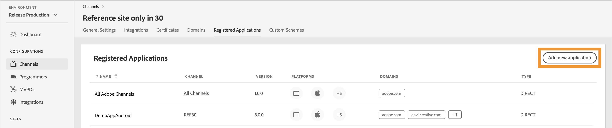

# Canaux {#channels}

>[!NOTE]
>
>Le contenu de cette page est fourni à titre d’information uniquement. L’utilisation de cette API nécessite une licence Adobe actuelle. Aucune utilisation non autorisée n’est autorisée.

La section **Canaux** du tableau de bord TVE vous permet d’afficher et de gérer les paramètres des canaux associés à un programmeur spécifique. Vous pouvez également [ajouter un nouveau canal](#add-new-channel) en fonction de vos besoins.

L’onglet **Canaux** dans le panneau de gauche affiche une liste des canaux liés avec les détails suivants :

* **Nom d’affichage** : nom de marque du canal utilisé à des fins commerciales.
* **Identifiant du canal** : un identifiant unique, également appelé identifiant du demandeur.
* **Intégrations** : nombre de connexions établies avec les [MVPD](/help/authentication/integration-guide-programmers/rest-apis/rest-api-v2/rest-api-v2-glossary.md#mvpd).


*Liste des canaux existants*

Saisissez le nom du canal dans la barre **Rechercher** au-dessus de la liste pour en savoir plus sur le canal.

## Gestion des configurations de canal {#manage-channel-conf}

Suivez les étapes pour gérer divers paramètres d’un canal spécifique.

1. Sélectionnez l’onglet **Canaux** dans le panneau de gauche.

1. Sélectionnez le canal dans la liste disponible.

1. Sélectionnez l’un des onglets suivants pour afficher et modifier les paramètres correspondants du canal sélectionné :

   * [Paramètres généraux](#general-settings)
   * [Intégrations](#integrations)
   * [Certificats](#certificates)
   * [Domaines](#domains)
   * [Applications enregistrées](#registered-applications)
   * [Schémas personnalisés](#custom-schemes)

   

   *Paramètres de canal*

>[!IMPORTANT]
>
> Consultez [Vérifier et transmettre les modifications](/help/authentication/user-guide-tve-dashboard/tve-dashboard-review-push-changes.md) pour plus d’informations sur l’activation des modifications de configuration.

### Paramètres généraux {#general-settings}

Cet onglet présente **Informations sur les canaux** et **Configuration Analytics**.

#### Informations sur le canal {#channel-information}

Dans cette section, vous pouvez modifier les détails suivants :

* **Nom d’affichage** : nom de marque du canal utilisé à des fins commerciales.

* **URL de redirection par défaut** : URL de redirection de sauvegarde pour l’authentification et la déconnexion.

* **Rapports d’erreur** : en sélectionnant **Oui**, les SDK Adobe Pass envoient des rapports d’erreur au serveur principal Adobe Pass pour Analytics.


*Modifier les informations du canal*

#### Configuration Analytics {#analytics-configuration}

Cette section vous permet de configurer le transfert des événements d’authentification Adobe Pass vers Adobe Analytics.

Pour activer **Configuration d’Analytics**, contactez votre gestionnaire de compte technique (TAM) pour plus d’informations sur la configuration de l’identifiant de suite de rapports (RSID).


*Activer les configurations Analytics*

Sélectionnez **Ajouter une nouvelle configuration d’analyse** pour ajouter plusieurs configurations.

Une nouvelle modification de configuration a été créée et est prête pour la mise à jour du serveur. Pour utiliser la nouvelle configuration d’Analytics de la section **Configuration d’Analytics**, poursuivez avec le flux [réviser et pousser les modifications](/help/authentication/user-guide-tve-dashboard/tve-dashboard-review-push-changes.md).

### Intégrations {#integrations}

Cet onglet affiche la liste des intégrations disponibles entre le canal actuellement sélectionné et les MVPD. La liste présente chaque intégration avec son statut, en indiquant si elle est activée ou non. Sélectionnez une intégration spécifique dans cette liste pour accéder à des informations détaillées dans la section [ Intégrations ](tve-dashboard-integrations.md).


*Liste des intégrations disponibles*

### Certificats {#certificates}

Cet onglet affiche la liste des [certificats disponibles](#available-certificates) et [certificats disponibles hérités](#inherited-avail-certificates) utilisés dans les flux de chiffrement des métadonnées de l’utilisateur. Elle affiche des détails sur chaque certificat qui comprend :

* Le statut (qu’il soit activé pour **chiffrement des métadonnées de l’utilisateur** utilisation ou non)
* Numéro de série
* Nom de l&#39;institution émettrice
* Nom de l&#39;organisation en question
* Date d’émission
* Date d’expiration
* Un menu déroulant pour chiffrer les métadonnées de l’utilisateur (si vous sélectionnez **Oui**, le certificat chiffre les informations utilisateur sensibles, telles que les valeurs de code postal).

#### Certificats disponibles {#available-certificates}

Ces certificats servent de clés privées ou publiques et sont utilisés pour le chiffrement des métadonnées des utilisateurs.
Vous pouvez effectuer les modifications suivantes sous la section Certificats disponibles :

* [Ajouter un nouveau certificat](#add-new-certificate)
* [Supprimer le certificat](#delete-certificate)

##### Ajouter un nouveau certificat {#add-new-certificate}

Pour ajouter un nouveau certificat, procédez comme suit :

1. Sélectionnez **Ajouter un nouveau certificat** en haut de la section **Certificats disponibles**.

   

   *Ajouter un nouveau certificat*

1. Collez la clé publique de votre certificat dans la boîte de dialogue **Nouveau certificat**.

1. Sélectionnez **Ajouter un certificat**.

1. Recherchez le nouveau certificat dans la liste des **Certificats disponibles**.

   >[!IMPORTANT]
   >
   > Assurez-vous que vos systèmes sont à jour et prêts à utiliser le nouveau certificat.

1. Sélectionnez **Oui** dans le menu déroulant **Utilisé pour les métadonnées d’utilisateur chiffrées** pour activer un nouveau certificat.

Une nouvelle modification de configuration a été créée et est prête pour la mise à jour du serveur. Pour utiliser le nouveau certificat répertorié dans la section **Certificats disponibles**, poursuivez avec le flux [réviser et pousser les modifications](/help/authentication/user-guide-tve-dashboard/tve-dashboard-review-push-changes.md).

##### Supprimer le certificat {#delete-certificate}

Pour supprimer un certificat, procédez comme suit.

1. Pointez sur le certificat que vous souhaitez supprimer de la liste **Certificats disponibles**.

1. Sélectionnez **Supprimer**.

   

   *Supprimer le certificat sélectionné*

1. Sélectionnez **Supprimer** dans la boîte de dialogue **Supprimer le certificat actif**.

Une nouvelle modification de configuration a été créée et est prête pour la mise à jour du serveur. Le certificat sera supprimé de la section **Certificats disponibles** uniquement après [révision et notification push des modifications](/help/authentication/user-guide-tve-dashboard/tve-dashboard-review-push-changes.md).

#### Certificats disponibles hérités {#inherited-avail-certificates}

Les sociétés de médias définissent ces certificats à leur propre niveau. Tous les canaux associés à la même société de médias peuvent utiliser ces certificats.


*Certificats disponibles hérités*

### Domaines {#domains}

Cet onglet affiche la liste des domaines disponibles par l’intermédiaire desquels le canal respectif communique avec l’authentification Adobe Pass.

Vous pouvez apporter les modifications suivantes aux domaines :

* [Ajouter un nouveau domaine](#add-domains)
* [Supprimer le domaine](#delete-domain)

>[!TIP]
>
> Évitez d’ajouter un nouveau sous-domaine s’il existe un domaine plus général dans la liste.

#### Ajouter un nouveau domaine {#add-domains}

Pour ajouter un domaine, procédez comme suit.

1. Sélectionnez **Ajouter un nouveau domaine** dans le coin supérieur droit de la section **Domaines disponibles**.

   

   *Ajouter un nouveau domaine*

1. Saisissez le nom de votre domaine dans la boîte de dialogue **Nouveau domaine**.

1. Sélectionnez **Ajouter un domaine** pour ajouter un nouveau domaine pour le canal sélectionné.

Une nouvelle modification de configuration a été créée et est prête pour la mise à jour du serveur. Pour utiliser le nouveau domaine répertorié dans la section **Domaines disponibles**, poursuivez avec le flux [vérifier et pousser les modifications](/help/authentication/user-guide-tve-dashboard/tve-dashboard-review-push-changes.md).

#### Supprimer le domaine {#delete-domain}

Pour supprimer un domaine, procédez comme suit.

1. Pointez sur le domaine que vous souhaitez supprimer de la liste des **Domaines disponibles**.

1. Sélectionnez **Supprimer**.

   

   *Supprimer le domaine sélectionné*

1. Sélectionnez **Supprimer** dans la boîte de dialogue **Supprimer le domaine**.

Une nouvelle modification de configuration a été créée et est prête pour la mise à jour du serveur. Le domaine ne sera supprimé de la section **Domaines disponibles** qu’après [révision et notification push des modifications](/help/authentication/user-guide-tve-dashboard/tve-dashboard-review-push-changes.md).

Le domaine sélectionné ne peut plus être utilisé. Par conséquent, l’application associée à ce domaine perd l’accès aux services d’authentification Adobe Pass.

### Applications enregistrées {#registered-applications}

Cet onglet affiche la liste des applications enregistrées. Pour plus d’informations sur l’utilisation des applications enregistrées, reportez-vous à la documentation [présentation de l’enregistrement client dynamique](../integration-guide-programmers/rest-apis/rest-api-dcr/dynamic-client-registration-overview.md).

Vous pouvez effectuer les actions suivantes avec les applications enregistrées :

* [Ajouter une nouvelle application enregistrée](#add-registered-applications)
* [Téléchargement d’un relevé de logiciel](#download-software-statement)

#### Ajouter une nouvelle application enregistrée {#add-registered-applications}

Pour ajouter une nouvelle application enregistrée, procédez comme suit.

1. Sélectionnez **Ajouter une nouvelle application** dans le coin supérieur droit de la section **Applications enregistrées**.

   

   *Ajouter une nouvelle application*

1. Sélectionnez **Plateformes** dans le menu déroulant de la boîte de dialogue **Nouvelle application**.

   >[!IMPORTANT]
   >
   > Il est recommandé de créer des applications enregistrées avec des autorisations plus spécifiques et limitées afin de renforcer la sécurité et d’empêcher tout accès non autorisé. Par conséquent, lors de la création d’applications enregistrées, pensez à utiliser des options plus étroites pour les `platforms` attribués.

1. Sélectionnez **Domaines** dans le menu déroulant.

   >[!IMPORTANT]
   >
   > Dans le processus d’enregistrement du client, l’application cliente peut demander l’autorisation d’utiliser une URL de redirection pour la finalisation du flux d’authentification. Lorsqu’une application cliente utilise une URL de redirection spécifique, elle est validée par rapport à la `domains` sélectionnée dans cette sélection.

1. Saisissez le **Nom** de l’application.

1. Saisissez la **Version** de l’application.

   >[!IMPORTANT]
   >
   > Il est recommandé de créer une nouvelle application enregistrée pour chaque mise à jour majeure de votre application cliente afin de gérer son cycle de vie et son utilisation. Si nécessaire, créez un ticket via notre [Zendesk](https://adobeprimetime.zendesk.com) et demandez à votre gestionnaire de compte technique (TAM) de révoquer une application enregistrée afin de bloquer la fonctionnalité d’une version spécifique de l’application cliente.

1. Sélectionnez **Type** valeur « DIRECT » dans le menu déroulant.

1. Sélectionnez **Ajouter une application**.

Une nouvelle modification de configuration a été créée et est prête pour la mise à jour du serveur. Pour utiliser la nouvelle application enregistrée répertoriée dans la section **Applications enregistrées**, poursuivez avec le flux [examiner et pousser les modifications](/help/authentication/user-guide-tve-dashboard/tve-dashboard-review-push-changes.md).

#### Téléchargement du relevé de logiciel {#download-software-statement}

Pour télécharger un relevé de logiciel, procédez comme suit.

1. Pointez sur l’application enregistrée pour télécharger la déclaration du logiciel à partir de la liste des **Applications enregistrées**.

1. Sélectionnez **Télécharger**.

   

   *Téléchargement d’une déclaration de logiciel*

### Schémas personnalisés {#custom-schemes}

Cet onglet affiche une liste des schémas personnalisés.
Les schémas personnalisés peuvent être utilisés pour les appareils Android et iOS.

Vous pouvez apporter les modifications suivantes aux schémas personnalisés :

* [Générer un nouveau schéma personnalisé](#generate-custom-schemes)

#### Générer un nouveau schéma personnalisé {#generate-custom-schemes}

Pour générer un nouveau schéma personnalisé, procédez comme suit.

1. Sélectionnez **Générer un nouveau schéma personnalisé**.

   

   *Générer un nouveau schéma personnalisé*

Une nouvelle modification de configuration a été créée et est prête pour la mise à jour du serveur. Pour utiliser le nouveau schéma personnalisé répertorié dans la section **Schémas personnalisés**, passez au flux [réviser et pousser les modifications](/help/authentication/user-guide-tve-dashboard/tve-dashboard-review-push-changes.md).

#### Si vous n’avez pas accès au tableau de bord Adobe TVE :

Envoyez un ticket à <tve-support@adobe.com>. Veuillez indiquer l’ID du canal. Une personne de notre équipe d’assistance créera un schéma personnalisé pour vous.

#### ANDROID {#Android}

1. Schéma personnalisé - Le schéma personnalisé créé dans le tableau de bord TVE peut être utilisé pour les applications d’appareils Android.

1. Dans le fichier de ressources de votre application, `strings.xml` ajoutez le code suivant :

```XML
       <string name="software_statement">softwarestatement value</string>
       <string name="redirect_uri">adbe.TTIFAaWuR-CmxXv1Di8PlQ://</string>
```

#### iOS {#iOS}

Le schéma personnalisé peut être utilisé dans le fichier `info.plist` de votre application. Vous trouverez ci-dessous l&#39;exemple où vous devez ajouter l&#39;URL générée dans le tableau de bord TVE :

```plist
    <key>CFBundleURLTypes</key>
    <array>
        <dict>
            <key>CFBundleURLSchemes</key>
            <array>
                <string>adbe.u-XFXJeTSDuJiIQs0HVRAg</string> // replace this with your custom scheme
            </array>
        </dict>
    </array>
```

### Schémas personnalisés hérités {#inherited-custom-schemes}

Les sociétés de médias définissent ces schémas personnalisés à leur propre niveau. Tous les canaux associés à la même société de médias peuvent utiliser ces schémas personnalisés.


*Schémas personnalisés hérités*

## Ajouter un nouveau canal {#add-new-channel}

Pour ajouter un nouveau canal, procédez comme suit.

1. Sélectionnez l’onglet **Canaux** dans le panneau de gauche.

1. Sélectionnez **Ajouter un nouveau canal** dans le coin supérieur droit de la section **Canaux**.

   

   *Ajouter un nouveau canal*

1. Sélectionnez **ID du programmeur** dans le menu déroulant de la boîte de dialogue **Nouveau canal**.

1. Saisissez un identifiant unique dans le champ **Identifiant du canal**.

1. Saisissez le nom de marque du canal utilisé à des fins commerciales dans le champ **Nom d’affichage**.

1. Sélectionnez **Ajouter un canal**.

Une nouvelle modification de configuration a été créée et est prête pour la mise à jour du serveur. Pour utiliser le nouveau canal répertorié dans la section **Canaux**, poursuivez avec le flux [réviser et pousser les modifications](/help/authentication/user-guide-tve-dashboard/tve-dashboard-review-push-changes.md).