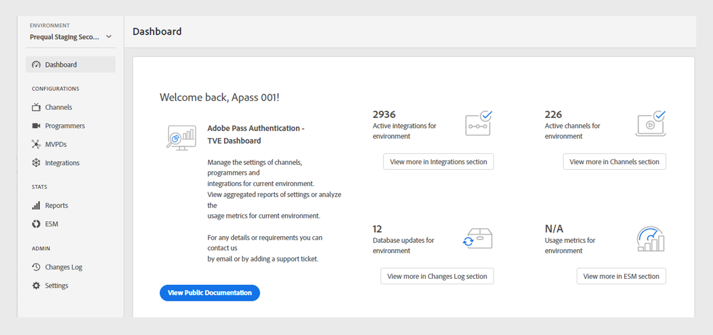

# Tableau de bord {#dashboard}

>[!NOTE]
>
>Le contenu de cette page est fourni à titre d’information uniquement. L’utilisation de cette API nécessite une licence Adobe actuelle. Aucune utilisation non autorisée n’est autorisée.

La section **Tableau de bord** du panneau de gauche sert de page d’accueil du tableau de bord Adobe Pass Authentication TVE.

Deux sections sont disponibles sur la page d’accueil :

* [Écran de bienvenue](#welcome-screen)
* [Statut de la configuration](#configuration-status)

## Écran de bienvenue {#welcome}

Dans cette section, vous pouvez accéder directement à la documentation publique à partir du message de bienvenue et afficher un instantané de vos configurations actuelles.

* **Intégrations actives** : nombre d’intégrations actives dans l’environnement actuel. Sélectionnez **En savoir plus dans la section relative à l’intégration** pour accéder à des informations détaillées dans la section [Intégrations](tve-dashboard-integrations.md).
* **Canaux actifs** : nombre de canaux actifs dans l’environnement actuel. Sélectionnez **En savoir plus dans la section Canaux** pour accéder à des informations détaillées dans la section [Canaux](tve-dashboard-channels.md).
* **Mises à jour de la base de données** : nombre de modifications de configuration apportées à l’environnement actuel. Sélectionnez **Afficher plus dans la section Journal des modifications** pour accéder à des informations détaillées dans la section [Journal des modifications](tve-dashboard-changes-log.md).
* **Tableau de bord ESM** : gardez un œil sur le prochain tableau de bord ESM, qui offre des mesures détaillées sur l’utilisation des propriétés dans l’environnement actuel. Cette fonctionnalité sera accessible dans les futures mises à jour.

*Écran de bienvenue*

## Statut de la configuration {#conf-status}

Cette section présente les 10 modifications de configuration les plus récentes, parmi lesquelles :

* **Description des modifications** : brève description de la modification sélectionnée par l’utilisateur.
* **poussé par** : compte responsable de la modification.
* **Date push** : date à laquelle la modification a été effectuée.

*Statut de configuration d’un journal des modifications*

Pour afficher la liste complète des modifications, sélectionnez **Afficher plus dans le journal des modifications** dans le coin inférieur droit pour afficher la section [Journal des modifications](tve-dashboard-changes-log.md).
