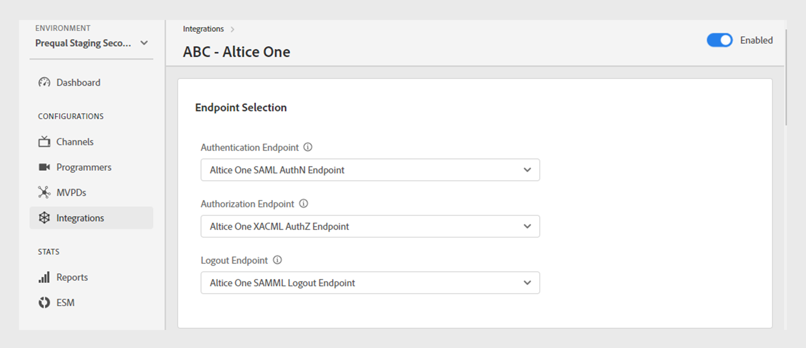
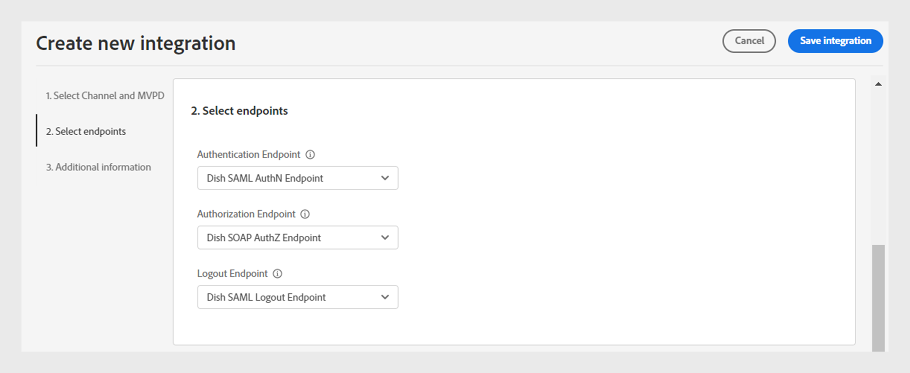

# Intégrations

>[!NOTE]
>
>Le contenu de cette page est fourni à titre d’information uniquement. L’utilisation de cette API nécessite une licence actuelle de Adobe. Aucune utilisation non autorisée n’est autorisée.

La section **Intégrations** du tableau de bord TVE vous permet d’afficher et de gérer les paramètres pour les intégrations entre vos canaux et MVPD. Vous pouvez également [créer une nouvelle intégration](#create-new-integration) selon vos besoins.

L’onglet **Intégrations** du panneau de gauche affiche une liste des intégrations existantes avec les détails suivants :

* État indiquant si l’intégration est actuellement active ou inactive
* Intégration liant des canaux spécifiques à des MVPD respectifs
* Nom du canal avec identifiant de canal
* Nom d’affichage MVPD et identifiant MVPD

*Liste des intégrations existantes*

Saisissez le nom du canal ou du MVPD dans la barre **Rechercher** située au-dessus de la liste pour en savoir plus sur l’intégration.

## Gestion des configurations d’intégration {#manage-integration-conf}

Pour gérer une intégration spécifique, procédez comme suit.

1. Sélectionnez l’onglet **Intégrations** dans le panneau de gauche.
1. Sélectionnez une intégration dans la liste fournie pour afficher et modifier divers paramètres dans les sections suivantes :

   * [Sélection du point de fin](#endpoint-selection)
   * [Paramètres de plateforme](#platform-settings)
   * [Métadonnées utilisateur](#user-metadata)

>[!IMPORTANT]
>
> Afficher [Réviser et pousser les modifications](/help/authentication/user-guide-tve-dashboard/tve-dashboard-review-push-changes.md) pour plus d’informations sur l’activation des modifications de configuration.

### Sélection du point de fin {#endpoint-selection}

Cette section vous permet de choisir les points de terminaison du MVPD utilisé pour l’authentification, l’autorisation et les flux de déconnexion depuis les menus déroulants respectifs.

*Points de terminaison pour les flux d’authentification, d’autorisation et de déconnexion*

>[!NOTE]
>
>Les MVPD peuvent fournir un ou plusieurs points de terminaison pour chaque flux. Lors de l’intégration d’un nouveau canal, le MVPD doit spécifier son point de terminaison préféré pour chaque flux.

>[!IMPORTANT]
>
>Toute modification apportée aux points de terminaison aura un impact sur le comportement global d’une intégration. Ces modifications ne doivent être implémentées qu’après avoir reçu la confirmation du MVPD.

### Paramètres de plateforme {#platform-settings}

Cette section vous permet d’afficher et de modifier les paramètres d’intégration sur toutes les [plateformes](/help/authentication/user-guide-tve-dashboard/tve-dashboard-reports.md#platforms). Vous pouvez modifier ces paramètres en fonction de plateformes individuelles. Par exemple, vous pouvez ajuster la durée TTL d’autorisation sur Android tout en conservant une valeur par défaut pour une autre plateforme.

Chaque propriété des paramètres de la plateforme hérite d’une valeur par défaut définie par le MVPD, mais peut être ajustée si nécessaire.

>[!IMPORTANT]
>
>Un accord avec le MVPD est nécessaire pour déterminer les valeurs définies pour chaque propriété dans les paramètres de la plateforme.

>[!IMPORTANT]
>
> L’héritage des paramètres suit une chaîne commençant par les paramètres MVPD (qui sont les plus généraux), puis le point de terminaison MVPD, l’intégration, la catégorie de plateforme et la plateforme (qui contient la valeur la plus spécifique).

**Paramètres de plateforme** permet de remplacer les paramètres de chaque niveau de la chaîne d’héritage. Les niveaux disponibles dans la chaîne sont regroupés comme suit :

* **Par défaut pour tous** : définissez des valeurs pour les propriétés applicables de manière universelle sur toutes les plateformes si des valeurs de plateforme spécifiques ne sont pas définies, quelles que soient les implémentations du programmeur.

* **Périphériques de bureau** : définissez des valeurs pour les propriétés applicables à tous les ordinateurs de bureau et ordinateurs portables, indépendamment de la méthode de programmation (SDK JS ou API REST).

* **Périphériques mobiles** : définissez des valeurs pour les propriétés applicables à tous les appareils mobiles, y compris **iOS**, **Android** et autres, quelle que soit l’approche de programmation (SDK ou API REST).

* **Périphériques connectés à la télévision** : définissez des valeurs pour les propriétés applicables à tous les appareils connectés à la télévision, y compris **tvOS**, **Roku**, **FireTV** et autres, indépendamment de la méthode de programmation (SDK ou API REST).

* **Appareils non identifiés** : définissez des valeurs pour les propriétés applicables à tous les appareils pour lesquels le mécanisme actuel ne peut pas identifier précisément la plateforme. Dans ce cas, appliquez les règles les plus restrictives définies par le MVPD.

  

  *Catégorie de plateformes et de leurs appareils*

Sélectionner Icône  située à droite de chaque propriété pour explorer les propriétés utilisées pour chaque niveau d’héritage décrit ci-dessus.

#### Flux d’entreprise les plus utilisés {#most-used-flows}

La section **Paramètres de plateforme** offre une gamme de propriétés utilisées dans différents flux d’activités. Les propriétés réelles peuvent varier en fonction des MVPD sélectionnés dans l’intégration spécifique. Vous trouverez ci-dessous les flux les plus utilisés :

**AuthN TTL et AuthZ TTL sur toutes les plateformes**

>[!IMPORTANT]
>
>Les valeurs TTL d’authentification (AuthN) et d’autorisation (AuthZ) doivent correspondre de manière cohérente aux paramètres MVPD.

Pour modifier le délai d’activation de l’authentification et de l’autorisation sur toutes les plateformes pour une intégration spécifique, procédez comme suit.

1. Sélectionnez l’onglet **Intégrations** dans le panneau de gauche.

1. Sélectionnez l’intégration pour laquelle vous souhaitez modifier les valeurs TTL AuthN et TTL AuthZ.

1. Accédez à la section **Paramètres de plateforme** .

1. Sélectionnez l’onglet **Par défaut pour tous** sous **Paramètres de plateforme**.

   >[!NOTE]
   >
   >Si vous souhaitez modifier la durée de **AuthN TTL** et **AuthZ TTL** pour une catégorie de plateforme ou une plateforme spécifique, sélectionnez la plateforme en conséquence.

   

   *Modifier la durée de durée de vie TTL AuthN TTL AuthZ sur toutes les plateformes*

   **A.** Propriété TTL AuthN **B.** Propriété TTL AuthZ

1. Sélectionnez les flèches vers le haut et vers le bas pour ajuster la durée du nombre de jours, heures, minutes et secondes dans les propriétés **AuthN TTL** et **AuthZ TTL** .

La durée de **AuthN TTL** et **AuthZ TTL** sur toutes les plateformes ne sera mise à jour qu’après les [modifications de révision et de notification push](/help/authentication/user-guide-tve-dashboard/tve-dashboard-review-push-changes.md).

**Activer la plateforme SSO**

>[!IMPORTANT]
>
>La propriété **Activer l’authentification unique** est exclusivement prise en charge sur les plateformes *iOS, tvOS, Roku et FireTV*. Il s’applique uniquement aux intégrations avec des MVPD qui prennent en charge l’authentification unique pour ces plateformes.

Suivez ces étapes pour activer ou désactiver l’authentification unique pour une intégration et une plateforme spécifiques.

1. Sélectionnez l’onglet **Intégrations** dans le panneau de gauche.

1. Sélectionnez l’intégration pour laquelle vous souhaitez activer ou désactiver l’authentification unique.

1. Accédez à la section **Paramètres de plateforme** .

1. Sélectionnez une plateforme ou une catégorie spécifique de plateformes pour laquelle vous souhaitez activer l’authentification unique sous **Paramètres de plateforme**.

   

   *Activer l’authentification unique pour une plateforme spécifique*

   **A.** Propriété de connexion unique **B.** Propriété d’autorisation de plateforme

1. Sélectionnez **Oui** pour activer ou **Non** pour désactiver dans le menu déroulant **Activer l’authentification unique**.

1. Sélectionnez **Oui** pour activer ou **Non** pour désactiver dans le menu déroulant **Exiger une autorisation de plateforme**.

   La propriété **Exiger l’autorisation de plateforme** contrôle si la décision de l’utilisateur de **Autoriser** ou de **Refuser** l’accès à son abonnement au fournisseur de télévision est respectée.

   Par exemple, si les options **Activer l’authentification unique** et **Exiger l’autorisation de plateforme** sont activées et que l’utilisateur choisit de refuser l’accès de la plateforme à son abonnement au fournisseur de télévision, alors l’application (canal) respective ne pourra pas utiliser le jeton d’authentification Adobe Pass obtenu par une autre application (canal).

La propriété **Authentification unique** pour une plateforme sélectionnée sera activée ou désactivée uniquement après les [modifications de révision et de notification push](/help/authentication/user-guide-tve-dashboard/tve-dashboard-review-push-changes.md).

**Activer l’authentification par domicile**

Suivez ces étapes pour activer ou désactiver l’authentification basée sur la page d’accueil pour les MVPD basés sur OAuth2.

1. Sélectionnez l’onglet **Intégrations** dans le panneau de gauche.

1. Sélectionnez l’intégration pour laquelle vous souhaitez activer ou désactiver l’authentification par domicile.

1. Accédez à la section **Paramètres de plateforme** .

1. Sélectionnez une plateforme ou une catégorie spécifique de plateformes pour laquelle vous souhaitez activer l’authentification basée sur la page d’accueil sous **Paramètres de plateforme**.

   

   *Activer l’authentification par domicile pour une plateforme spécifique*

   **A.** Propriété de l’adaptateur de bus hôte **B.** Propriété TTL AuthN de l’adaptateur de bus hôte

1. Sélectionnez **Oui** pour activer et **Non** pour désactiver dans le menu déroulant **Tenter l’adaptateur de bus hôte**.

>[!IMPORTANT]
>
>Il est préférable d’éviter de modifier la durée de la propriété **Adapter AuthN TTL**. Cela peut entraîner des échecs inattendus du processus d’autorisation.

La propriété **Tenter l’adaptateur de bus hôte** pour un MVPD spécifique sera activée ou désactivée uniquement après les [modifications de révision et de notification push](/help/authentication/user-guide-tve-dashboard/tve-dashboard-review-push-changes.md).

#### Ajout de propriétés {#add-more-properties}

L’ **ajout de propriétés** permet d’inclure des propriétés spécifiques supplémentaires pour les intégrations, en particulier pour les flux moins courants.

Vous pouvez ajouter les propriétés suivantes :

* Pour toutes les plateformes, sélectionnez l’onglet **Par défaut pour tous** sur la gauche.
* Pour une catégorie de plateforme, sélectionnez l’onglet **Périphériques de bureau**, **Périphériques mobiles** ou **Périphériques connectés à la télévision** sur la gauche.
* Pour un appareil spécifique, sélectionnez l’onglet **iOS**, **Android**, **tvOS**, **Roku** ou **FireTV** sur la gauche.

Voici quelques exemples de différents flux qui peuvent être activés en ajoutant ces propriétés :

**Modifier le nombre de ressources préautorisées**

La plupart des MVPD prennent en charge un appel authZ de contrôle en amont à l’aide de 5 identifiants de ressource par défaut au maximum.
Cependant, dans les cas où les MVPD acceptent d’augmenter cette limite, vous pouvez accéder à l’option **Ajouter d’autres propriétés** et sélectionner **Preflight Max Resources** dans le menu d’options.

**Preflight Max Resources** ajoutera un nouvel attribut où la limite convenue avec le MVPD peut être spécifiée.

*Ajouter la propriété Ressources max. de contrôle en amont*

La propriété **Preflight Max Resources** ne sera ajoutée qu&#39;après les [modifications de révision et de notification push](/help/authentication/user-guide-tve-dashboard/tve-dashboard-review-push-changes.md).

**Modifier le nom d’affichage MVPD ou l’URL du logo**

Pour les applications de programmation qui ne souhaitent pas créer leur sélecteur MVPD et qui utilisent à la place les configurations fournies, vous pouvez accéder au répertoire **Ajouter d’autres propriétés** et sélectionner **Nom d’affichage** ou **URL de logo** pour ajouter les URL de nom d’affichage ou de logo requises pour chaque MVPD dans le menu d’options.

Des valeurs différentes pour ces propriétés peuvent être utilisées pour le même MVPD en fonction de la plateforme de l’appareil et de l’expérience utilisateur souhaitée.

*Ajouter la propriété Nom d’affichage ou URL de logo*

La propriété **Nom d’affichage** ou **URL de logo** ne sera ajoutée qu’après les [modifications de révision et de notification push](/help/authentication/user-guide-tve-dashboard/tve-dashboard-review-push-changes.md).

**Demander un nouveau flux d’authentification lors du changement d’application (canal)**

Si vous souhaitez forcer une nouvelle authentification lorsque les utilisateurs basculent entre les applications. Dans ce cas, vous pouvez accéder à **Ajouter d’autres propriétés**, sélectionnez la propriété **Auth per Aggregator**.

L’ajout de **Auth per Aggregator** rompt effectivement l’authentification unique pour le canal respectif.

*Ajouter une Auth par propriété d’agrégateur*

La propriété **Auth per Aggregator** ne sera ajoutée qu&#39;après les [modifications de révision et de notification push](/help/authentication/user-guide-tve-dashboard/tve-dashboard-review-push-changes.md).

Une fois ajoutée, sélectionnez **Oui** pour activer la propriété **Auth per Aggregator** pour une intégration sélectionnée.

#### Suppression des propriétés {#delete-properties}

Sélectionner Icône  située à droite de chaque propriété pour supprimer les propriétés qui ne sont plus requises.

>[!NOTE]
>
>Certaines propriétés ne peuvent pas être supprimées car il s’agit d’exigences obligatoires pour le MVPD sélectionné.

La propriété sera supprimée de la section **Paramètres de la plateforme** uniquement après [la révision et la notification push des modifications](/help/authentication/user-guide-tve-dashboard/tve-dashboard-review-push-changes.md).

### Métadonnées utilisateur {#user-metadata}

Cette section vous permet de mettre à jour les paramètres de métadonnées utilisateur partagés par le MVPD.

>[!NOTE]
>
>Chaque MVPD peut partager des paramètres différents. Pour plus d’informations sur les paramètres qu’un MVPD spécifique peut partager, contactez votre représentant Adobe.

La section de métadonnées utilisateur affiche les colonnes suivantes :

**Clé** : représente les paramètres de métadonnées utilisateur réels à utiliser dans l’API pour extraire des valeurs.

**Description** : fournit une brève description de chaque paramètre de métadonnées utilisateur.

**Encrypted** : cette colonne vous permet d’activer ou de désactiver des paramètres dans l’API en sélectionnant **Oui** ou **Non** dans le menu déroulant, respectivement. Si vous optez pour **Oui**, cela signifie que la valeur du paramètre sera chiffrée dans l’API. Le chiffrement est effectué à l’aide d’un certificat défini par une portée de **métadonnées utilisateur**.

>[!TIP]
>
>
> Assurez-vous toujours que le paramètre **ZIP** est chiffré.

En savoir plus sur les certificats disponibles dans les sections [Programmeurs](/help/authentication/user-guide-tve-dashboard/tve-dashboard-programmers.md#available-certificates) et [Canaux](/help/authentication/user-guide-tve-dashboard/tve-dashboard-channels.md#available-certificates) .

**Activé** : cette colonne vous permet d’activer ou de désactiver les paramètres dans l’API en sélectionnant respectivement **Oui** ou **Non** dans le menu déroulant.

*Paramètres disponibles pour les métadonnées utilisateur*

## Création d’une intégration {#create-new-integration}

Pour créer une nouvelle intégration avec un nouveau MVPD dans votre configuration actuelle, procédez comme suit :

1. Sélectionnez l’onglet **Intégrations** dans le panneau de gauche.

1. Sélectionnez **Créer une intégration** dans l’angle supérieur droit de la section **Intégrations**.

   

   *Créer une nouvelle intégration*

   Les sections suivantes s’affichent :

   **Sélectionner un canal et MVPD**

   Sélectionnez un **Canal** dans le menu déroulant **Sélectionner un canal** pour ajouter une nouvelle intégration. Une fois que vous avez sélectionné le canal, sélectionnez le **MVPD** requis dans le menu déroulant **Sélectionner MVPD** à intégrer au canal sélectionné.

   

   *Sélectionner un canal et MVPD*

   **Sélectionner des points de terminaison**

   Après avoir sélectionné le MVPD requis, la section **Sélectionner le point de terminaison** sera prérenseignée avec les points de terminaison par défaut configurés pour ce MVPD particulier.

   >[!IMPORTANT]
   >
   >Ne modifiez pas les points de terminaison par défaut dans aucun flux, sauf indication spécifique du MVPD.

   

   *Sélectionner des points de terminaison*

   **Informations supplémentaires**

   Cette section comprend diverses propriétés qui doivent être configurées pour le MVPD sélectionné dans la section **Select Channel and MVPD** .

   >[!NOTE]
   >
   > Les propriétés réelles peuvent différer selon les MVPD sélectionnés dans la section **Select Channel and MVPD** .

   Par exemple, vous pouvez modifier l’ **AuthN TTL** ou l’ **identifiant de partenaire** (identifiant de canal) à des fins d’alliance de marques sur la page de connexion MVPD dans l’image suivante.

   

   *Modifier des informations supplémentaires*

   Sélectionnez **Enregistrer l&#39;intégration** en haut à droite de la section **Créer une intégration**.

Une nouvelle intégration sera créée uniquement après les [modifications de révision et de notification push](/help/authentication/user-guide-tve-dashboard/tve-dashboard-review-push-changes.md).

## Désactivation de l’intégration {#disable-integration}

Pour désactiver une intégration, procédez comme suit :

1. Sélectionnez l’onglet **Intégrations** dans le panneau de gauche.

1. Sélectionnez l’intégration que vous souhaitez désactiver.

1. Désactivez le bouton d’activation disponible dans le coin supérieur droit de l’intégration sélectionnée.

   

   *Désactiver l’intégration*

L’intégration ne sera désactivée qu’après les [modifications de révision et de notification push](/help/authentication/user-guide-tve-dashboard/tve-dashboard-review-push-changes.md).

Une fois l’intégration désactivée, les utilisateurs finaux perdront la possibilité de s’authentifier ou d’autoriser à l’aide du MVPD spécifique.
