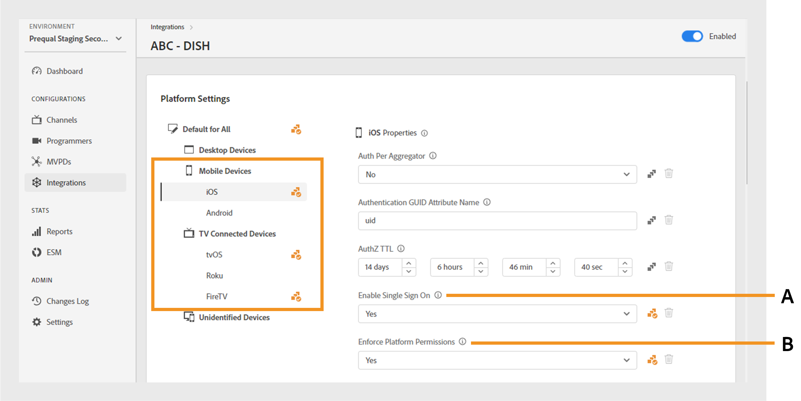
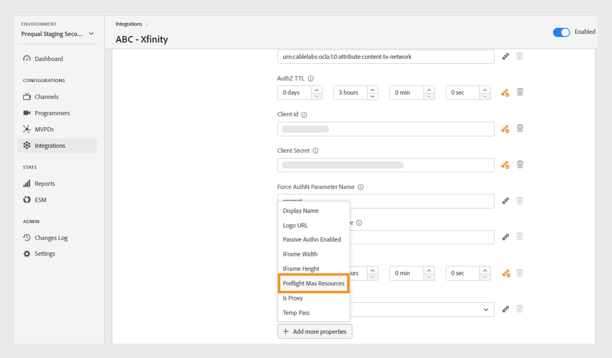

# Intégrations

>[!NOTE]
>
>Le contenu de cette page est fourni à titre d’information uniquement. L’utilisation de cette API nécessite une licence Adobe actuelle. Aucune utilisation non autorisée n’est autorisée.

La section **Intégrations** du tableau de bord TVE vous permet d’afficher et de gérer les paramètres des intégrations entre vos canaux et les MVPD. Vous pouvez également [créer une nouvelle intégration](#create-new-integration) en fonction de vos besoins.

L’onglet **Intégrations** du panneau de gauche affiche une liste des intégrations existantes avec les détails suivants :

* Statut indiquant si l’intégration est active ou inactive
* Intégration reliant des canaux spécifiques à des fichiers MVPD respectifs
* Nom du canal avec l’identifiant du canal
* Nom d’affichage MVPD et ID MVPD

*Liste des intégrations existantes*

Saisissez le nom du canal ou du MVPD dans la barre **Rechercher** au-dessus de la liste pour en savoir plus sur l’intégration.

## Gestion des configurations d’intégration {#manage-integration-conf}

Pour gérer une intégration spécifique, procédez comme suit.

1. Sélectionnez l’onglet **Intégrations** dans le panneau de gauche.
1. Sélectionnez une intégration dans la liste fournie pour afficher et modifier divers paramètres dans les sections suivantes :

   * [Sélection du point d’entrée](#endpoint-selection)
   * [Paramètres de la plateforme](#platform-settings)
   * [Métadonnées utilisateur](#user-metadata)

>[!IMPORTANT]
>
> Consultez [Vérifier et transmettre les modifications](/help/authentication/user-guide-tve-dashboard/tve-dashboard-review-push-changes.md) pour plus d’informations sur l’activation des modifications de configuration.

### Sélection du point d’entrée {#endpoint-selection}

Cette section vous permet de choisir les points d’entrée du MVPD utilisés pour l’authentification, l’autorisation et les flux de déconnexion à partir des menus déroulants respectifs.

*Points d’entrée pour les flux d’authentification, d’autorisation et de déconnexion*

>[!NOTE]
>
>Les MVPD peuvent fournir un ou plusieurs points d’entrée pour chaque flux. Lors de l’intégration d’un nouveau canal, le MVPD doit spécifier son point d’entrée préféré pour chaque flux.

>[!IMPORTANT]
>
>Toute modification des points d’entrée aura un impact sur le comportement global d’une intégration. Ces modifications ne doivent être implémentées qu’après réception d’une confirmation de la part du MVPD.

### Paramètres de Platform {#platform-settings}

Cette section vous permet d’afficher et de modifier les paramètres d’intégration sur toutes les [&#x200B; plateformes &#x200B;](/help/authentication/user-guide-tve-dashboard/tve-dashboard-reports.md#platforms). Vous pouvez modifier ces paramètres en fonction des plateformes individuelles. Par exemple, vous pouvez ajuster la durée de vie d’autorisation sur Android tout en conservant une valeur par défaut pour une autre plateforme.

Chaque propriété des paramètres de la plateforme hérite d’une valeur par défaut définie par le MVPD, mais peut être ajustée si nécessaire.

>[!IMPORTANT]
>
>Un accord avec le MVPD est nécessaire pour déterminer les valeurs définies pour chaque propriété dans les paramètres de la plateforme.

>[!IMPORTANT]
>
> L’héritage des paramètres suit une chaîne commençant par les paramètres de MVPD (les plus généraux), puis le point d’entrée MVPD, l’intégration, la catégorie de plateforme et la plateforme (qui contient la valeur la plus spécifique).

**Paramètres de plateforme** est utilisé pour remplacer les paramètres de chaque niveau de la chaîne d’héritage. Les niveaux disponibles dans la chaîne sont regroupés comme suit :

* **Par défaut pour tous** : définissez des valeurs pour les propriétés applicables universellement sur toutes les plateformes si des valeurs de plateforme spécifiques ne sont pas définies, quelles que soient les implémentations du programmeur.

* **Appareils de bureau** : définissez des valeurs pour les propriétés applicables à tous les ordinateurs de bureau et portables, quelle que soit la méthode de programmation (JS SDK ou API REST).

* **Appareils mobiles** : définissez des valeurs pour les propriétés applicables à tous les appareils mobiles, y compris **iOS**, **Android** et autres, quelle que soit l’approche de programmation (SDK ou API REST).

* **Appareils connectés à la télévision** : définissez des valeurs pour les propriétés applicables à tous les appareils connectés à la télévision, y compris **tvOS**, **Roku**, **FireTV** et autres, quelle que soit la méthode de programmation (API SDK ou REST).

* **Appareils non identifiés** : définissez des valeurs pour les propriétés applicables à tous les appareils pour lesquels le mécanisme actuel ne peut pas identifier précisément la plateforme. Dans ce cas, respectez les règles les plus restrictives définies par le MVPD.

  

  *Catégorie de plateformes et de leurs appareils*

Sélectionner ’icône située à droite de chaque propriété pour explorer les propriétés utilisées pour chaque niveau d’héritage décrit ci-dessus.

#### Flux métier les plus utilisés {#most-used-flows}

La section **Paramètres de Platform** propose un éventail de propriétés utilisées dans différents flux d’activités. Les propriétés réelles peuvent varier en fonction des MVPD sélectionnés dans l’intégration spécifique. Voici les flux les plus utilisés :

**TTL AuthN et TTL AuthZ sur toutes les plateformes**

>[!IMPORTANT]
>
>Les valeurs de durée de vie d’authentification (AuthN) et d’autorisation (AuthZ) doivent s’aligner de manière cohérente sur les paramètres MVPD.

Suivez ces étapes pour modifier la durée de vie de l’authentification et de l’autorisation sur toutes les plateformes pour une intégration spécifique.

1. Sélectionnez l’onglet **Intégrations** dans le panneau de gauche.

1. Sélectionnez l’intégration pour laquelle vous souhaitez modifier les valeurs de TTL AuthN et de TTL AuthZ.

1. Accédez à la section **Paramètres de Platform**.

1. Sélectionnez l’onglet **Par défaut pour tous** sous **Paramètres de la plateforme**.

   >[!NOTE]
   >
   >Si vous souhaitez modifier la durée de la **TTL AuthN** et de la **TTL AuthZ** pour une catégorie de plateforme ou une plateforme spécifique, sélectionnez la plateforme en conséquence.

   

   *Modifier la durée de vie de la TTL AuthN sur toutes les plateformes*

   **A.** propriété de TTL AuthN **B.** propriété de TTL AuthZ

1. Sélectionnez les flèches vers le haut et vers le bas pour ajuster la durée pour le nombre de jours, heures, minutes et secondes dans les propriétés **TTL AuthN** et **TTL AuthZ**.

La durée de la **TTL AuthN** et de la **TTL AuthZ** sur toutes les plateformes n’est mise à jour qu’après [révision et notification push des modifications](/help/authentication/user-guide-tve-dashboard/tve-dashboard-review-push-changes.md).

**Activer l’authentification unique de la plateforme**

>[!IMPORTANT]
>
>La propriété **Activer l’authentification unique** est exclusivement prise en charge sur les plateformes *iOS, tvOS, Roku et FireTV*. Il ne s’applique qu’aux intégrations avec les MVPD qui prennent en charge l’authentification unique pour ces plateformes.

Pour activer ou désactiver l’authentification unique pour une intégration et une plateforme spécifiques, procédez comme suit.

1. Sélectionnez l’onglet **Intégrations** dans le panneau de gauche.

1. Sélectionnez l’intégration pour laquelle vous souhaitez activer ou désactiver l’authentification SSO.

1. Accédez à la section **Paramètres de Platform**.

1. Sélectionnez une plateforme ou une catégorie de plateformes spécifique pour laquelle vous souhaitez activer l’authentification SSO sous **Paramètres de Platform**.

   

   *Activer l’authentification SSO pour une plateforme spécifique*

   **A.** Propriété d’authentification unique **B.** Propriété Appliquer les autorisations Platform

1. Sélectionnez **Oui** pour activer ou **Non** pour désactiver l’authentification unique dans le menu déroulant **Activer l’authentification SSO**.

1. Sélectionnez **Oui** pour activer ou **Non** pour désactiver dans le menu déroulant **Exiger les autorisations de plateforme**.

   La propriété **Enforce Platform Permission** contrôle si la décision de l’utilisateur d’**Autoriser** ou **Refuser** l’accès de la plateforme à son abonnement de fournisseur de télévision est respectée.

   Par exemple, si les autorisations **Activer l’authentification unique** et **Imposer l’autorisation de plateforme** sont activées et que l’utilisateur choisit de refuser l’accès de la plateforme à son abonnement de fournisseur de télévision, l’application correspondante (canal) ne pourra pas utiliser le jeton d’authentification Adobe Pass obtenu par une autre application (canal).

La propriété **Authentification unique** pour une plateforme sélectionnée sera activée ou désactivée uniquement après [révision et notification push des modifications](/help/authentication/user-guide-tve-dashboard/tve-dashboard-review-push-changes.md).

**Activer l’authentification à domicile**

Pour activer ou désactiver l’authentification à domicile pour les fichiers MVPD basés sur OAuth2, procédez comme suit.

1. Sélectionnez l’onglet **Intégrations** dans le panneau de gauche.

1. Sélectionnez l’intégration pour laquelle activer ou désactiver l’authentification basée sur l’accueil.

1. Accédez à la section **Paramètres de Platform**.

1. Sélectionnez une plateforme ou une catégorie de plateformes spécifique pour laquelle vous souhaitez activer l’authentification à domicile sous **Paramètres de la plateforme**.

   

   *Activer l’authentification à domicile pour une plateforme spécifique*

   **A.** Tentative de propriété d&#39;adaptateur HBA **B.** Propriété de durée de vie AuthN de l&#39;adaptateur HBA

1. Sélectionnez **Oui** pour activer et **Non** pour désactiver dans le menu déroulant **Tenter un adaptateur HBA**.

>[!IMPORTANT]
>
>Il faut éviter de modifier la durée de la propriété **TTL AuthN de l’adaptateur HBA**. Cela peut entraîner des échecs inattendus du processus d’autorisation.

La propriété **Attempt HBA** pour un MVPD spécifique ne sera activée ou désactivée qu&#39;après [révision et notification push des modifications](/help/authentication/user-guide-tve-dashboard/tve-dashboard-review-push-changes.md).

#### Ajouter d’autres propriétés {#add-more-properties}

Le **Ajouter plus de propriétés** permet d’inclure des propriétés spécifiques supplémentaires pour les intégrations, en particulier pour les flux moins courants.

Vous pouvez ajouter les propriétés suivantes :

* Pour toutes les plateformes, sélectionnez l’onglet **Par défaut pour toutes** sur la gauche.
* Pour une catégorie de plateforme, sélectionnez l’onglet **Ordinateurs de bureau**, **Appareils mobiles** ou **Appareils connectés à la télévision** sur la gauche.
* Pour un appareil spécifique, sélectionnez l’onglet **iOS**, **Android**, **tvOS**, **Roku** ou **FireTV** sur la gauche.

Voici quelques exemples de différents flux qui peuvent être activés en ajoutant ces propriétés :

**Modifier le nombre de ressources préautorisées**

La plupart des MVPD prennent en charge un appel authZ de contrôle en amont en utilisant jusqu’à 5 identifiants de ressource par défaut.
Cependant, dans les cas où les fichiers MVPD acceptent d’augmenter cette limite, vous pouvez accéder à l’**Ajouter d’autres propriétés** et sélectionner **Contrôler en amont les ressources max** dans le menu d’options.

**Ressources maximales de contrôle en amont** ajoute un nouvel attribut dans lequel la limite convenue avec le MVPD peut être spécifiée.

*Ajouter la propriété Ressources maximales de contrôle en amont*

La propriété **Ressources maximales de contrôle en amont** ne sera ajoutée qu’après [révision et transmission des modifications](/help/authentication/user-guide-tve-dashboard/tve-dashboard-review-push-changes.md).

**Modifier le nom d’affichage ou l’URL du logo MVPD**

Pour les applications de programmation qui ne souhaitent pas créer leur sélecteur MVPD et qui comptent plutôt sur les configurations fournies, vous pouvez accéder à l’**Ajouter plus de propriétés** et sélectionner **Nom d’affichage** ou **URL du logo** pour ajouter le nom d’affichage ou les URL de logo requis pour chaque MVPD à partir du menu d’options.

Différentes valeurs pour ces propriétés peuvent être utilisées pour le même MVPD en fonction de la plateforme de l’appareil et de l’expérience utilisateur souhaitée.

*Ajouter la propriété Nom d’affichage ou URL du logo*

La propriété **Nom d’affichage** ou **URL du logo** ne sera ajoutée qu’après [révision et notification push des modifications](/help/authentication/user-guide-tve-dashboard/tve-dashboard-review-push-changes.md).

**Demander un nouveau flux d’authentification lors du changement d’application (canal)**

Si vous souhaitez forcer une nouvelle authentification lorsque les utilisateurs basculent entre les applications. Dans ce cas, vous pouvez accéder à la propriété **Ajouter d’autres propriétés**, puis sélectionner la propriété **Auth par agrégateur**.

L’ajout de **Authentification par agrégateur** interrompt l’authentification unique pour le canal correspondant.

*Ajouter une propriété Auth par agrégateur*

La propriété **Auth par agrégateur** ne sera ajoutée qu&#39;après [révision et transmission des modifications](/help/authentication/user-guide-tve-dashboard/tve-dashboard-review-push-changes.md).

Une fois l’ajout effectué, sélectionnez **Oui** pour activer la propriété **Authentification par agrégateur** pour une intégration sélectionnée.

#### Suppression des propriétés {#delete-properties}

Sélectionner ’icône située à droite de chaque propriété pour supprimer les propriétés qui ne sont plus nécessaires.

>[!NOTE]
>
>Certaines propriétés ne peuvent pas être supprimées, car elles sont obligatoires pour le MVPD sélectionné.

La propriété sera supprimée de la section **Paramètres de Platform** uniquement après [révision et transmission des modifications](/help/authentication/user-guide-tve-dashboard/tve-dashboard-review-push-changes.md).

### Métadonnées utilisateur {#user-metadata}

Cette section vous permet de mettre à jour les paramètres de chaque utilisateur ou utilisatrice des paramètres de métadonnées partagés par MVPD.

>[!NOTE]
>
>Chaque MVPD peut partager différents paramètres. Pour plus d’informations sur les paramètres qu’un MVPD spécifique peut partager, contactez votre représentant ou représentante Adobe.

La section des métadonnées de l’utilisateur affiche les colonnes suivantes :

**Clé** : représente les paramètres de métadonnées de l’utilisateur réel à utiliser dans l’API pour extraire des valeurs.

**Description** : fournit une brève description de chaque paramètre de métadonnées utilisateur.

**Chiffré** : cette colonne permet d’activer ou de désactiver des paramètres dans l’API en sélectionnant respectivement **Oui** ou **Non** dans le menu déroulant. Opter pour **Oui** indique que la valeur du paramètre sera chiffrée dans l’API. Le chiffrement est effectué à l’aide d’un certificat défini par une étendue **Métadonnées utilisateur**.

>[!TIP]
>
>
> Assurez-vous toujours que le paramètre **ZIP** est chiffré.

En savoir plus sur les certificats disponibles dans les sections [Programmeurs](/help/authentication/user-guide-tve-dashboard/tve-dashboard-programmers.md#available-certificates) et [Canaux](/help/authentication/user-guide-tve-dashboard/tve-dashboard-channels.md#available-certificates).

**Activé** : cette colonne permet d’activer ou de désactiver les paramètres de l’API en sélectionnant respectivement **Oui** ou **Non** dans le menu déroulant.

*Paramètres disponibles pour les métadonnées utilisateur*

## Créer une intégration {#create-new-integration}

Pour créer une intégration avec un nouveau MVPD sur votre configuration actuelle, procédez comme suit :

1. Sélectionnez l’onglet **Intégrations** dans le panneau de gauche.

1. Sélectionnez **Créer une intégration** dans le coin supérieur droit de la section **Intégrations**.

   

   *Créer une intégration*

   Les sections suivantes s’affichent :

   **Sélectionner le canal et le MVPD**

   Sélectionnez un **Canal** dans le menu déroulant **Sélectionner un canal** pour ajouter une nouvelle intégration. Une fois le canal sélectionné, sélectionnez le **MVPD requis** dans le menu déroulant **Sélectionner le MVPD** à intégrer au canal sélectionné.

   

   *Sélectionner le canal et le MVPD*

   **Sélectionner des points d’entrée**

   Après avoir sélectionné le MVPD requis, la section **Sélectionner le point d’entrée** sera préremplie avec les points d’entrée par défaut configurés pour ce MVPD particulier.

   >[!IMPORTANT]
   >
   >Ne modifiez les points d’entrée par défaut dans aucun flux, sauf indication spécifique du MVPD.

   

   *Sélectionner des points d’entrée*

   **Informations supplémentaires**

   Cette section comprend différentes propriétés qui doivent être configurées pour le MVPD sélectionné dans la section **Sélectionner le canal et le MVPD**.

   >[!NOTE]
   >
   > Les propriétés réelles peuvent varier en fonction des MVPD sélectionnés dans la section **Sélectionner le canal et le MVPD**.

   Par exemple, vous pouvez modifier la **TTL AuthN** ou l’**ID de partenaire** (ID de canal) à des fins de co-branding sur la page de connexion de MVPD dans l’image suivante.

   

   *Modifier informations supplémentaires*

   Sélectionnez **Enregistrer l’intégration** dans le coin supérieur droit de la section **Créer une intégration**.

Une nouvelle intégration sera créée uniquement après [révision et transmission des modifications](/help/authentication/user-guide-tve-dashboard/tve-dashboard-review-push-changes.md).

## Désactiver l’intégration {#disable-integration}

Pour désactiver une intégration, procédez comme suit :

1. Sélectionnez l’onglet **Intégrations** dans le panneau de gauche.

1. Sélectionnez l’intégration que vous souhaitez désactiver.

1. Désactivez le bouton (bascule) disponible dans le coin supérieur droit de l’intégration sélectionnée.

   

   *Désactiver l’intégration*

L&#39;intégration sera désactivée uniquement après [révision et notification push des modifications](/help/authentication/user-guide-tve-dashboard/tve-dashboard-review-push-changes.md).

Une fois l’intégration désactivée, les utilisateurs finaux perdront la possibilité de s’authentifier ou d’autoriser à l’aide du MVPD spécifique.
