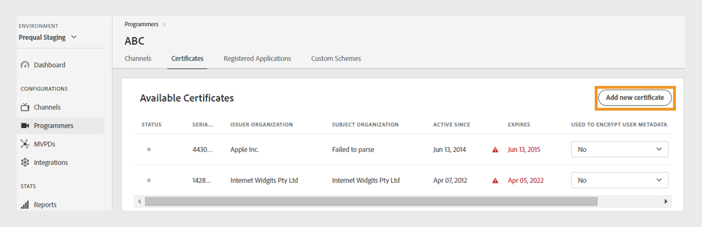

# Programmeurs {#programmers}

>[!NOTE]
>
>Le contenu de cette page est fourni à titre d’information uniquement. L’utilisation de cette API nécessite une licence Adobe actuelle. Aucune utilisation non autorisée n’est autorisée.

La section **Programmeurs** du tableau de bord TVE vous permet d’afficher et de gérer les paramètres des [programmeurs](/help/authentication/integration-guide-programmers/rest-apis/rest-api-v2/rest-api-v2-glossary.md#programmer) liés à vos droits de compte. Vous pouvez également [ajouter un nouveau programmeur](#add-new-programmer) en fonction de vos besoins.

L’onglet **Programmeurs** dans le panneau de gauche affiche une liste des programmeurs existants avec les détails suivants :

* **ID du programmeur** : identifiant de société de médias dans le système.
* **Canaux** : nombre de canaux associés à un programmeur.

*Liste des programmeurs existants*

Saisissez le nom du programmeur dans la barre **Rechercher** au-dessus de la liste pour en savoir plus sur un programmeur.

## Gestion des configurations du programmeur {#manage-programmer-conf}

Pour gérer les différents paramètres d’un programmeur spécifique, procédez comme suit.

1. Sélectionnez l’onglet **Programmeurs** dans le panneau de gauche.
1. Sélectionnez un programmeur dans la liste.
1. Sélectionnez l’un des onglets suivants pour afficher et modifier les paramètres correspondants du programmeur sélectionné :

   * [Canaux](#channels)
   * [Certificats](#certificates)
   * [Applications enregistrées](#registered-applications)
   * [Schémas personnalisés](#custom-schemes)

   

   *Paramètres du programmeur*

>[!IMPORTANT]
>
> Consultez [Vérifier et transmettre les modifications](/help/authentication/user-guide-tve-dashboard/tve-dashboard-review-push-changes.md) pour plus d’informations sur l’activation des modifications de configuration.

### Canaux {#channels}

Cet onglet affiche la liste des canaux associés à un programmeur courant. Sélectionnez un canal spécifique dans cette liste pour accéder à des informations détaillées dans la section [Canaux](/help/authentication/user-guide-tve-dashboard/tve-dashboard-channels.md).

Pour ajouter un nouveau canal pour le programmeur sélectionné, sélectionnez **Ajouter un nouveau canal** dans le coin supérieur droit de la section **Canaux disponibles**. Découvrez [comment ajouter un nouveau canal](/help/authentication/user-guide-tve-dashboard/tve-dashboard-channels.md#add-new-channel).

*Ajouter un nouveau canal*

### Certificats {#certificates}

Cet onglet affiche une liste des [certificats disponibles](#available-certificates) utilisés dans les flux de chiffrement des métadonnées de l’utilisateur. Elle affiche des détails sur chaque certificat qui comprend :

* Le statut (qu’il soit activé pour **chiffrement des métadonnées de l’utilisateur** utilisation ou non)
* Numéro de série
* Nom de l&#39;institution émettrice
* Nom de l&#39;organisation en question
* Date d’émission
* Date d’expiration
* Un menu déroulant pour chiffrer les métadonnées de l’utilisateur (si vous sélectionnez **Oui**, le certificat chiffre les informations utilisateur sensibles, telles que les valeurs de code postal).

#### Certificats disponibles {#available-certificates}

Ces certificats servent de clés privées ou publiques et sont utilisés pour le chiffrement des métadonnées des utilisateurs. Tous les canaux associés à la même société de médias peuvent utiliser ces certificats.

Vous pouvez apporter les modifications suivantes aux certificats disponibles :

* [Ajouter un nouveau certificat](#add-new-certificate)
* [Supprimer le certificat](#delete-certificate)

##### Ajouter un nouveau certificat {#add-new-certificate}

Pour ajouter un nouveau certificat, procédez comme suit.

1. Sélectionnez **Ajouter un nouveau certificat** dans le coin supérieur droit de la section **Certificats disponibles**.

   

   *Ajouter un nouveau certificat*

1. Collez la clé publique de votre certificat dans la boîte de dialogue **Nouveau certificat**.

1. Sélectionnez **Ajouter un certificat**.

1. Recherchez le nouveau certificat dans la liste des **Certificats disponibles**.

   >[!IMPORTANT]
   >
   > Assurez-vous que vos systèmes sont à jour et prêts à utiliser le nouveau certificat.

1. Sélectionnez **Oui** dans le menu déroulant **Utilisé pour les métadonnées d’utilisateur chiffrées** pour activer un nouveau certificat.

Une nouvelle modification de configuration a été créée et est prête pour la mise à jour du serveur. Pour utiliser le nouveau certificat répertorié dans la section **Certificats disponibles**, poursuivez avec le flux [réviser et pousser les modifications](/help/authentication/user-guide-tve-dashboard/tve-dashboard-review-push-changes.md).

##### Supprimer le certificat {#delete-certificate}

Pour supprimer un certificat, procédez comme suit.

1. Pointez sur le certificat que vous souhaitez supprimer de la liste des **Certificats disponibles**.

1. Sélectionnez **Supprimer**.

   

   *Supprimer le certificat sélectionné*

1. Sélectionnez **Supprimer** dans la boîte de dialogue **Supprimer le certificat**.

Une nouvelle modification de configuration a été créée et est prête pour la mise à jour du serveur. Le certificat sera supprimé de la section **Certificats disponibles** uniquement après [révision et notification push des modifications](/help/authentication/user-guide-tve-dashboard/tve-dashboard-review-push-changes.md).

### Applications enregistrées {#registered-applications}

Cet onglet affiche la liste des applications enregistrées. Pour plus d’informations sur l’utilisation des applications enregistrées, reportez-vous à la documentation [présentation de l’enregistrement client dynamique](../integration-guide-programmers/rest-apis/rest-api-dcr/dynamic-client-registration-overview.md).

Vous pouvez effectuer les actions suivantes avec les applications enregistrées :

* [Ajouter une nouvelle application enregistrée](#add-registered-applications)
* [Téléchargement d’un relevé de logiciel](#download-software-statement)

#### Ajouter une nouvelle application enregistrée {#add-registered-applications}

Pour ajouter une nouvelle application enregistrée, procédez comme suit.

1. Sélectionnez **Ajouter une nouvelle application** dans le coin supérieur droit de la section **Applications enregistrées**.

   

   *Ajouter une nouvelle application*

1. Sélectionnez **Affecté au canal** dans le menu déroulant de la boîte de dialogue **Nouvelle application**.

   >[!IMPORTANT]
   >
   > Il est recommandé de créer des applications enregistrées avec des autorisations plus spécifiques et limitées afin de renforcer la sécurité et d’empêcher tout accès non autorisé. Par conséquent, lors de la création d’applications enregistrées, pensez à utiliser des options plus étroites pour les `channel` attribués.

1. Sélectionnez **Plateformes** dans le menu déroulant.

   >[!IMPORTANT]
   >
   > Il est recommandé de créer des applications enregistrées avec des autorisations plus spécifiques et limitées afin de renforcer la sécurité et d’empêcher tout accès non autorisé. Par conséquent, lors de la création d’applications enregistrées, pensez à utiliser des options plus étroites pour les `platforms` attribués.

1. Sélectionnez **Domaines** dans le menu déroulant.

   >[!IMPORTANT]
   >
   > Dans le processus d’enregistrement du client, l’application cliente peut demander l’autorisation d’utiliser une URL de redirection pour la finalisation du flux d’authentification. Lorsqu’une application cliente utilise une URL de redirection spécifique, elle est validée par rapport à la `domains` sélectionnée dans cette sélection.

1. Saisissez le **Nom** de l’application.

1. Saisissez la **Version** de l’application.

   >[!IMPORTANT]
   >
   > Il est recommandé de créer une nouvelle application enregistrée pour chaque mise à jour majeure de votre application cliente afin de gérer son cycle de vie et son utilisation. Si nécessaire, créez un ticket via notre [Zendesk](https://adobeprimetime.zendesk.com) et demandez à votre gestionnaire de compte technique (TAM) de révoquer une application enregistrée afin de bloquer la fonctionnalité d’une version spécifique de l’application cliente.

1. Sélectionnez **Type** valeur « DIRECT » dans le menu déroulant.

1. Sélectionnez **Ajouter une application**.

Une nouvelle modification de configuration a été créée et est prête pour la mise à jour du serveur. Pour utiliser la nouvelle application enregistrée répertoriée dans la section **Applications enregistrées**, poursuivez avec le flux [examiner et pousser les modifications](/help/authentication/user-guide-tve-dashboard/tve-dashboard-review-push-changes.md).

#### Téléchargement du relevé de logiciel {#download-software-statement}

Pour télécharger un relevé de logiciel, procédez comme suit.

1. Pointez sur l&#39;application enregistrée pour télécharger la déclaration du logiciel à partir de la liste des **Applications enregistrées**.

1. Sélectionnez **Télécharger**.

   

   *Téléchargement d’une déclaration de logiciel*

### Schémas personnalisés {#custom-schemes}

Cet onglet affiche une liste des schémas personnalisés. Pour plus d’informations sur l’utilisation des schémas personnalisés, reportez-vous à l’enregistrement de l’application [iOS/tvOS](/help/authentication/integration-guide-programmers/legacy/sdks/ios-tvos-sdk/iostvos-application-registration.md).

Vous pouvez apporter les modifications suivantes aux schémas personnalisés :

* [Générer un nouveau schéma personnalisé](#generate-custom-schemes)

#### Générer un nouveau schéma personnalisé {#generate-custom-schemes}

Pour générer un nouveau schéma personnalisé, procédez comme suit.

1. Sélectionnez **Générer un nouveau schéma personnalisé**.

   

   *Générer un nouveau schéma personnalisé*

Une nouvelle modification de configuration a été créée et est prête pour la mise à jour du serveur. Pour utiliser le nouveau schéma personnalisé répertorié dans la section **Schémas personnalisés**, passez au flux [réviser et pousser les modifications](/help/authentication/user-guide-tve-dashboard/tve-dashboard-review-push-changes.md).

## Ajouter un nouveau programmeur {#add-new-programmer}

Pour ajouter une nouvelle entité de programmation, procédez comme suit.

1. Sélectionnez l’onglet **Programmeurs** dans le panneau de gauche.

1. Sélectionnez **Ajouter un nouveau programmeur** dans le coin supérieur droit de la section **Programmeurs**.

   

   *Ajouter un nouveau programmeur*

1. Saisissez l’identifiant de la société de médias dans **ID du programmeur** dans la boîte de dialogue **Nouveau programmeur**.

1. Saisissez un nom de marque commerciale à afficher dans la console sous **Nom d’affichage**.

1. Sélectionnez **Ajouter un programmeur**.

Une nouvelle modification de configuration a été créée et est prête pour la mise à jour du serveur. Pour utiliser le nouveau programmeur répertorié dans la section **Programmeurs**, poursuivez avec le flux [réviser et pousser les modifications](/help/authentication/user-guide-tve-dashboard/tve-dashboard-review-push-changes.md).
