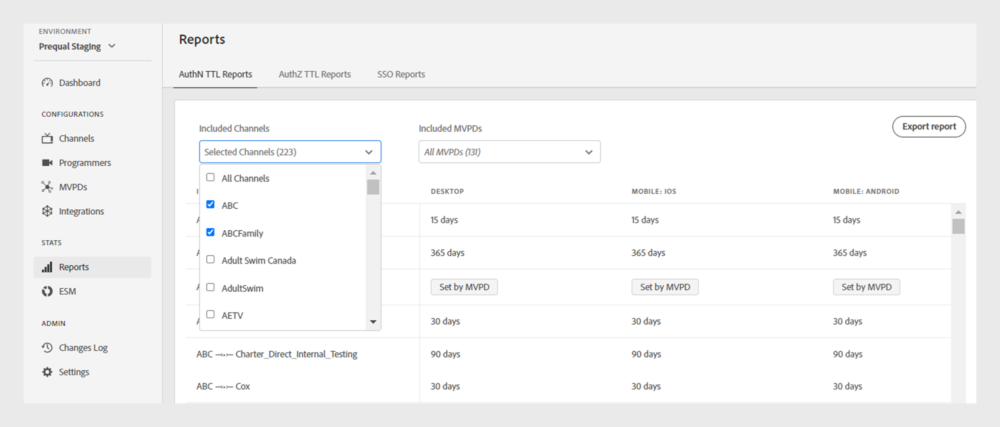

# Rapports {#Reports}

>[!NOTE]
>
>Le contenu de cette page est fourni à titre d’information uniquement. L’utilisation de cette API nécessite une licence actuelle de Adobe. Aucune utilisation non autorisée n’est autorisée.

La section **Rapports** du tableau de bord TVE permet d’accéder aux données agrégées pour les rapports TTL, AuthZ TTL et SSO AuthN. Ces rapports incluent vos intégrations de canaux avec différents MVPD sur toutes les [plateformes](#platforms).

Les rapports vous permettent de filtrer les données et de collecter des informations sur [des canaux ou des MVPD spécifiques](#selecting-specific-channels-mvpds). Vous pouvez également exporter des rapports dans un fichier CSV pour une analyse plus approfondie.

## Affichage des rapports {#view-reports}

Pour afficher un rapport spécifique, procédez comme suit.

1. Sélectionnez l’onglet **Rapports** dans le panneau de gauche.
1. Sélectionnez l’un des onglets suivants pour afficher et exporter les données agrégées des canaux et MVPD inclus :
   * [Rapports TTL AuthN](#authn-ttl-reports)
   * [Rapports TTL AuthZ](#authz-ttl-reports)
   * [Rapports SSO](#sso-reports)

   

   *Type de rapports*

### Rapports TTL AuthN {#authn-ttl-reports}

Les rapports TTL AuthN, également appelés durée de vie de l’authentification (TTL), affichent la durée pendant laquelle les jetons d’authentification sont configurés pour vos intégrations de canaux avec divers MVPD sur toutes les [plateformes](#platforms). Ces rapports vous permettent d’examiner le temps pendant lequel un utilisateur reste authentifié pour un MVPD et une plateforme spécifiques. Les valeurs de durée sont présentées dans des formats conviviaux tels que, **days**, **hours**, **minutes** et **seconds**. Le tableau Rapports TTL AuthN comprend un défilement horizontal et vertical pour s’adapter à différentes tailles d’écran.

Vous pouvez également afficher et télécharger des données pour [ canaux spécifiques ou MVPDs](#selecting-specific-channels-mvpds).

*Exporter des rapports TTL AuthN*

>[!IMPORTANT]
>
> L’espace réservé **défini par MVPD** est utilisé lorsque le MVPD applique la valeur TTL AuthN plutôt que la configuration de l’authentification Adobe Pass.

Sélectionnez **Exporter les rapports** pour enregistrer les données au format CSV sur votre ordinateur local.

### Rapports TTL AuthZ {#authz-ttl-reports}

Les rapports TTL AuthZ, également appelés TTL (Authorization Time-To-Live, durée de vie), affichent la durée du jeton d’autorisation configuré pour vos intégrations de canaux avec divers MVPD sur toutes les [plateformes](#platforms). Ces rapports vous permettent d’examiner le temps pendant lequel un utilisateur reste autorisé à regarder le contenu pour un MVPD et une plateforme spécifiques. Les valeurs de durée sont présentées dans des formats conviviaux tels que, **days**, **hours**, **minutes** et **seconds**. Le tableau Rapports TTL AuthZ propose un défilement horizontal et vertical pour s’adapter à différentes tailles d’écran.

Vous pouvez également afficher et télécharger les données pour [ canaux spécifiques ou MVPDs](#selecting-specific-channels-mvpds).

*Exporter des rapports TTL AuthZ*

>[!IMPORTANT]
>
> L’espace réservé **défini par MVPD** est utilisé lorsque le MVPD applique la valeur TTL AuthZ plutôt que la configuration de l’authentification Adobe Pass.

Sélectionnez **Exporter les rapports** pour enregistrer les données au format CSV sur votre ordinateur local.

### Rapports SSO {#sso-reports}

Les rapports SSO, également appelés connexion unique, affichent l’état de connexion unique configuré pour vos intégrations de canaux avec divers MVPD sur toutes les [plateformes](#platforms). Ces rapports vous permettent d’examiner l’expérience d’authentification unique de l’utilisateur attendue pour un MVPD et une plateforme spécifique. Les valeurs sont présentées dans des formats conviviaux tels que **SSO Disabled**, **SSO Enabled** et **SSO Uncertain**. Le tableau Rapports d’authentification unique (SSO) propose un défilement horizontal et vertical pour s’adapter à différentes tailles d’écran.

Vous pouvez également afficher et télécharger des données pour [ canaux spécifiques ou MVPDs](#selecting-specific-channels-mvpds).

*Exporter des rapports SSO*

>[!IMPORTANT]
>
> L’espace réservé **SSO Uncertain** indique que l’authentification unique (SSO) est activée et peut être opérationnelle. Toutefois, les paramètres répertoriés ci-dessous peuvent empêcher l’authentification SSO, comme expliqué dans les exemples suivants :
>
> * Paramètres de la plateforme utilisateur : option permettant de bloquer les cookies tiers.
> * Décisions de l&#39;utilisateur : les utilisateurs refusent à la plateforme l&#39;accès à leur abonnement au fournisseur de télévision.
> * Paramètres MVPD : le MVPD demande une authentification pour chaque canal.

Sélectionnez **Exporter les rapports** pour enregistrer les données au format CSV sur votre ordinateur local.

## Plateformes {#platforms}

Les [ rapports TTL AuthN ](#authn-ttl-reports), les [ rapports TTL AuthZ ](#authz-ttl-reports) et les [ rapports SSO ](#sso-reports) présentent des données sur diverses plateformes, telles que :

* **Bureau** : affiche les valeurs appliquées aux mises en oeuvre de programmeur via le SDK JavaScript d’authentification Adobe Pass.

* **Mobile**

  **iOS** : affiche les valeurs appliquées à l’aide du SDK iOS d’authentification Adobe Pass.

  **Android** : affiche les valeurs appliquées par le biais du SDK Android d’authentification Adobe Pass.

  **Autres** : affiche les valeurs appliquées à l’aide de l’API REST d’authentification Adobe Pass développée pour les appareils mobiles.

* **TVCD**

  **Roku** : affiche les valeurs appliquées via l’API REST d’authentification Adobe Pass, en identifiant Roku comme type d’appareil.

  **FireTV** : affiche les valeurs appliquées par le biais du SDK Adobe Pass Authentication FireTV.

  **Apple TV** : affiche les valeurs appliquées via le SDK Adobe Pass Authentication tvOS.

  **Autres** : affiche les valeurs appliquées à l’aide de l’API REST d’authentification Adobe Pass pour les appareils connectés à la télévision.

* **Plateforme non identifiée** : affiche les valeurs appliquées aux mises en oeuvre de programmeur lorsque les services d’authentification Adobe Pass détectent un type d’appareil inconnu.

Pour en savoir plus sur le partage du type d’appareil souhaité, tel que **Roku** avec des API REST d’authentification Adobe Pass ou des SDK, consultez le mécanisme de [transmission d’informations client](/help/authentication/integration-guide-programmers/passing-client-information-device-connection-and-application.md).

>[!IMPORTANT]
>
> Les données agrégées sont basées sur la configuration spécifique de chaque environnement d’authentification Adobe Pass. Lors du basculement entre différents environnements de tableau de bord TVE, attendez-vous à des variations des données dans les rapports. Pour en savoir plus, consultez la section [Environnements d’authentification Adobe Pass](/help/authentication/user-guide-tve-dashboard/tve-dashboard-environments.md) .

## Sélection de canaux et de MVPD spécifiques {#selecting-specific-channels-mvpds}

Les [ rapports TTL AuthN ](#authn-ttl-reports), les [ rapports TTL AuthZ ](#authz-ttl-reports) et les [rapports SSO](#sso-reports) présentent des données pour les intégrations **Tous les canaux** avec **Tous les MVPD** par défaut.

>[!NOTE]
>
> Si vous désélectionnez **Tous les canaux** ou **Tous les MVPD** dans les menus déroulants respectifs, un message s’affiche pour effectuer une sélection afin d’afficher des rapports significatifs.

Pour générer un rapport pour des canaux spécifiques :

1. Sélectionnez le menu déroulant **Canaux inclus** en haut du rapport sélectionné.

   

   *Menu déroulant Canaux inclus*

1. Désélectionnez **Tous les canaux**.

1. Sélectionnez les canaux requis dans le menu déroulant **Canaux inclus** pour lesquels vous souhaitez générer des données.

>[!NOTE]
>
> Pour que des options soient disponibles dans le menu déroulant **MVPD inclus**, vous devez sélectionner au moins un canal dans le menu déroulant **Canaux inclus** .

Pour générer un rapport pour des MVPD spécifiques :

1. Sélectionnez le menu déroulant **MVPD inclus** en haut du rapport sélectionné.

   

   *Menu déroulant MVPD inclus*

1. Désélectionnez **Tous les MVPD**.

1. Sélectionnez les MVPD requis dans le menu déroulant **MVPD inclus** pour lequel vous souhaitez générer des données.
