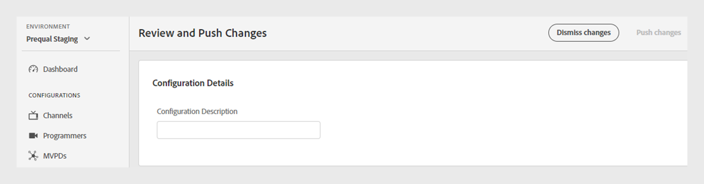

# Révision et notification push des modifications

>[!NOTE]
>
>Le contenu de cette page est fourni à titre d’information uniquement. L’utilisation de cette API nécessite une licence actuelle de Adobe. Aucune utilisation non autorisée n’est autorisée.

Le tableau de bord TVE vous permet d’examiner les modifications apportées à la configuration actuelle, puis de les déployer sur le serveur. Chaque fois que vous modifiez la configuration actuelle, une notification s’affiche à l’écran, vous invitant à examiner et à transmettre ces modifications.

Suivez ces étapes pour passer en revue et pousser les modifications.

1. Recherchez la notification de révision et de modification push dans la partie inférieure de l’écran.

   

   *Boîte de notification de modification des révisions et des notifications push*

1. Sélectionnez **Modifications de révision** dans la zone de notification **Modifications de révision et de notification push**.

1. Saisissez une brève description de la modification dans **Description de configuration** pour effectuer un suivi efficace et comprendre l’objectif de chaque modification.

   

   *Ajouter une description de configuration*

1. Accédez à la section **Modifications de configuration** pour afficher un résumé des modifications.

1. Pointez sur la modification que vous souhaitez réviser.

1. Sélectionnez **Afficher** pour passer en revue les valeurs précédentes et nouvelles associées à un changement de configuration.

   

   *Afficher les modifications de configuration*

1. Une fois que vous avez examiné toutes les modifications et que tout semble correct, sélectionnez **Modifications push** pour appliquer la configuration mise à jour au serveur.

   >[!NOTE]
   >
   >Le bouton **Push changes** devient actif uniquement après l’ajout d’une **Description de configuration**.

   

   *Modifications push*

   Vous pouvez également sélectionner **Ignorer les modifications** si vous souhaitez annuler toutes les modifications de configuration répertoriées.
