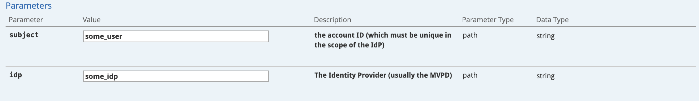
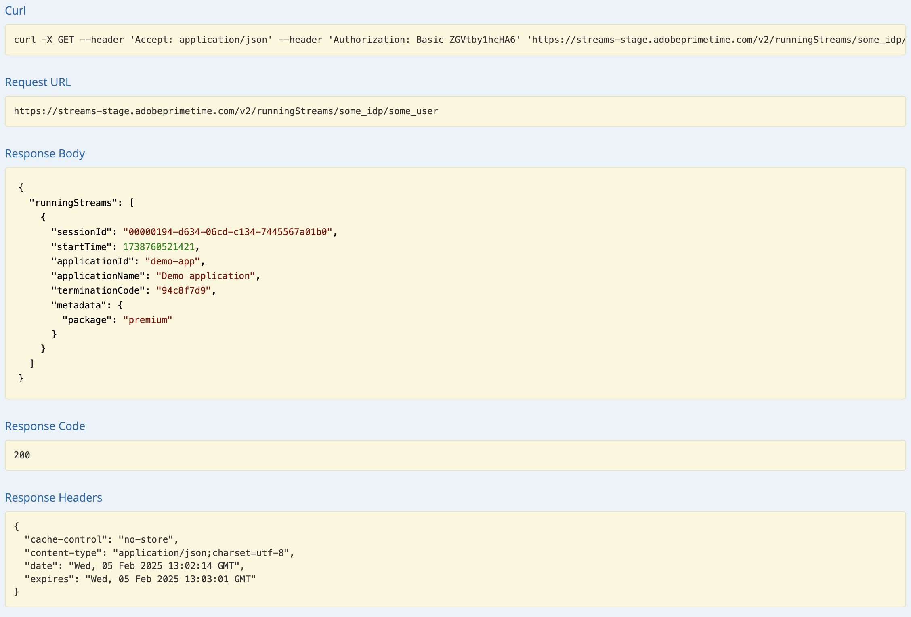

# Présentation de l’API {#api-overview}

Consultez la [documentation des API en ligne](http://docs.adobeptime.io/cm-api-v2/) pour plus d’informations.

## Objectif et conditions préalables {#purpose-prerequisites}

Ce document aide les développeurs d’applications à utiliser notre spécification d’API Swagger lors de la mise en œuvre d’une intégration à la surveillance de simultanéité. Il est vivement recommandé que le lecteur ait déjà compris les concepts définis par le service avant de suivre cette ligne directrice. Pour cela, il est nécessaire de disposer d’une vue d’ensemble de la [documentation du produit](/help/concurrency-monitoring/cm-home.md) et de la [spécification de l’API Swagger](http://docs.adobeptime.io/cm-api-v2/).


## Introduction {#api-overview-intro}

Pendant le processus de développement, la documentation publique Swagger représente la ligne directrice de référence pour comprendre et tester les flux d’API. C’est un excellent point de départ pour adopter une approche pratique et se familiariser avec le comportement des applications du monde réel dans différents scénarios d’interaction client.

Envoyez un ticket dans [Zendesk](mailto:tve-support@adobe.com) pour enregistrer votre société et vos applications dans la surveillance de concurrence. Adobe attribuera un identifiant d&#39;application à chaque entité. Dans ce guide, nous utiliserons deux applications de référence avec les ID **demo-app** et **demo-app-2** qui se trouveront sous le client Adobe.


## Cas d’utilisation {#api-use-case}

La première étape du test d’un flux à l’aide de Swagger consiste à saisir l’identifiant de l’application dans le coin supérieur droit de la page, comme suit :


Ensuite, nous appuyons sur **Explorer** pour définir l’identifiant qui sera utilisé dans l’en-tête d’autorisation pour tous les appels effectués à l’API REST.  Chaque appel API nécessite que l’ID d’application soit transmis via l’authentification de base HTTP. Le nom d&#39;utilisateur est l&#39;ID de l&#39;application et le mot de passe est vide.


### Première application {#first-app-use-cases}

L’application avec l’ID **demo-app** s’est vu attribuer par l’équipe d’Adobe une politique avec une règle qui limite le nombre de flux simultanés à 3. Une politique est affectée à une application spécifique en fonction de la demande soumise dans Zendesk.


#### Récupération des métadonnées {#retrieve-metadata-use-case}

Le premier appel que nous effectuons concerne la ressource de métadonnées afin d’obtenir la liste des attributs de métadonnées devant être transmis en tant que données de formulaire lors de l’initialisation de la session. Ces métadonnées seront utilisées pour évaluer les politiques affectées à cette application.


Après avoir appuyé sur « Essayer », pour l’application avec l’identifiant **demo-app** nous obtiendrons le résultat suivant :


Comme nous pouvons le voir dans le champ du corps de la réponse , la liste des attributs de métadonnées est vide. Cela signifie que les attributs requis par la conception sont suffisants pour évaluer la politique des 3 flux affectée à cette application. Consultez également la [documentation sur les champs de métadonnées standard](/help/concurrency-monitoring/standard-metadata-attributes.md). Après cet appel, nous pouvons continuer et créer une nouvelle session sur la ressource REST Sessions.


#### Initialisation de la session {#session-initial}

L’appel d’initialisation de session est effectué par une application après l’acquisition de toutes les informations nécessaires à son exécution.


Il n’est pas nécessaire de fournir un code de terminaison lors du premier appel, car nous n’avons pas d’autres flux actifs. Et aucun attribut de métadonnées, car aucun n’a été renvoyé par l’appel de récupération des métadonnées .

Les paramètres **subject** et **idp** sont obligatoires, ils sont spécifiés comme des variables de chemin URI. Vous pouvez obtenir les paramètres **subject** et **idp** en effectuant un appel pour les champs de métadonnées **mvpd** et **amontUserID** à partir de l’authentification Adobe Pass. Consultez également la [présentation des API de métadonnées](https://experienceleague.adobe.com/docs/primetime/authentication/auth-features/user-metadat/user-metadata-feature.html?lang=en#). Pour cet exemple, nous indiquerons la valeur « 12345 » comme objet et « adobe » comme fournisseur d’identité.


Effectuez l’appel d’initialisation de session. Vous obtiendrez la réponse suivante :


Toutes les données dont nous avons besoin sont contenues dans les en-têtes de réponse. L’en-tête **Location** représente l’identifiant de la nouvelle session créée et les en-têtes **Date** et **Expires** représentent les valeurs utilisées pour planifier votre application afin d’effectuer la pulsation suivante et de maintenir la session active.

À chaque appel, vous êtes autorisé à envoyer les métadonnées dont vous avez besoin, et pas seulement les métadonnées obligatoires pour votre application. L’envoi de métadonnées peut être réalisé de deux manières :
* en utilisant **query** **parameters** :

  ```sh
  curl -i -XPOST -u "user:pass" "https://streams-stage.adobeprimetime.com/v2/sessions/some_idp/some_user?metadata1=value1&metadata2=value2"
  ```

* en utilisant **request** **body** :

  ```sh
  curl -i -XPOST -u "user:pass" https://streams-stage.adobeprimetime.com/v2/sessions/some_idp/some_user -d "metadata1=value1" -d "metadata2=value2" -H "Content-Type=application/x-www-form-urlencoded"
  ```

#### Heartbeat {#heartbeat}

Faites un appel de pulsation. Indiquez l’**ID de session** obtenu lors de l’appel d’initialisation de session, ainsi que les paramètres **subject** et **idp** utilisés.


Pour l’appel Heartbeat, vous êtes autorisé à envoyer des métadonnées de la même manière que pour l’initialisation de la session. Vous pouvez ajouter de nouvelles métadonnées à tout moment et mettre à jour les valeurs précédemment envoyées avec quelques **exceptions**. Une fois définies, les valeurs suivantes ne peuvent pas être modifiées : **package**, **channel**, **platform**, **assetId**, **idp**, **mvpd**, **hba_status**, **hba**,
**mobileDevice**

Si la session est toujours valide (elle n’a pas expiré ou a été supprimée manuellement), vous obtiendrez un résultat positif :


Comme dans le premier cas, nous utiliserons les en-têtes **Date** et **Expires** pour planifier une autre pulsation pour cette session particulière. Si la session n&#39;est plus valide, cet appel échoue avec un code d&#39;état HTTP GONE 410.

Vous pouvez utiliser l’option « Garder le flux actif » disponible dans l’interface utilisateur Swagger afin d’exécuter des pulsations automatiques sur une session spécifique. Cela peut vous aider à tester une règle sans avoir à vous soucier de la norme standard nécessaire pour exécuter des pulsations de session opportunes. Ce bouton est placé à côté du bouton « Essayer » dans l’onglet Swagger Heartbeat. Pour définir une pulsation automatique pour toutes les sessions créées, vous devez les planifier chacune dans une interface utilisateur Swagger distincte ouverte dans un onglet de navigateur web.


#### Fin de session {#session-termination}

L’analyse de rentabilité de votre entreprise peut nécessiter la surveillance d’accès simultané pour mettre fin à une session spécifique lorsque, par exemple, un utilisateur ou une utilisatrice cesse de regarder une vidéo. Pour ce faire, effectuez un appel DELETE sur la ressource Sessions .


Utilisez les mêmes paramètres pour l’appel que pour la pulsation de la session. Les codes d’état HTTP de réponse sont les suivants :

* 202 ACCEPTÉ pour une réponse réussie
* 410 DISPARU si la session était déjà arrêtée.

#### Obtenir tous les flux actifs {#get-all-running-streams}

Ce point d’entrée offre toutes les sessions en cours d’exécution pour un client spécifique sur toutes ses applications. Utilisez les paramètres **subject** et **idp** pour l&#39;appel :



Lorsque vous passez l’appel , vous obtenez la réponse suivante :



Pour chaque session, un utilisateur obtient le **terminationCode** et complète les métadonnées.

Notez l’en-tête **Expires**. Il s’agit de l’heure à laquelle la première session doit expirer, sauf si une pulsation est envoyée.
Le champ de métadonnées est renseigné avec toutes les métadonnées envoyées au démarrage de la session. Nous ne le filtrons pas, vous recevrez tout ce que vous avez envoyé.
La réponse inclut tous les flux s’exécutant sur les applications d’autres clients tant que les applications partagent la même politique.
Si aucune session n’est en cours pour un utilisateur spécifique lorsque vous passez l’appel, vous obtenez la réponse suivante :


Notez également que dans ce cas, l’en-tête **Expires** n’est pas présent.

Si une session a été créée en tuant une autre, à l’aide de l’en-tête **X-Terminate**, sous métadonnées, vous trouverez le champ **remplacé**. Sa valeur est un indicateur de la session tuée pour faire de la place à la session en cours.


#### Enfreindre la politique {#breaking-policy-app-first}


Afin de simuler le comportement de notre application lorsque la politique des 3 flux qui lui est assignée est rompue, nous devons effectuer 3 appels pour l&#39;initialisation de la session. Pour que la politique prenne effet, les appels doivent être effectués avant l’expiration de l’une des sessions en raison d’un manque de pulsations. Nous verrons que ces appels réussissent tous, mais si nous en effectuons un 4e, il échouera avec l’erreur suivante :


Nous obtenons une réponse CONFLICT 409 avec un objet de résultat d&#39;évaluation dans la payload. Cela indique que les politiques côté serveur ne permettent pas de créer cette session ou de la poursuivre. Le corps de la réponse contient un objet EvaluationResult avec un objet AssociatedAdvice non vide, qui est la liste des objets Advice contenant des explications pour chaque violation de règle.

L’application doit avertir l’utilisateur du ou des messages d’erreur transmis par chaque instance d’Advice. En outre, chaque conseil indique également les détails de la règle, tels que les noms d’attribut, de seuil, de règle et de politique. De plus, les valeurs en conflit seront également incluses avec la liste des sessions actives pour chaque valeur.

Ces informations sont destinées à un formatage avancé des messages d’erreur et permettent à l’utilisateur ou à l’utilisatrice d’agir concernant les sessions en conflit.

Chaque session en conflit comporte un **terminationCode** qui peut être utilisé pour **tuer** ce flux. Ainsi, l’application peut permettre à l’utilisateur de choisir la ou les sessions à terminer afin d’essayer d’accéder à la session en cours.

L’application peut utiliser les informations du résultat de l’évaluation pour afficher un certain message à l’utilisateur ou à l’utilisatrice lors de l’arrêt de la vidéo et prendre d’autres actions si nécessaire. Un cas d’utilisation peut consister à arrêter d’autres flux existants afin d’en démarrer un nouveau. Pour ce faire, utilisez la valeur **terminationCode** présente dans le champ **conflits** pour un attribut en conflit spécifique. La valeur est fournie comme en-tête HTTP X-Terminate dans l’appel pour une nouvelle initialisation de session.


Lorsque vous fournissez un ou plusieurs codes de fin à l’initialisation de la session, l’appel réussit et une nouvelle session est générée. Ensuite, si nous essayons de faire un battement de cœur avec l’une des sessions qui ont été arrêtées à distance, nous obtenons une réponse 410 GONE avec une payload de résultat d’évaluation qui décrit le fait que la session a été arrêtée à distance, comme dans l’exemple :


410 peut être renvoyé avec ou sans corps, en fonction de ce qui a provoqué l’arrêt de la session en cours.

Lorsque la réponse ne comporte aucun corps, l’adresse 410 signifie qu’un appel de pulsation (ou de terminaison) est tenté pour une session qui n’est plus active (en raison d’une temporisation ou d’un conflit précédent, ou autre). La seule façon de récupérer à partir de cet état est que l’application lance une nouvelle session. Comme il n&#39;y a pas de corps, l&#39;application est censée gérer cette erreur sans que l&#39;utilisateur en soit conscient.

D’un autre côté, lorsqu’un corps de réponse est fourni, l’application doit rechercher dans l’attribut **AssociatedAdvice** un conseil **remote-terminaison** qui indique la session à distance qui a été lancée avec l’intention explicite de **tuer** la session en cours. Cela peut entraîner un message d’erreur du type « Votre session a été fermée par l’appareil ou l’application ».

### Corps de réponse {#response-body}

Pour tous les appels de l’API du cycle de vie de la session, le corps de la réponse (le cas échéant) sera un objet JSON contenant les champs suivants :


**Conseils**
Le **EvaluationResult** inclura un tableau d&#39;objets Advice sous **associatedAdvice**. Ces conseils sont destinés à permettre à l’application d’afficher un message d’erreur complet à l’intention de l’utilisateur et (potentiellement) de permettre à l’utilisateur d’agir.

Actuellement, il existe deux types de conseils (spécifiés par leur valeur d’attribut **type**) : **violation de règle** et **terminaison à distance**. La première fournit des détails sur une règle enfreinte et les sessions en conflit avec la session actuelle (y compris l’attribut terminate qui peut être utilisé pour terminer cette session à distance). La deuxième est simplement de dire que la session en cours a été délibérément interrompue par une session à distance, de sorte que les utilisateurs sauront qui les a chassés quand les limites ont été atteintes. Si la mention **remplacé** est incluse dans les métadonnées, la session en question a été créée à l’aide de l’en-tête **X-Terminate**.


**Obligation**
L’évaluation peut également contenir une ou plusieurs actions prédéfinies qui doivent être déclenchées par l’application à la suite de cette évaluation.


### Deuxième demande {#second-application}

L’autre exemple d’application que nous utiliserons est celui avec l’ID **demo-app-2**. Une politique a été affectée à cette dernière avec une règle qui limite le nombre de flux disponibles pour un canal à un maximum de 2.   Vous devez fournir la variable de canal afin d’évaluer cette politique.

#### Récupération des métadonnées {#retrieving-metadata}

Définissez le nouvel ID d’application dans le coin supérieur droit de la page et effectuez un appel à la ressource de métadonnées . Vous obtiendrez la réponse suivante :


Cette fois, le corps de la réponse n’est plus une liste vide, comme dans l’exemple de la première application. Désormais, le service de surveillance de simultanéité indique dans le corps de la réponse que les métadonnées **channel** sont requises lors de l’initialisation de la session afin d’évaluer la politique.

Si vous effectuez un appel sans fournir de valeur pour le paramètre **channel**, vous obtenez :

* Code de réponse - 400 BAD REQUEST
* Corps de réponse : payload des résultats d’évaluation qui décrit dans le champ **obligations** ce qui est attendu dans la demande d’initialisation de session pour que l’opération réussisse.


#### Initialisation de la session {#session-init}

Attribuez une valeur à la clé de métadonnées requise et définissez-la comme paramètre de formulaire dans la demande d’initialisation de session, comme illustré ci-dessous :


L’appel réussit et une nouvelle session est générée.


#### Enfreindre la politique {#breaking-policy-second-app}

Pour enfreindre la règle que nous avons dans la politique affectée à cette application, nous devons effectuer 2 appels avec la même valeur de canal. Comme dans le premier exemple, le deuxième appel doit être effectué pendant que la première session générée est toujours valide.


Si nous utilisons des valeurs différentes pour les métadonnées de canal à chaque création d’une session, tous les appels réussiront, car le seuil de 2 est défini pour chaque valeur individuellement.

Comme dans le premier exemple, nous pouvons utiliser le code de terminaison afin d’arrêter à distance les flux en conflit ou nous pouvons attendre que l’un des flux expire, en supposant qu’aucune pulsation ne sera exécutée sur lui.
